## Mermaid 图表模板

### 支持的图表类型

本指南使用 Mermaid.js 创建以下类型的图表：

#### 1. 流程图 (Flowchart)

用于展示流程、步骤和决策。

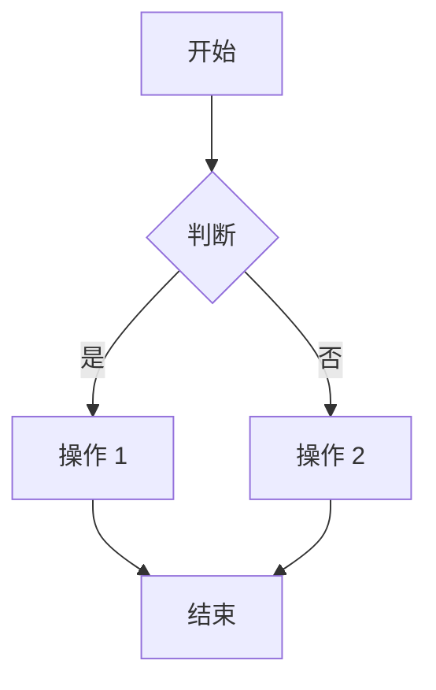

**示例：Cornerstone3D 初始化流程**

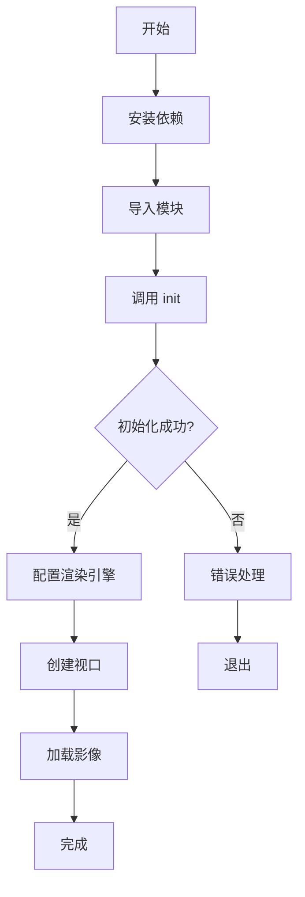

#### 2. 序列图 (Sequence Diagram)

用于展示对象之间的交互顺序。

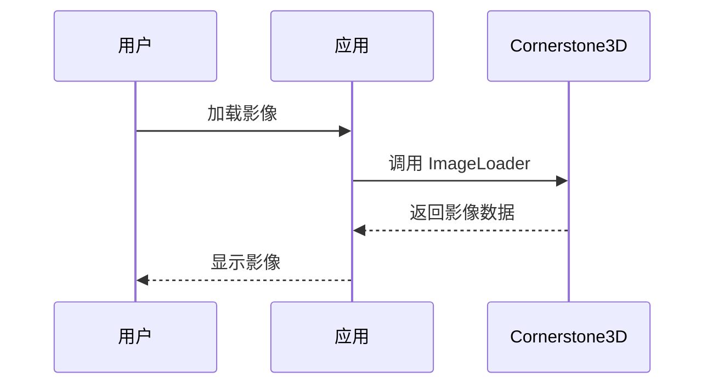

**示例：DICOM 影像加载流程**

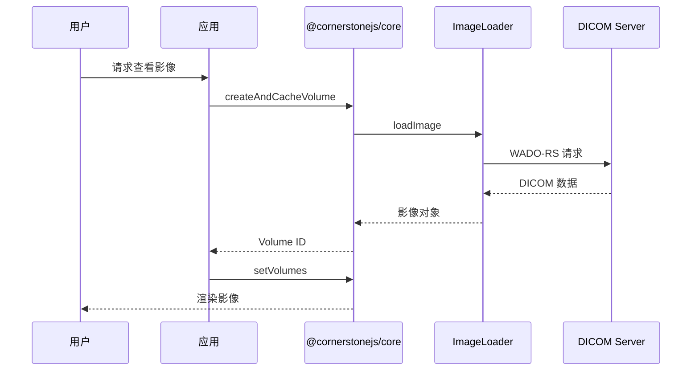

#### 3. 类图 (Class Diagram)

用于展示类、接口和它们之间的关系。

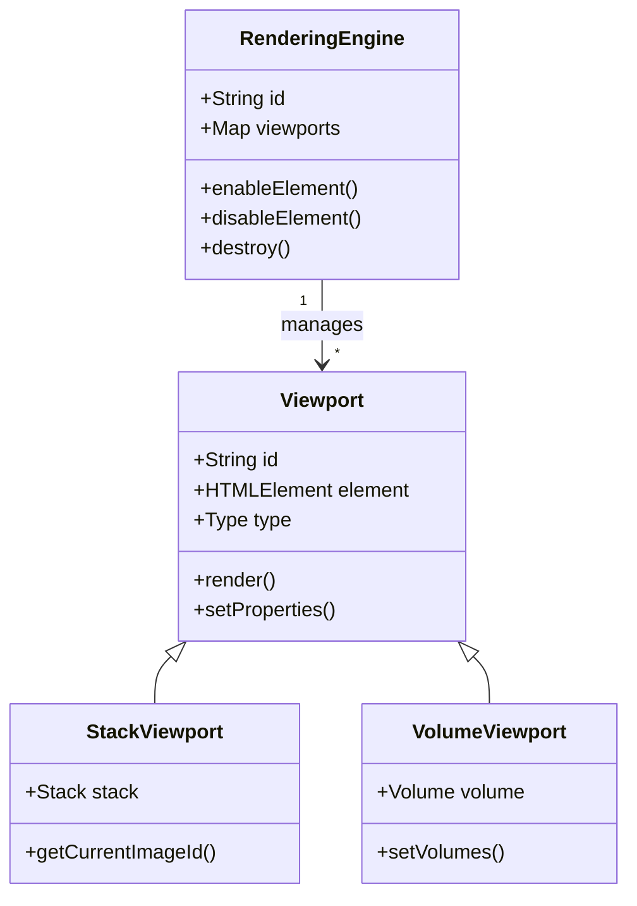

#### 4. 状态图 (State Diagram)

用于展示对象的状态转换。

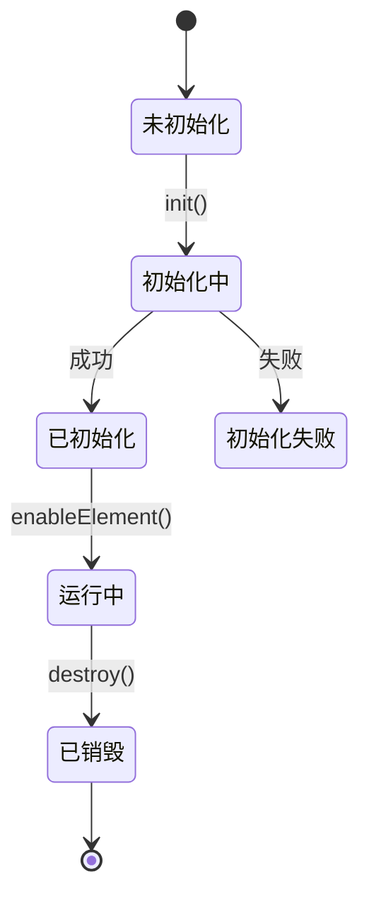

#### 5. 实体关系图 (ER Diagram)

用于展示数据实体和它们之间的关系。

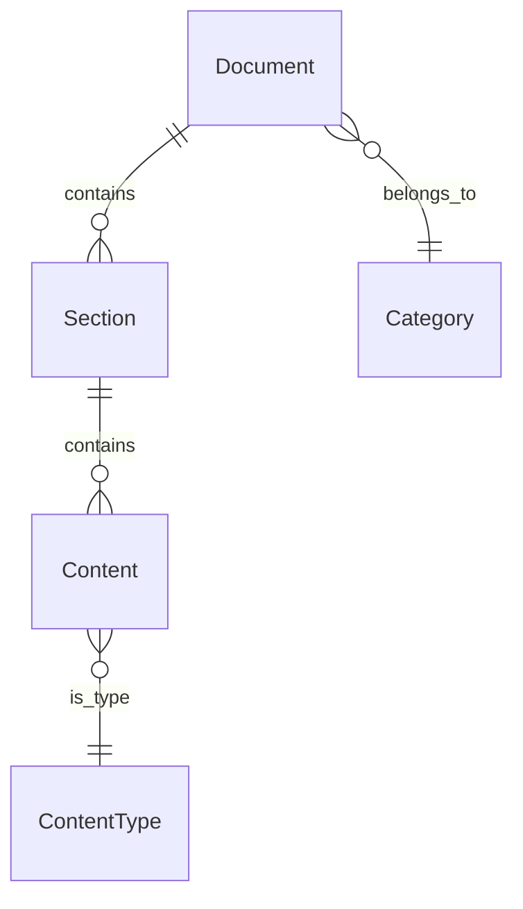

### 图表使用规范

#### 图表标题和说明

每个图表都应该有：


**示例**：

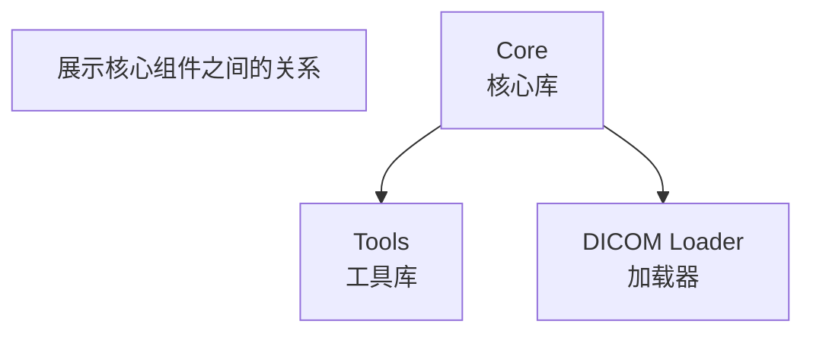

#### 图表样式

##### 主题样式


##### 节点样式

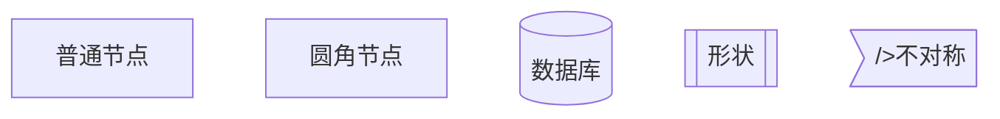

##### 箭头样式

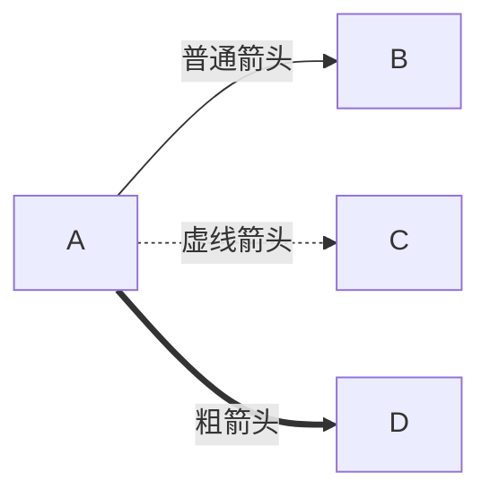

### 图表最佳实践

#### 1. 简洁性

- ✅ 保持图表简洁，避免过度复杂
- ✅ 只包含必要的节点和关系
- ✅ 使用有意义的节点名称

#### 2. 可读性

- ✅ 节点名称使用中文
- ✅ 合理使用颜色区分不同类型的节点
- ✅ 避免箭头交叉和混乱

#### 3. 一致性

- ✅ 相同类型的图表使用一致的样式
- ✅ 相同概念使用相同的颜色
- ✅ 遵循统一的命名规范

#### 4. 实用性

- ✅ 图表应该帮助理解复杂概念
- ✅ 专注于关键信息
- ✅ 避免不必要的细节

### 图表嵌入示例

#### 在文档中嵌入

```markdown
## 架构概览

Cornerstone3D 的核心架构如下：

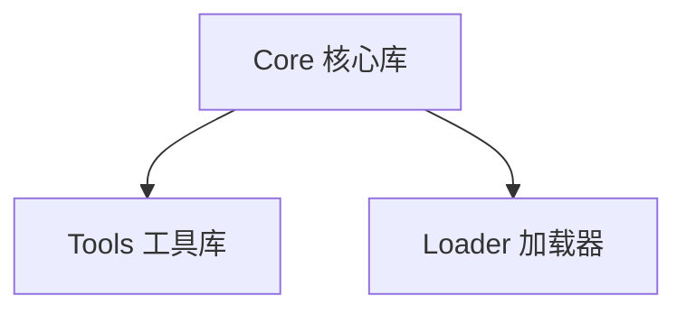

上图展示了核心组件之间的关系。
```

#### 图表说明

每个图表后都应该有文字说明：

```markdown
## 初始化流程

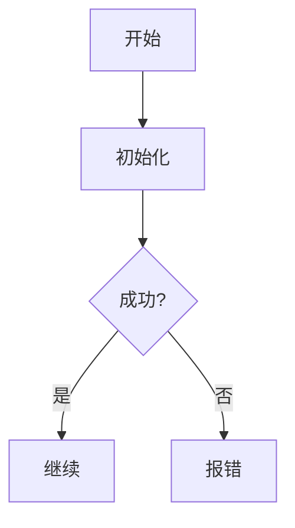

**流程说明**：

1. **开始**: 应用启动
2. **初始化**: 调用 `init()` 函数
3. **判断**: 检查是否成功
4. **成功**: 继续执行后续逻辑
5. **失败**: 显示错误信息并退出
```

### 常见图表场景

#### 1. 架构图

展示系统组件和它们的关系。

#### 2. 流程图

展示操作步骤和决策流程。

#### 3. 时序图

展示对象之间的交互顺序。

#### 4. 状态图

展示对象的生命周期和状态转换。

### 参考资源

- [Mermaid 官方文档](https://mermaid.js.org/)
- [Mermaid 语法指南](https://mermaid.js.org/syntax/flowchart.html)
- [Mermaid 在线编辑器](https://mermaid.live/)
