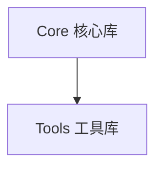

# Mermaid.js 配置指南

**Purpose**: 配置 Mermaid.js 用于在指南文档中渲染图表
**Date**: 2025-01-18

---

## 配置说明

### 在 GitHub 中使用 Mermaid

GitHub 原生支持 Mermaid.js，无需额外配置。只需在 Markdown 文件中使用 mermaid 代码块即可：

\`\`\`mermaid
flowchart TD
    A[开始] --> B[结束]
\`\`\`

### 在本地预览中使用 Mermaid

#### 选项 1: 使用 VS Code 扩展

1. 安装 **Markdown Preview Mermaid Support** 扩展
2. 打开 Markdown 文件
3. 按 `Ctrl+Shift+V` (或 `Cmd+Shift+V`) 预览

#### 选项 2: 使用 VitePress 或 Docusaurus（未来）

如果将来构建独立的文档站点，可以配置：

**VitePress 配置** (`docs/.vitepress/config.js`):

```javascript
import { defineConfig } from 'vitepress'

export default defineConfig({
  markdown: {
    config: (md) => {
      // 使用 Mermaid
      md.use(require('markdown-it-mermaid'))
    },
  },
})
```

**Docusaurus 配置** (`docusaurus.config.js`):

```javascript
module.exports = {
  themes: ['@docusaurus/theme-mermaid'],
  themeConfig: {
    mermaid: {
      theme: {
        light: 'default',
        dark: 'dark',
      },
    },
  },
}
```

---

## Mermaid 配置

### 基础配置

在文档开头添加 Mermaid 配置：

```markdown
%%{init: {'theme': 'base'}}%%
%%{
  init: function () {
    const { mermaid } = window;
    mermaid.initialize({
      startOnLoad: true,
      theme: 'default',
      securityLevel: 'loose',
    });
  }
}%%
```

### 主题配置

#### 主题选项

- `default`: 默认主题
- `forest`: 森林主题
- `dark`: 暗色主题
- `neutral`: 中性主题
- `night`: 夜间主题

**示例**：


---

## 支持的图表类型

本指南支持以下 Mermaid 图表类型：

1. **Flowchart** (flowchart) - 流程图
2. **Sequence Diagram** (sequence) - 序列图
3. **Class Diagram** (class) - 类图
4. **State Diagram** (state) - 状态图
5. **ER Diagram** (er) - 实体关系图
6. **Gantt** (gantt) - 甘特图
7. **Pie** (pie) - 饼图
8. **Mindmap** (mindmap) - 思维导图

---

## 最佳实践

### 1. 图表大小

- 保持图表简洁，避免过度复杂
- 单个图表不超过 20 个节点
- 复杂图表拆分为多个小图表

### 2. 节点命名

- 使用中文节点名称
- 节点名称简洁明了
- 避免特殊字符（除了 `_` 和 `-`）

### 3. 布局方向

- **TD** (Top-Down): 自上而下
- **LR** (Left-Right): 自左向右
- 根据内容选择合适的方向

### 4. 样式一致性

- 相同类型的图表使用一致的样式
- 相同概念使用相同的颜色
- 遵循统一的命名规范

---

## 验证和测试

### 本地验证

1. 创建测试文档 `test-mermaid.md`:

```markdown
# Mermaid 测试

\`\`\`mermaid
flowchart TD
    A[测试] --> B[成功]
\`\`\`
```

2. 在 GitHub 或 VS Code 中预览
3. 确认图表正确渲染

### 在线验证

访问 [Mermaid Live Editor](https://mermaid.live/)：

1. 粘贴 Mermaid 代码
2. 查看实时预览
3. 调整和优化代码

---

## 故障排查

### 图表不显示

**问题**: 图表代码显示为文本块而不是渲染的图表

**解决方案**:
1. 确认代码块标记为 `mermaid`（不是 `javascript` 或其他）
2. 检查语法是否正确
3. 在 GitHub 上查看（本地可能不支持）

### 图表渲染错误

**问题**: 图表显示不完整或格式错误

**解决方案**:
1. 检查节点和箭头的语法
2. 确认没有多余的空格或特殊字符
3. 使用 [Mermaid Live Editor](https://mermaid.live/) 验证语法

### 样式不生效

**问题**: 主题或颜色配置不生效

**解决方案**:
1. 确认配置在代码块内部
2. 检查配置语法是否正确
3. 尝试使用不同的主题名称

---

## 示例和模板

### 参考模板

本指南提供了完整的 Mermaid 模板：

- **[图表模板](../.templates/diagram-template.md)** - 包含所有支持的图表类型和使用示例

### 使用示例

在文档中引用模板：

```markdown
## 架构概览

详细的架构说明请参考 [图表模板](../.templates/diagram-template.md)。


```

---

## 相关资源

- [Mermaid 官方文档](https://mermaid.js.org/)
- [Mermaid 语法指南](https://mermaid.js.org/syntax/flowchart.html)
- [Mermaid 在线编辑器](https://mermaid.live/)
- [Mermaid GitHub](https://github.com/mermaid-js/mermaid)

---

## 配置文件位置

- **模板文件**: `guides/.templates/diagram-template.md`
- **本文件**: `guides/.templates/mermaid-config.md`
- **全局配置**: 在每个文档的 frontmatter 中配置
