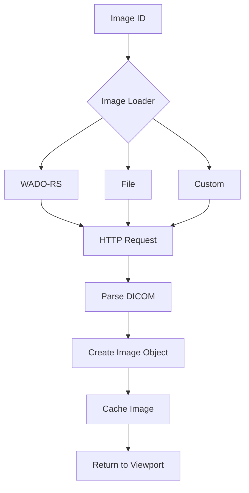
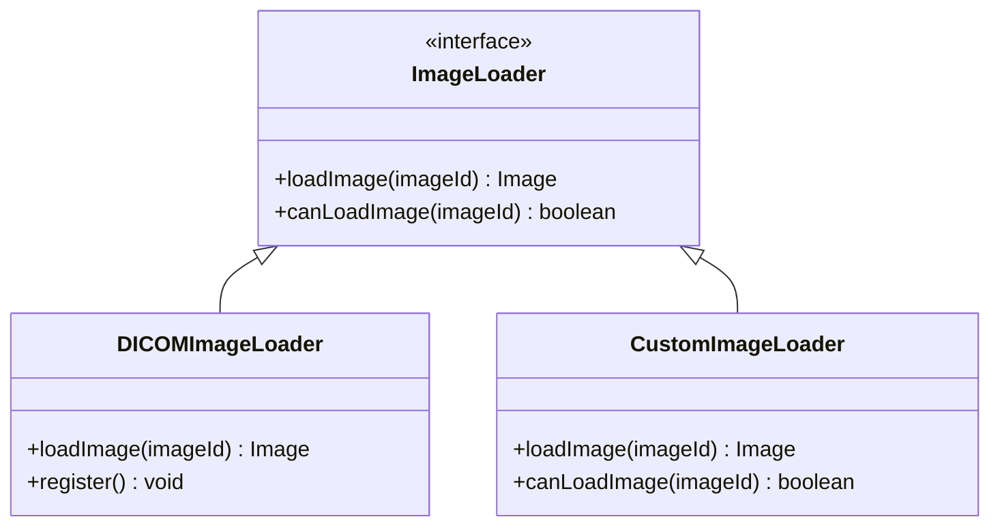

# 高级加载器指南

**目标**: 学习如何使用和扩展 Cornerstone3D 的影像加载器

**预计时间**: 50 分钟

**难度**: 高级

**前置要求**:
- [x] 已完成 [第一个影像查看器](../getting-started/first-viewer.md)
- [x] 已完成 [基本交互](../getting-started/basic-interactions.md)
- [x] 了解 DICOM 标准和影像格式

---

## 概述

影像加载器（Image Loader）是 Cornerstone3D 的核心组件，负责从各种来源加载医学影像数据。理解和使用高级加载器功能可以帮助你处理各种复杂的影像加载场景。

**支持的影像格式**:
- 📦 **DICOM**: 医学数字影像传输协议
- 🖼️ **NIfTI**: 神经影像数据格式
- 🎨 **PNG/JPEG**: 标准图像格式（用于演示）
- 📊 **NRRD**: 近乎原始光栅数据
- 🗜️ **压缩 DICOM**: JPEG 2000、JPEG Lossless 压缩

**加载方式**:
- 🌐 **WADO-RS**: DICOMweb RESTful API
- 📁 **本地文件**: File API 加载本地 DICOM 文件
- 🔗 **WADO-URI**: 传统 WADO 协议
- ☁️ **云存储**: AWS S3、Google Cloud Storage 等
- 🔄 **自定义协议**: 实现自定义加载协议

---

## 加载器架构

### 加载流程



### 加载器类型



---

## 2. WADO-RS 加载器

WADO-RS 是 DICOMweb 标准的一部分，提供 RESTful API 访问 DICOM 影像。

### 2.1 配置 WADO-RS 加载器

```typescript
import { init as initDICOMLoader } from '@cornerstonejs/dicom-image-loader';

// 初始化 DICOM 加载器
initDICOMLoader();

// 配置 WADO-RS 服务器
const config = {
  headers: {
    // 添加认证头
    Authorization: `Bearer ${accessToken}`,
  },
};

// 应用配置
dicomImageLoader.wadors.config = config;
```

### 2.2 加载 WADO-RS 影像

```typescript
// 构造 WADO-RS Image ID
const imageId = `wadors:https://dicomserver.com/wado-rs/studies/${studyInstanceUID}/series/${seriesInstanceUID}/instances/${sopInstanceUID}/frames/${frameNumber}`;

// 加载影像
const image = await imageLoader.loadImage(imageId);

console.log('影像加载成功:', image);
console.log('宽度:', image.width);
console.log('高度:', image.height);
```

### 2.3 批量加载 WADO-RS 影像

```typescript
// 获取系列中的所有实例
const fetchSeriesInstances = async (
  wadoRsBaseUrl: string,
  studyInstanceUID: string,
  seriesInstanceUID: string
): Promise<string[]> => {
  const url = `${wadoRsBaseUrl}/studies/${studyInstanceUID}/series/${seriesInstanceUID}/instances`;

  const response = await fetch(url, {
    headers: {
      Accept: 'application/dicom+json',
    },
  });

  const instances = await response.json();

  // 构造 Image ID 列表
  const imageIds = instances.map((instance) => {
    const sopInstanceUID = instance['00080018'].Value[0]; // SOP Instance UID
    return `wadors:${wadoRsBaseUrl}/studies/${studyInstanceUID}/series/${seriesInstanceUID}/instances/${sopInstanceUID}/frames/1`;
  });

  return imageIds;
};

// 使用示例
const imageIds = await fetchSeriesInstances(
  'https://dicomserver.com/wado-rs',
  '1.2.840.113619.2.55.3.12345',
  '1.2.840.113619.2.55.3.12345.67890'
);

console.log('找到', imageIds.length, '个实例');
```

---

## 3. 本地文件加载器

### 3.1 加载本地 DICOM 文件

```typescript
// HTML: 文件选择器
// <input type="file" accept=".dcm" onChange={handleFileSelect} multiple />

// TypeScript: 处理文件选择
const handleFileSelect = async (event: React.ChangeEvent<HTMLInputElement>) => {
  const files = event.target.files;
  if (!files) return;

  const imageIds: string[] = [];

  for (let i = 0; i < files.length; i++) {
    const file = files[i];

    // 读取文件
    const arrayBuffer = await file.arrayBuffer();

    // 创建 Image ID
    const imageId = `imageLoader:file:${file.name}`;

    // 注册文件数据
    dicomImageLoader.wadors.register(file.name, arrayBuffer);

    imageIds.push(imageId);
  }

  // 加载影像
  const viewport = renderingEngine.getStackViewport('my-viewport');
  await viewport.setStack(imageIds, 0);
  viewport.render();
};
```

### 3.2 拖放加载文件

```typescript
// 实现拖放加载
const setupDragAndDrop = (viewportElement: HTMLElement) => {
  viewportElement.addEventListener('dragover', (event) => {
    event.preventDefault();
    event.dataTransfer.dropEffect = 'copy';
  });

  viewportElement.addEventListener('drop', async (event) => {
    event.preventDefault();

    const files = event.dataTransfer.files;
    const imageIds: string[] = [];

    for (let i = 0; i < files.length; i++) {
      const file = files[i];

      if (file.name.endsWith('.dcm')) {
        const arrayBuffer = await file.arrayBuffer();
        const imageId = `imageLoader:file:${file.name}`;

        dicomImageLoader.wadors.register(file.name, arrayBuffer);
        imageIds.push(imageId);
      }
    }

    // 加载影像
    const viewport = renderingEngine.getStackViewport('my-viewport');
    await viewport.setStack(imageIds, 0);
    viewport.render();
  });
};

// 使用示例
const viewportElement = document.getElementById('my-viewport');
setupDragAndDrop(viewportElement);
```

---

## 4. 自定义影像加载器

### 4.1 创建自定义加载器

```typescript
import { ImageLoader, Types } from '@cornerstonejs/core';

// 自定义加载器类
class CustomImageLoader implements ImageLoader {
  // 加载器名称
  public static readonly loaderName = 'CustomLoader';

  // 检查是否可以加载该 Image ID
  public canLoadImage(imageId: string): boolean {
    return imageId.startsWith('custom:');
  }

  // 加载影像
  public async loadImage(imageId: string): Promise<Types.IImage> {
    // 解析 Image ID
    const url = imageId.replace('custom:', '');

    try {
      // 发起 HTTP 请求
      const response = await fetch(url);

      if (!response.ok) {
        throw new Error(`HTTP ${response.status}: ${response.statusText}`);
      }

      // 获取影像数据
      const arrayBuffer = await response.arrayBuffer();

      // 解析影像数据
      const image = await this.parseImageData(arrayBuffer);

      return image;

    } catch (error) {
      console.error('加载影像失败:', error);
      throw error;
    }
  }

  // 解析影像数据
  private async parseImageData(arrayBuffer: ArrayBuffer): Promise<Types.IImage> {
    // 实现影像解析逻辑
    // 这里需要根据具体的影像格式实现

    // 示例：返回一个简单的影像对象
    return {
      imageId: 'custom-image-1',
      width: 512,
      height: 512,
      color: false,
      getPixelData: () => new Int16Array(512 * 512),
      minPixelValue: -1000,
      maxPixelValue: 3000,
      slope: 1,
      intercept: 0,
      rowPixelSpacing: 1,
      columnPixelSpacing: 1,
      sizeInBytes: 512 * 512 * 2,
    };
  }
}

// 导出加载器
export default CustomImageLoader;
```

### 4.2 注册自定义加载器

```typescript
import { registerImageLoader } from '@cornerstonejs/core';
import CustomImageLoader from './loaders/CustomImageLoader';

// 创建加载器实例
const customLoader = new CustomImageLoader();

// 注册加载器
registerImageLoader(CustomImageLoader.loaderName, customLoader);

// 现在可以使用自定义加载器
const imageId = 'custom:https://example.com/custom-image.dat';
const image = await imageLoader.loadImage(imageId);
```

---

## 5. 处理压缩 DICOM

### 5.1 JPEG 2000 压缩

```typescript
// 配置 JPEG 2000 解码
import { init as initDICOMLoader } from '@cornerstonejs/dicom-image-loader';

// 初始化加载器
await initDICOMLoader();

// JPEG 2000 通常会自动处理
// 如果遇到问题，可以手动配置
const config = {
  // 启用 JPEG 2000 解码
  decodeJPEG2000: true,
};

dicomImageLoader.wadors.config = config;
```

### 5.2 JPEG Lossless 压缩

```typescript
// 配置 JPEG Lossless 解码
const config = {
  // 启用 JPEG Lossless 解码
  decodeJPEGLossless: true,
  // 配置解码器选项
  jpegLosslessOptions: {
    // 解码器配置
  },
};

dicomImageLoader.wadors.config = config;
```

---

## 6. 加载进度监控

### 6.1 监听影像加载事件

```typescript
import { eventTarget, Enums } from '@cornerstonejs/core';

// 监听影像加载开始事件
eventTarget.addEventListener(Enums.Events.IMAGE_LOAD_PROGRESS, (event) => {
  const { imageId, progress } = event.detail;

  console.log(`影像加载进度: ${imageId} - ${progress * 100}%`);

  // 更新 UI 进度条
  updateProgressBar(progress);
});

// 监听影像加载完成事件
eventTarget.addEventListener(Enums.Events.IMAGE_LOADED, (event) => {
  const { imageId } = event.detail;

  console.log('✅ 影像加载完成:', imageId);

  // 隐藏进度条
  hideProgressBar();
});

// 监听影像加载失败事件
eventTarget.addEventListener(Enums.Events.IMAGE_LOAD_FAILED, (event) => {
  const { imageId, error } = event.detail;

  console.error('❌ 影像加载失败:', imageId, error);

  // 显示错误消息
  showErrorMessage(`加载失败: ${imageId}`);
});
```

### 6.2 创建进度条组件

```typescript
import React, { useState, useEffect } from 'react';
import { eventTarget, Enums } from '@cornerstonejs/core';

const ImageLoadProgress = () => {
  const [progress, setProgress] = useState(0);
  const [loading, setLoading] = useState(false);
  const [currentImageId, setCurrentImageId] = useState<string>('');

  useEffect(() => {
    const handleProgress = (event: any) => {
      const { imageId, progress: loadProgress } = event.detail;
      setProgress(loadProgress * 100);
      setLoading(true);
      setCurrentImageId(imageId);
    };

    const handleLoaded = (event: any) => {
      setLoading(false);
      setProgress(100);
      setCurrentImageId(event.detail.imageId);

      // 2 秒后隐藏进度条
      setTimeout(() => {
        setProgress(0);
        setCurrentImageId('');
      }, 2000);
    };

    const handleFailed = (event: any) => {
      setLoading(false);
      setProgress(0);
      setCurrentImageId('');

      alert(`加载失败: ${event.detail.imageId}`);
    };

    eventTarget.addEventListener(Enums.Events.IMAGE_LOAD_PROGRESS, handleProgress);
    eventTarget.addEventListener(Enums.Events.IMAGE_LOADED, handleLoaded);
    eventTarget.addEventListener(Enums.Events.IMAGE_LOAD_FAILED, handleFailed);

    return () => {
      eventTarget.removeEventListener(Enums.Events.IMAGE_LOAD_PROGRESS, handleProgress);
      eventTarget.removeEventListener(Enums.Events.IMAGE_LOADED, handleLoaded);
      eventTarget.removeEventListener(Enums.Events.IMAGE_LOAD_FAILED, handleFailed);
    };
  }, []);

  return (
    <div>
      {loading && (
        <div style={{ padding: '16px', border: '1px solid #ccc' }}>
          <p>加载中: {currentImageId}</p>
          <div style={{ width: '100%', height: '20px', border: '1px solid #ccc' }}>
            <div
              style={{
                width: `${progress}%`,
                height: '100%',
                backgroundColor: '#4CAF50',
              }}
            />
          </div>
          <p>{progress.toFixed(1)}%</p>
        </div>
      )}
    </div>
  );
};

export default ImageLoadProgress;
```

---

## 7. 高级功能

### 7.1 预加载影像

```typescript
// 预加载即将查看的影像
const preloadImages = async (imageIds: string[], count: number = 5) => {
  for (let i = 0; i < Math.min(count, imageIds.length); i++) {
    try {
      await imageLoader.loadImage(imageIds[i]);
      console.log(`✅ 预加载成功: ${imageIds[i]}`);
    } catch (error) {
      console.error(`❌ 预加载失败: ${imageIds[i]}`, error);
    }
  }
};

// 使用示例：预加载当前影像的前后各 5 张
const preloadAroundCurrent = async (currentIndex: number, imageIds: string[]) => {
  const start = Math.max(0, currentIndex - 5);
  const end = Math.min(imageIds.length, currentIndex + 6);

  const toPreload = imageIds.slice(start, end);
  await preloadImages(toPreload);
};
```

### 7.2 取消加载

```typescript
// 取消影像加载
const abortController = new AbortController();

const loadImageWithCancel = async (imageId: string) => {
  try {
    const image = await imageLoader.loadImage(imageId, {
      signal: abortController.signal,
    });

    return image;

  } catch (error) {
    if (error.name === 'AbortError') {
      console.log('影像加载已取消');
    } else {
      console.error('加载失败:', error);
    }
  }
};

// 取消加载
abortController.abort();
```

### 7.3 加载优先级

```typescript
// 为影像设置加载优先级
const loadImageWithPriority = async (
  imageId: string,
  priority: 'low' | 'normal' | 'high'
) => {
  const priorityMap = {
    low: 0,
    normal: 1,
    high: 2,
  };

  const image = await imageLoader.loadImage(imageId, {
    priority: priorityMap[priority],
  });

  return image;
};

// 使用示例：优先加载当前影像，低优先级预加载其他影像
const currentImage = await loadImageWithPriority(currentImageId, 'high');
const preloadImages = imageIds.map(id =>
  loadImageWithPriority(id, 'low')
);
```

---

## 8. 错误处理

### 8.1 处理加载错误

```typescript
const loadImageWithErrorHandling = async (imageId: string) => {
  try {
    const image = await imageLoader.loadImage(imageId);
    return image;

  } catch (error) {
    // 根据错误类型处理
    if (error.message.includes('HTTP 404')) {
      console.error('影像不存在:', imageId);
      // 显示用户友好的错误消息
      alert('影像不存在，请检查 Image ID');

    } else if (error.message.includes('HTTP 401')) {
      console.error('未授权访问:', imageId);
      // 提示用户登录
      alert('请先登录以访问影像');

    } else if (error.message.includes('Network')) {
      console.error('网络错误:', imageId);
      // 提示用户检查网络连接
      alert('网络连接失败，请检查网络');

    } else {
      console.error('未知错误:', error);
      // 显示通用错误消息
      alert('加载影像失败，请稍后重试');
    }

    throw error;
  }
};
```

### 8.2 重试机制

```typescript
// 实现自动重试
const loadImageWithRetry = async (
  imageId: string,
  maxRetries: number = 3,
  retryDelay: number = 1000
): Promise<Types.IImage> => {
  let lastError: Error | null = null;

  for (let i = 0; i < maxRetries; i++) {
    try {
      const image = await imageLoader.loadImage(imageId);
      return image;

    } catch (error) {
      lastError = error;
      console.warn(`加载失败，第 ${i + 1}/${maxRetries} 次重试...`, error);

      // 等待一段时间后重试
      if (i < maxRetries - 1) {
        await new Promise(resolve => setTimeout(resolve, retryDelay));
      }
    }
  }

  throw lastError;
};

// 使用示例
try {
  const image = await loadImageWithRetry(imageId, 3, 2000);
  console.log('加载成功:', image);
} catch (error) {
  console.error('重试后仍然失败:', error);
}
```

---

## 9. 性能优化

### 9.1 并行加载

```typescript
// 并行加载多张影像
const loadImagesInParallel = async (imageIds: string[]): Promise<Types.IImage[]> => {
  const loadPromises = imageIds.map(imageId =>
    imageLoader.loadImage(imageId).catch(error => {
      console.error(`加载失败: ${imageId}`, error);
      return null;
    })
  );

  const results = await Promise.all(loadPromises);

  // 过滤掉失败的加载
  return results.filter(image => image !== null) as Types.IImage[];
};

// 使用示例
const images = await loadImagesInParallel(imageIds);
console.log(`成功加载 ${images.length}/${imageIds.length} 张影像`);
```

### 9.2 分块加载

```typescript
// 分块加载大量影像
const loadImagesInChunks = async (
  imageIds: string[],
  chunkSize: number = 10,
  onProgress?: (loaded: number, total: number) => void
): Promise<Types.IImage[]> => {
  const results: Types.IImage[] = [];

  for (let i = 0; i < imageIds.length; i += chunkSize) {
    const chunk = imageIds.slice(i, i + chunkSize);
    const chunkResults = await loadImagesInParallel(chunk);

    results.push(...chunkResults);

    // 报告进度
    if (onProgress) {
      onProgress(results.length, imageIds.length);
    }
  }

  return results;
};

// 使用示例
const images = await loadImagesInChunks(imageIds, 10, (loaded, total) => {
  console.log(`加载进度: ${loaded}/${total} (${(loaded / total * 100).toFixed(1)}%)`);
});
```

---

## 10. 常见问题

### Q1: WADO-RS 加载失败？

**可能原因**:
- 服务器未配置 CORS
- 认证失败
- Image ID 格式错误

**解决方案**:
```typescript
// 检查服务器配置
fetch('https://dicomserver.com/wado-rs/studies', {
  headers: {
    Accept: 'application/dicom+json',
  },
})
  .then(response => console.log('服务器状态:', response.status))
  .catch(error => console.error('连接失败:', error));
```

### Q2: 本地文件加载失败？

**解决方案**: 确保文件是有效的 DICOM 文件

```typescript
// 验证 DICOM 文件
const validateDICOMFile = (file: File): boolean => {
  return file.name.endsWith('.dcm') || file.type === 'application/dicom';
};
```

### Q3: 压缩 DICOM 加载很慢？

**解决方案**: 启用 Web Worker 解码

```typescript
// 在 Web Worker 中解码压缩 DICOM
// 具体实现取决于 Cornerstone3D 版本
```

---

## 11. 下一步

- ⚡ [性能优化](./performance-optimization.md) - 优化影像加载性能
- 🤖 [AI 集成](./ai-integration.md) - 使用 AI 处理加载的影像
- 🎯 [自定义工具](./custom-tools.md) - 开发影像处理工具

---

## 相关资源

- 📚 [官方文档 - Image Loaders](https://www.cornerstonejs.org/docs/concepts/imageLoaders)
- 📚 [DICOM 标准](https://www.dicomstandard.org/)
- 💻 [示例项目 - 自定义加载器](../examples/advanced-viewer/)
- 🔍 [API 文档 - ImageLoader](https://www.cornerstonejs.org/docs/api/interfaces/core.ImageLoader)

---

**需要帮助？** 查看 [故障排查文档](../troubleshooting/common-errors.md)
