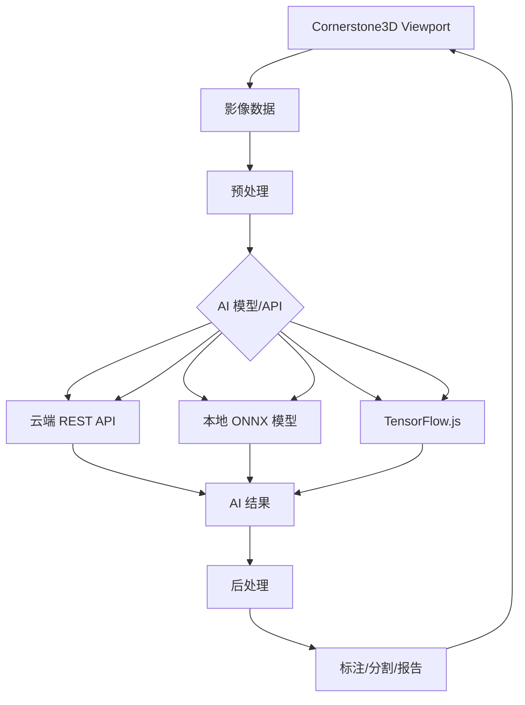

# AI 集成指南

**目标**: 学习如何在 Cornerstone3D 应用中集成 AI 辅助诊断功能

**预计时间**: 70 分钟

**难度**: 高级

**前置要求**:
- [x] 已完成 [第一个影像查看器](../getting-started/first-viewer.md)
- [x] 已完成 [标注工具](./annotations.md)
- [x] 了解机器学习/深度学习基础
- [x] 拥有 AI 模型或 API

---

## 概述

AI 辅助诊断是医学影像的前沿技术，可以显著提高诊断效率和准确性。Cornerstone3D 提供了灵活的架构，支持集成各种 AI 模型和 API。

**主要应用场景**:
- 🎯 **病灶检测**: 自动检测肿瘤、结节等病灶
- 📏 **自动分割**: 分割器官、肿瘤等结构
- 🏷️ **自动标注**: 生成测量标注和诊断报告
- 🔍 **质量评估**: 评估影像质量、检测伪影
- 📊 **疾病分类**: AI 辅助疾病诊断和分类

**集成方式**:
- 🔌 **REST API**: 调用云端 AI 服务
- 🤖 **ONNX Runtime**: 在浏览器中运行 ONNX 模型
- 🧠 **TensorFlow.js**: 在浏览器中运行 TensorFlow 模型
- 📦 **本地服务**: 连接本地 AI 推理服务器

---

## AI 集成架构

### 架构图



**关键组件**:

- **预处理**: 影像数据准备（归一化、裁剪等）
- **AI 模型**: 推理引擎（API 或本地模型）
- **后处理**: 结果解析和可视化
- **结果展示**: 标注、分割掩膜、报告

---

## 2. 使用 REST API 集成 AI

### 2.1 基础 REST API 调用

```typescript
// 调用 AI REST API 进行病灶检测
const detectLesions = async (imageId: string): Promise<Lesion[]> => {
  try {
    // 1. 获取影像数据
    const image = await imageLoader.loadImage(imageId);
    const imageData = image.getPixelData();

    // 2. 准备请求数据
    const requestPayload = {
      imageId,
      imageData: Array.from(imageData),
      width: image.width,
      height: image.height,
      pixelSpacing: image.pixelSpacing,
    };

    // 3. 调用 AI API
    const response = await fetch('https://ai-service.com/api/detect', {
      method: 'POST',
      headers: {
        'Content-Type': 'application/json',
        'Authorization': `Bearer ${AI_API_KEY}`,
      },
      body: JSON.stringify(requestPayload),
    });

    if (!response.ok) {
      throw new Error(`AI API 请求失败: ${response.statusText}`);
    }

    // 4. 解析结果
    const result = await response.json();
    return result.lesions;

  } catch (error) {
    console.error('AI 病灶检测失败:', error);
    return [];
  }
};

// 使用示例
const lesions = await detectLesions(imageId);
console.log('检测到', lesions.length, '个病灶');
```

### 2.2 显示 AI 检测结果

```typescript
import { RectangleROITool } from '@cornerstonejs/tools';
import { annotationState } from '@cornerstonejs/tools';

// 将 AI 检测结果转换为标注
const displayAILesions = async (lesions: Lesion[], viewportId: string) => {
  const toolGroup = ToolGroupManager.getToolGroup('myToolGroup');

  // 确保矩形 ROI 工具已激活
  toolGroup.addTool(RectangleROITool.toolName);

  // 为每个检测到的病灶创建标注
  for (const lesion of lesions) {
    const annotation = {
      metadata: {
        toolName: RectangleROITool.toolName,
        viewportId,
      },
      data: {
        rectangle: {
          x: lesion.bbox.x,
          y: lesion.bbox.y,
          width: lesion.bbox.width,
          height: lesion.bbox.height,
        },
        label: {
          value: `AI: ${lesion.type} (${(lesion.confidence * 100).toFixed(1)}%)`,
        },
      },
    };

    // 添加标注到视口
    await annotationState.addAnnotation(annotation);
  }

  // 渲染视口
  const viewport = renderingEngine.getViewport(viewportId);
  viewport.render();
};

// 使用示例
const lesions = await detectLesions(imageId);
await displayAILesions(lesions, 'my-viewport');
```

---

## 3. 使用 ONNX Runtime

ONNX Runtime 允许在浏览器中运行 AI 模型，无需调用远程 API。

### 3.1 安装 ONNX Runtime

```bash
yarn add onnxruntime-web
```

### 3.2 加载和运行 ONNX 模型

```typescript
import * as ort from 'onnxruntime-web';

// 初始化 ONNX Runtime
await ort.env.wasm.numThreads(); // 设置线程数

// 加载 ONNX 模型
const loadModel = async (modelPath: string): Promise<ort.InferenceSession> => {
  const session = await ort.InferenceSession.create(modelPath);
  return session;
};

// 预处理影像数据
const preprocessImage = (image: Types.IImage): ort.Tensor => {
  const imageData = image.getPixelData();

  // 归一化到 [0, 1]
  const normalizedData = new Float32Array(imageData.length);
  for (let i = 0; i < imageData.length; i++) {
    normalizedData[i] = imageData[i] / 4096; // 假设 12-bit CT
  }

  // 创建 ONNX Tensor
  const tensor = new ort.Tensor('float32', normalizedData, [1, 1, image.height, image.width]);

  return tensor;
};

// 运行模型推理
const runInference = async (
  session: ort.InferenceSession,
  image: Types.IImage
): Promise<any> => {
  // 预处理
  const inputTensor = preprocessImage(image);

  // 准备输入
  const feeds = { input: inputTensor };

  // 运行推理
  const results = await session.run(feeds);

  return results;
};

// 使用示例
const detectWithONNX = async (imageId: string) => {
  // 加载模型
  const session = await loadModel('/models/lesion-detection.onnx');

  // 加载影像
  const image = await imageLoader.loadImage(imageId);

  // 运行推理
  const results = await runInference(session, image);

  // 解析结果
  const detections = results.output.data; // 假设输出是检测结果
  console.log('检测结果:', detections);

  return detections;
};
```

### 3.3 显示 ONNX 模型结果

```typescript
// 解析 ONNX 模型输出
const parseDetectionResults = (results: any): Detection[] => {
  const detections = [];

  // 假设输出格式: [num_detections, 6] (x, y, width, height, confidence, class)
  const data = results.output.data as Float32Array;
  const numDetections = data.length / 6;

  for (let i = 0; i < numDetections; i++) {
    const offset = i * 6;
    detections.push({
      bbox: {
        x: data[offset],
        y: data[offset + 1],
        width: data[offset + 2],
        height: data[offset + 3],
      },
      confidence: data[offset + 4],
      classId: Math.round(data[offset + 5]),
    });
  }

  return detections;
};

// 显示检测结果
const displayONNXDetections = async (imageId: string, viewportId: string) => {
  // 运行 ONNX 模型
  const results = await detectWithONNX(imageId);

  // 解析结果
  const detections = parseDetectionResults(results);

  // 显示为标注
  await displayAILesions(detections, viewportId);
};
```

---

## 4. 使用 TensorFlow.js

TensorFlow.js 是另一个流行的浏览器端机器学习库。

### 4.1 安装 TensorFlow.js

```bash
yarn add @tensorflow/tfjs
```

### 4.2 加载和运行 TensorFlow.js 模型

```typescript
import * as tf from '@tensorflow/tfjs';

// 加载 TensorFlow.js 模型
const loadTFJSModel = async (modelPath: string): Promise<tf.GraphModel> => {
  const model = await tf.loadGraphModel(modelPath);
  return model;
};

// 预处理影像数据
const preprocessImageForTF = (image: Types.IImage): tf.Tensor => {
  const imageData = image.getPixelData();

  // 归一化到 [0, 1]
  const normalizedData = tf.tensor(imageData, [image.height, image.width, 1]);
  const normalized = normalizedData.div(255);

  return normalized;
};

// 运行模型推理
const runTFJSInference = async (
  model: tf.GraphModel,
  image: Types.IImage
): Promise<tf.Tensor> => {
  // 预处理
  const inputTensor = preprocessImageForTF(image);

  // 添加批次维度
  const batched = inputTensor.expandDims(0);

  // 运行推理
  const results = await model.executeAsync(batched) as tf.Tensor;

  // 清理中间张量
  inputTensor.dispose();
  batched.dispose();

  return results;
};

// 使用示例
const segmentWithTFJS = async (imageId: string) => {
  // 加载模型
  const model = await loadTFJSModel('/models/segmentation/model.json');

  // 加载影像
  const image = await imageLoader.loadImage(imageId);

  // 运行推理
  const segmentationMask = await runTFJSInference(model, image);

  // 后处理分割掩膜
  const maskData = await segmentationMask.data();
  console.log('分割掩膜:', maskData);

  // 清理张量
  segmentationMask.dispose();

  return maskData;
};
```

---

## 5. AI 辅助分割

### 5.1 显示分割掩膜

```typescript
// 将分割掩膜叠加到影像上
const displaySegmentationMask = async (
  imageId: string,
  maskData: Uint8Array,
  viewportId: string
) => {
  // 获取视口
  const viewport = renderingEngine.getViewport(viewportId);

  // 获取影像
  const image = await imageLoader.loadImage(imageId);

  // 创建彩色掩膜
  const coloredMask = new Uint8Array(maskData.length * 4);
  for (let i = 0; i < maskData.length; i++) {
    const offset = i * 4;

    if (maskData[i] === 1) { // 器官/肿瘤
      coloredMask[offset] = 255;     // R
      coloredMask[offset + 1] = 0;   // G
      coloredMask[offset + 2] = 0;   // B
      coloredMask[offset + 3] = 128; // A (50% 透明)
    } else { // 背景
      coloredMask[offset] = 0;
      coloredMask[offset + 1] = 0;
      coloredMask[offset + 2] = 0;
      coloredMask[offset + 3] = 0;   // 完全透明
    }
  }

  // 创建图像对象
  const maskImage = new ImageData(
    new Uint8ClampedArray(coloredMask),
    image.width,
    image.height
  );

  // 在 Canvas 上绘制掩膜
  const canvas = document.createElement('canvas');
  canvas.width = image.width;
  canvas.height = image.height;
  const ctx = canvas.getContext('2d')!;
  ctx.putImageData(maskImage, 0, 0);

  // 将掩膜添加到视口
  // 具体实现取决于 Cornerstone3D 版本和 API
};
```

### 5.2 交互式分割

```typescript
// 允许用户调整分割阈值
const adjustSegmentationThreshold = (maskData: Uint8Array, threshold: number): Uint8Array => {
  const adjustedMask = new Uint8Array(maskData.length);

  for (let i = 0; i < maskData.length; i++) {
    // 应用阈值
    adjustedMask[i] = maskData[i] >= threshold ? 1 : 0;
  }

  return adjustedMask;
};

// 使用滑块调整阈值
const thresholdSlider = document.getElementById('segmentation-threshold');

thresholdSlider.addEventListener('input', async (event) => {
  const threshold = parseFloat((event.target as HTMLInputElement).value);

  // 调整分割
  const adjustedMask = adjustSegmentationThreshold(originalMaskData, threshold);

  // 重新显示
  await displaySegmentationMask(imageId, adjustedMask, viewportId);
});
```

---

## 6. 完整示例：AI 病灶检测组件

```typescript
import React, { useState } from 'react';
import { renderingEngine, imageLoader } from '../cornerstone';

interface Lesion {
  bbox: {
    x: number;
    y: number;
    width: number;
    height: number;
  };
  confidence: number;
  type: string;
}

const AILesionDetection: React.FC = () => {
  const [isDetecting, setIsDetecting] = useState(false);
  const [lesions, setLesions] = useState<Lesion[]>([]);

  // 调用 AI API 检测病灶
  const detectLesions = async (imageId: string): Promise<Lesion[]> => {
    try {
      // 1. 获取影像数据
      const image = await imageLoader.loadImage(imageId);
      const imageData = image.getPixelData();

      // 2. 调用 AI API
      const response = await fetch('/api/ai/detect-lesions', {
        method: 'POST',
        headers: {
          'Content-Type': 'application/json',
        },
        body: JSON.stringify({
          imageId,
          imageData: Array.from(imageData.slice(0, 1000)), // 示例：只发送部分数据
          width: image.width,
          height: image.height,
        }),
      });

      if (!response.ok) {
        throw new Error(`检测失败: ${response.statusText}`);
      }

      const result = await response.json();
      return result.lesions;

    } catch (error) {
      console.error('AI 检测失败:', error);
      return [];
    }
  };

  // 显示检测结果
  const displayResults = async (lesions: Lesion[]) => {
    // 将检测结果添加到视口作为标注
    const { annotationState } = await import('@cornerstonejs/tools');

    for (const lesion of lesions) {
      const annotation = {
        metadata: {
          toolName: 'RectangleROITool',
          viewportId: 'my-viewport',
        },
        data: {
          rectangle: lesion.bbox,
          label: {
            value: `${lesion.type} (${(lesion.confidence * 100).toFixed(1)}%)`,
          },
        },
      };

      await annotationState.addAnnotation(annotation);
    }

    // 渲染视口
    const viewport = renderingEngine.getViewport('my-viewport');
    viewport.render();
  };

  // 处理检测按钮点击
  const handleDetect = async () => {
    setIsDetecting(true);
    setLesions([]);

    try {
      // 获取当前影像 ID
      const viewport = renderingEngine.getViewport('my-viewport');
      const imageId = viewport.getCurrentImageId();

      // 调用 AI 检测
      const detectedLesions = await detectLesions(imageId);

      // 更新状态
      setLesions(detectedLesions);

      // 显示结果
      await displayResults(detectedLesions);

    } catch (error) {
      console.error('检测失败:', error);
      alert('检测失败，请查看控制台错误信息');
    } finally {
      setIsDetecting(false);
    }
  };

  return (
    <div style={{ padding: '16px', border: '1px solid #ccc' }}>
      <h3>AI 病灶检测</h3>

      <button
        onClick={handleDetect}
        disabled={isDetecting}
        style={{ marginBottom: '16px' }}
      >
        {isDetecting ? '检测中...' : '开始检测'}
      </button>

      {lesions.length > 0 && (
        <div>
          <h4>检测结果 ({lesions.length})</h4>
          <ul>
            {lesions.map((lesion, index) => (
              <li key={index}>
                {lesion.type} - 置信度: {(lesion.confidence * 100).toFixed(1)}%
              </li>
            ))}
          </ul>
        </div>
      )}
    </div>
  );
};

export default AILesionDetection;
```

---

## 7. 性能优化

### 7.1 批量推理

```typescript
// 批量处理多张影像以提高效率
const batchDetect = async (imageIds: string[], batchSize: number = 5): Promise<Lesion[][]> => {
  const results = [];

  for (let i = 0; i < imageIds.length; i += batchSize) {
    const batch = imageIds.slice(i, i + batchSize);

    // 并行处理当前批次
    const batchResults = await Promise.all(
      batch.map(imageId => detectLesions(imageId))
    );

    results.push(...batchResults);
  }

  return results;
};
```

### 7.2 使用 Web Worker

```typescript
// 在 Web Worker 中运行 AI 推理
// worker.js
self.addEventListener('message', async (event) => {
  const { imageId, modelPath } = event.data;

  // 加载模型（只加载一次）
  if (!self.model) {
    self.model = await loadModel(modelPath);
  }

  // 运行推理
  const results = await runInference(self.model, imageId);

  // 发送结果回主线程
  self.postMessage({ results });
});
```

---

## 8. 常见问题

### Q1: AI 模型推理速度慢？

**解决方案**:
- ✅ 使用 Web Worker 在后台线程运行推理
- ✅ 降低输入分辨率
- ✅ 使用量化模型（INT8 量化）
- ✅ 使用批量推理

### Q2: AI 检测结果不准确？

**解决方案**:
- ✅ 检查影像预处理是否正确
- ✅ 检查模型是否适合当前影像类型
- ✅ 调整推理阈值
- ✅ 使用更适合的模型

### Q3: 内存溢出？

**解决方案**:
- ✅ 降低输入分辨率
- ✅ 使用模型量化
- ✅ 及时清理模型和张量
- ✅ 使用流式推理（分块处理）

---

## 9. AI 应用场景示例

### 9.1 肺结节检测

```typescript
// 肺结节 AI 检测
const detectLungNodules = async (imageId: string) => {
  const noduleDetections = await detectLesions(imageId);

  // 过滤低置信度结果
  const highConfidenceNodules = noduleDetections.filter(
    detection => detection.confidence > 0.8
  );

  // 按大小排序
  highConfidenceNodules.sort((a, b) => {
    const areaA = a.bbox.width * a.bbox.height;
    const areaB = b.bbox.width * b.bbox.height;
    return areaB - areaA;
  });

  return highConfidenceNodules;
};
```

### 9.2 骨折检测

```typescript
// 骨折 AI 检测
const detectFractures = async (imageId: string) => {
  const response = await fetch('/api/ai/detect-fractures', {
    method: 'POST',
    body: JSON.stringify({ imageId }),
  });

  const fractures = await response.json();

  // 显示骨折位置标注
  fractures.forEach(fracture => {
    addFractureAnnotation(fracture);
  });

  return fractures;
};
```

---

## 10. 下一步

- 🛠️ [自定义工具](./custom-tools.md) - 开发自定义 AI 工具
- ⚡ [性能优化](./performance-optimization.md) - 优化 AI 推理性能
- 📊 [多视口同步](./multi-viewport.md) - 在多视口中显示 AI 结果

---

## 相关资源

- 📚 [ONNX Runtime 文档](https://onnxruntime.ai/docs/)
- 📚 [TensorFlow.js 文档](https://www.tensorflow.org/js)
- 💻 [示例项目 - AI 集成](../examples/advanced-viewer/)
- 🔍 [Cornerstone3D AI 示例](https://www.cornerstonejs.org/examples/ai-integration)

---

**需要帮助？** 查看 [故障排查文档](../troubleshooting/common-errors.md)
