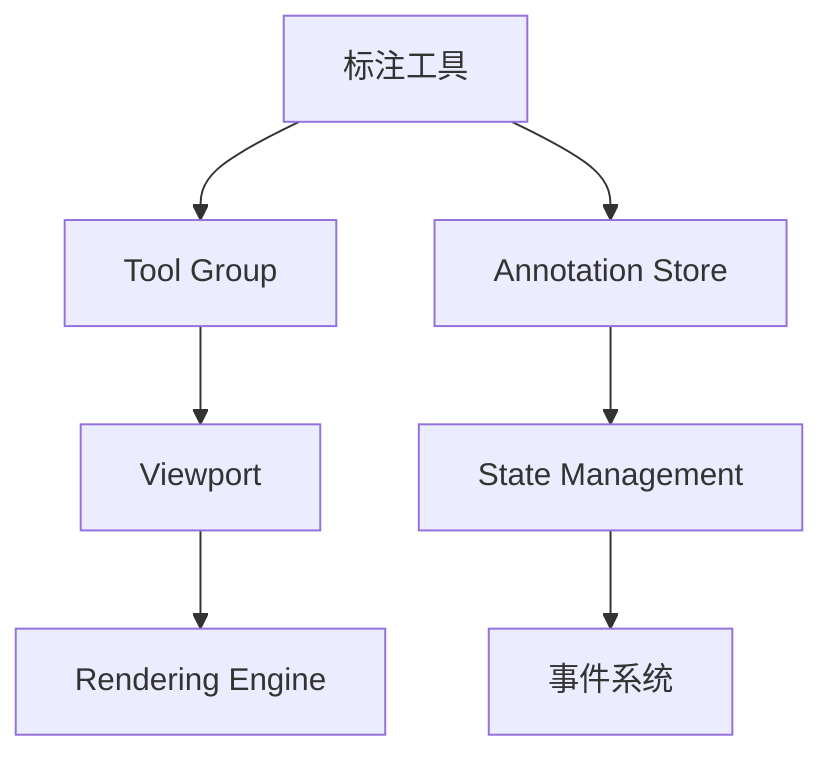

# 标注工具集成指南

**目标**: 学习如何在 Cornerstone3D 应用中集成和使用标注（Annotation）工具

**预计时间**: 45 分钟

**难度**: 中级

**前置要求**:
- [x] 已完成 [第一个影像查看器](../getting-started/first-viewer.md)
- [x] 已完成 [基本交互](../getting-started/basic-interactions.md)
- [x] 了解 Cornerstone3D 的工具系统

---

## 概述

Cornerstone3D 提供了强大的标注工具系统，允许开发者在医学影像上绘制各种类型的标注（Annotations），包括：

- **ROI（Region of Interest）**: 感兴趣区域标注
- **箭头标注**: 指向特定区域的箭头
- **自由手绘**: 自由绘制的图形
- **椭圆/矩形**: 规则几何图形
- **探针工具**: 查看特定点的像素值

标注工具在医学影像应用中非常重要，常用于：
- 标记病灶区域
- 添加诊断备注
- 测量和分析
- 协作和交流

---

## 标注工具基础

### 1. 标注系统架构

Cornerstone3D 的标注系统由以下核心组件组成：



**关键概念**:

- **Tool（工具）**: 实际执行标注的工具类
- **ToolGroup（工具组）**: 管理工具的集合，控制工具的激活状态
- **Annotation（标注）**: 存储标注数据的对象
- **AnnotationStore（标注存储）**: 管理所有标注的全局存储

---

## 2. 启用基础标注工具

### 步骤 1: 导入必要的工具

```typescript
import {
  addTool,
  ToolGroupManager,
  Enums,
  Types,
} from '@cornerstonejs/tools';

// 导入标注工具
import { ArrowTool } from '@cornerstonejs/tools';
import { RectangleROITool } from '@cornerstonejs/tools';
import { EllipseROITool } from '@cornerstonejs/tools';
import { ProbeTool } from '@cornerstonejs/tools';
```

### 步骤 2: 添加工具到工具库

```typescript
// 添加标注工具到 Cornerstone3D 工具库
addTool(ArrowTool);
addTool(RectangleROITool);
addTool(EllipseROITool);
addTool(ProbeTool);
```

### 步骤 3: 创建工具组并添加标注工具

```typescript
// 创建工具组
const annotationToolGroup = ToolGroupManager.createToolGroup('annotationToolGroup');

// 添加标注工具到工具组
annotationToolGroup.addTool(ArrowTool.toolName);
annotationToolGroup.addTool(RectangleROITool.toolName);
annotationToolGroup.addTool(EllipseROITool.toolName);
annotationToolGroup.addTool(ProbeTool.toolName);

// 将视口添加到工具组
annotationToolGroup.addViewport('myViewportId', 'myRenderingEngineId');
```

### 步骤 4: 激活工具

```typescript
// 激活箭头工具（默认使用左键绘制）
annotationToolGroup.setToolActive(ArrowTool.toolName, {
  bindings: [
    {
      mouseButton: Enums.MouseBindings.Primary, // 左键
    },
  ],
});

// 或者设置为被动模式（只显示已有标注，不创建新标注）
annotationToolGroup.setToolPassive(RectangleROITool.toolName);
```

---

## 3. 标注工具类型详解

### 3.1 箭头工具 (ArrowTool)

**用途**: 指向特定区域并添加文本注释

**使用场景**: 标记病灶、添加说明

```typescript
// 激活箭头工具
annotationToolGroup.setToolActive(ArrowTool.toolName, {
  bindings: [{ mouseButton: Enums.MouseBindings.Primary }],
});

// 监听标注添加完成事件
import { eventTarget } from '@cornerstonejs/tools';

eventTarget.addEventListener(
  Enums.Events.ANNOTATION_COMPLETED,
  (event) => {
    const annotation = event.detail.annotation;
    console.log('箭头标注完成:', annotation);

    // 访问标注数据
    if (annotation.metadata.toolName === ArrowTool.toolName) {
      const { startPoint, endPoint } = annotation.data;
      const text = annotation.data.text?.value || '';
      console.log('起点:', startPoint);
      console.log('终点:', endPoint);
      console.log('文本:', text);
    }
  }
);
```

**自定义箭头样式**:

```typescript
// 配置箭头工具的样式
const arrowToolStyle = {
  color: 'rgb(255, 0, 0)', // 红色
  lineWidth: 2,
  arrowHeadLength: 10,
};

// 在工具配置中应用样式
// 注意：样式配置通常在工具初始化时设置
```

### 3.2 矩形 ROI 工具 (RectangleROITool)

**用途**: 绘制矩形感兴趣区域

**使用场景**: 标记矩形区域、测量矩形区域内的统计信息

```typescript
// 激活矩形 ROI 工具
annotationToolGroup.setToolActive(RectangleROITool.toolName, {
  bindings: [{ mouseButton: Enums.MouseBindings.Primary }],
});

// 监听标注添加事件
eventTarget.addEventListener(
  Enums.Events.ANNOTATION_COMPLETED,
  (event) => {
    const annotation = event.detail.annotation;

    if (annotation.metadata.toolName === RectangleROITool.toolName) {
      const { rectangle } = annotation.data;

      // 获取矩形统计信息
      const stats = {
        area: rectangle.width * rectangle.height,
        width: rectangle.width,
        height: rectangle.height,
      };

      console.log('矩形统计:', stats);
    }
  }
);
```

### 3.3 椭圆 ROI 工具 (EllipseROITool)

**用途**: 绘制椭圆感兴趣区域

**使用场景**: 标记圆形/椭圆形病灶

```typescript
// 激活椭圆 ROI 工具
annotationToolGroup.setToolActive(EllipseROITool.toolName, {
  bindings: [{ mouseButton: Enums.MouseBindings.Primary }],
});

// 监听标注事件
eventTarget.addEventListener(
  Enums.Events.ANNOTATION_COMPLETED,
  (event) => {
    const annotation = event.detail.annotation;

    if (annotation.metadata.toolName === EllipseROITool.toolName) {
      const { ellipse } = annotation.data;

      // 获取椭圆统计信息
      const stats = {
        area: Math.PI * ellipse.radiusX * ellipse.radiusY,
        radiusX: ellipse.radiusX,
        radiusY: ellipse.radiusY,
      };

      console.log('椭圆统计:', stats);
    }
  }
);
```

### 3.4 探针工具 (ProbeTool)

**用途**: 查看影像上特定点的像素值和元数据

**使用场景**: 查看感兴趣点的 CT 值、HU 值等

```typescript
// 激活探针工具
annotationToolGroup.setToolActive(ProbeTool.toolName, {
  bindings: [{ mouseButton: Enums.MouseBindings.Primary }],
});

// 监听探针工具事件
eventTarget.addEventListener(
  Enums.Events.PROBE_UPDATED,
  (event) => {
    const { x, y, value } = event.detail;

    console.log('探针位置:', { x, y });
    console.log('像素值:', value);
  }
);
```

---

## 4. 标注管理

### 4.1 获取所有标注

```typescript
import { annotationState } from '@cornerstonejs/tools';

// 获取特定影像的所有标注
const imageId = 'wadors:https://...';
const annotations = annotationState.getAnnotations(imageId);

console.log('标注数量:', annotations.length);
console.log('标注列表:', annotations);
```

### 4.2 删除标注

```typescript
import { annotationState } from '@cornerstonejs/tools';

// 方法 1: 通过标注 UID 删除
const annotationUID = '...';
annotationState.removeAnnotation(annotationUID);

// 方法 2: 删除特定影像的所有标注
const imageId = 'wadors:https://...';
const annotations = annotationState.getAnnotations(imageId);
annotations.forEach((annotation) => {
  annotationState.removeAnnotation(annotation.annotationUID);
});
```

### 4.3 修改标注

```typescript
// 获取标注
const annotation = annotationState.getAnnotation(annotationUID);

// 修改标注数据
if (annotation && annotation.metadata.toolName === ArrowTool.toolName) {
  annotation.data.text = {
    value: '更新后的文本',
  };

  // 触发标注更新事件
  eventTarget.dispatchEvent(Enums.Events.ANNOTATION_MODIFIED, {
    annotation,
  });
}
```

---

## 5. 标注事件系统

Cornerstone3D 提供了丰富的标注事件，允许你监听和响应标注的生命周期：

### 5.1 标注生命周期事件

```typescript
// 标注开始绘制
eventTarget.addEventListener(
  Enums.Events.ANNOTATION_STARTED,
  (event) => {
    console.log('开始绘制标注:', event.detail);
  }
);

// 标注绘制完成
eventTarget.addEventListener(
  Enums.Events.ANNOTATION_COMPLETED,
  (event) => {
    console.log('标注完成:', event.detail.annotation);
  }
);

// 标注被修改
eventTarget.addEventListener(
  Enums.Events.ANNOTATION_MODIFIED,
  (event) => {
    console.log('标注被修改:', event.detail.annotation);
  }
);

// 标注被删除
eventTarget.addEventListener(
  Enums.Events.ANNOTATION_REMOVED,
  (event) => {
    console.log('标注被删除:', event.detail.annotationUID);
  }
);
```

### 5.2 标注选择事件

```typescript
// 标注被选中
eventTarget.addEventListener(
  Enums.Events.ANNOTATION_SELECTED,
  (event) => {
    console.log('标注被选中:', event.detail.annotation);
  }
);

// 标注取消选中
eventTarget.addEventListener(
  Enums.Events.ANNOTATION_DESELECTED,
  (event) => {
    console.log('标注取消选中:', event.detail.annotation);
  }
);
```

---

## 6. 完整示例：标注工具面板

下面是一个完整的 React 组件示例，展示如何创建一个标注工具面板：

```typescript
import React, { useState } from 'react';
import {
  ToolGroupManager,
  Enums,
  eventTarget,
} from '@cornerstonejs/tools';
import { ArrowTool, RectangleROITool, EllipseROITool } from '@cornerstonejs/tools';

const AnnotationPanel = () => {
  const [activeTool, setActiveTool] = useState<string | null>(null);

  // 初始化工具组
  React.useEffect(() => {
    const toolGroup = ToolGroupManager.createToolGroup('annotationGroup');
    toolGroup.addTool(ArrowTool.toolName);
    toolGroup.addTool(RectangleROITool.toolName);
    toolGroup.addTool(EllipseROITool.toolName);
    toolGroup.addViewport('myViewportId', 'myEngineId');

    return () => {
      ToolGroupManager.destroyToolGroup('annotationGroup');
    };
  }, []);

  // 切换工具
  const toggleTool = (toolName: string) => {
    const toolGroup = ToolGroupManager.getToolGroup('annotationGroup');

    if (activeTool === toolName) {
      // 取消激活工具
      toolGroup.setToolPassive(toolName);
      setActiveTool(null);
    } else {
      // 如果已有激活的工具，先取消激活
      if (activeTool) {
        toolGroup.setToolPassive(activeTool);
      }

      // 激活新工具
      toolGroup.setToolActive(toolName, {
        bindings: [{ mouseButton: Enums.MouseBindings.Primary }],
      });
      setActiveTool(toolName);
    }
  };

  // 清除所有标注
  const clearAllAnnotations = () => {
    const { annotationState } = await import('@cornerstonejs/tools');
    const annotations = annotationState.getAnnotations();

    annotations.forEach((annotation) => {
      annotationState.removeAnnotation(annotation.annotationUID);
    });
  };

  return (
    <div style={{ padding: '16px', border: '1px solid #ccc' }}>
      <h3>标注工具</h3>

      <button
        onClick={() => toggleTool(ArrowTool.toolName)}
        style={{
          backgroundColor: activeTool === ArrowTool.toolName ? '#e0f7fa' : 'white',
          margin: '4px',
        }}
      >
        📍 箭头工具
      </button>

      <button
        onClick={() => toggleTool(RectangleROITool.toolName)}
        style={{
          backgroundColor:
            activeTool === RectangleROITool.toolName ? '#e0f7fa' : 'white',
          margin: '4px',
        }}
      >
        ⬜ 矩形 ROI
      </button>

      <button
        onClick={() => toggleTool(EllipseROITool.toolName)}
        style={{
          backgroundColor:
            activeTool === EllipseROITool.toolName ? '#e0f7fa' : 'white',
          margin: '4px',
        }}
      >
        ⭕ 椭圆 ROI
      </button>

      <button onClick={clearAllAnnotations} style={{ margin: '4px' }}>
        🗑️ 清除所有标注
      </button>

      <div style={{ marginTop: '16px' }}>
        <p>当前激活的工具: {activeTool || '无'}</p>
      </div>
    </div>
  );
};

export default AnnotationPanel;
```

---

## 7. 标注数据持久化

### 7.1 导出标注数据

```typescript
import { annotationState } from '@cornerstonejs/tools';

// 导出所有标注为 JSON
const exportAnnotations = () => {
  const annotations = annotationState.getAnnotations();
  const jsonData = JSON.stringify(annotations, null, 2);

  // 下载为文件
  const blob = new Blob([jsonData], { type: 'application/json' });
  const url = URL.createObjectURL(blob);
  const a = document.createElement('a');
  a.href = url;
  a.download = 'annotations.json';
  a.click();
  URL.revokeObjectURL(url);
};
```

### 7.2 导入标注数据

```typescript
import { annotationState } from '@cornerstonejs/tools';

// 从 JSON 导入标注
const importAnnotations = async (jsonData: string) => {
  try {
    const annotations = JSON.parse(jsonData);

    for (const annotation of annotations) {
      await annotationState.addAnnotation(annotation);
    }

    console.log('标注导入成功');
  } catch (error) {
    console.error('标注导入失败:', error);
  }
};
```

---

## 8. 常见问题

### Q1: 标注工具不显示？

**检查清单**:
- ✅ 工具已添加到工具库（`addTool`）
- ✅ 工具已添加到工具组（`toolGroup.addTool`）
- ✅ 视口已添加到工具组（`toolGroup.addViewport`）
- ✅ 工具已激活（`toolGroup.setToolActive`）
- ✅ 渲染引擎正在运行

### Q2: 如何更改标注颜色？

```typescript
// 标注颜色通常在工具初始化时配置
// 具体方法取决于 Cornerstone3D 版本
// 查看官方文档获取最新配置方法
```

### Q3: 标注在影像切换后消失？

**问题原因**: 标注默认绑定到特定影像

**解决方案**:
```typescript
// 监听影像切换事件，重新显示标注
eventTarget.addEventListener(
  Enums.Events.STACK_SCROLL,
  (event) => {
    const { imageId } = event.detail;
    const annotations = annotationState.getAnnotations(imageId);

    // 标注会自动显示，无需手动处理
  }
);
```

---

## 9. 性能优化建议

### 9.1 大量标注时的优化

```typescript
// 限制同时显示的标注数量
const MAX_ANNOTATIONS = 100;

// 使用虚拟滚动或分页显示标注
const getVisibleAnnotations = (imageId: string, page: number = 0) => {
  const allAnnotations = annotationState.getAnnotations(imageId);
  const start = page * MAX_ANNOTATIONS;
  const end = start + MAX_ANNOTATIONS;

  return allAnnotations.slice(start, end);
};
```

### 9.2 标注渲染优化

```typescript
// 对于大量标注，考虑使用较低的渲染质量
// 或使用 Web Worker 处理标注数据
```

---

## 10. 下一步

- 📏 [测量工具指南](./measurements.md) - 学习添加测量功能
- 🎯 [自定义工具指南](./custom-tools.md) - 开发自己的标注工具
- 📊 [多视口同步](./multi-viewport.md) - 在多个视口中同步标注

---

## 相关资源

- 📚 [官方文档 - 标注工具](https://www.cornerstonejs.org/docs/tools/annotation)
- 💻 [示例项目 - 标注工具](../examples/advanced-viewer/)
- 🔍 [API 文档 - AnnotationState](https://www.cornerstonejs.org/docs/api/classes/annotation.AnnotationState)

---

**需要帮助？** 查看 [故障排查文档](../troubleshooting/common-errors.md)
