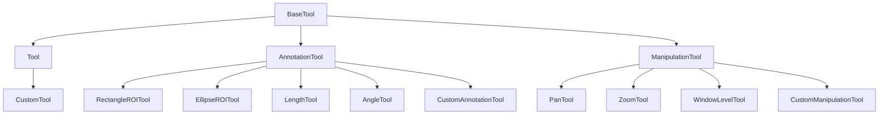
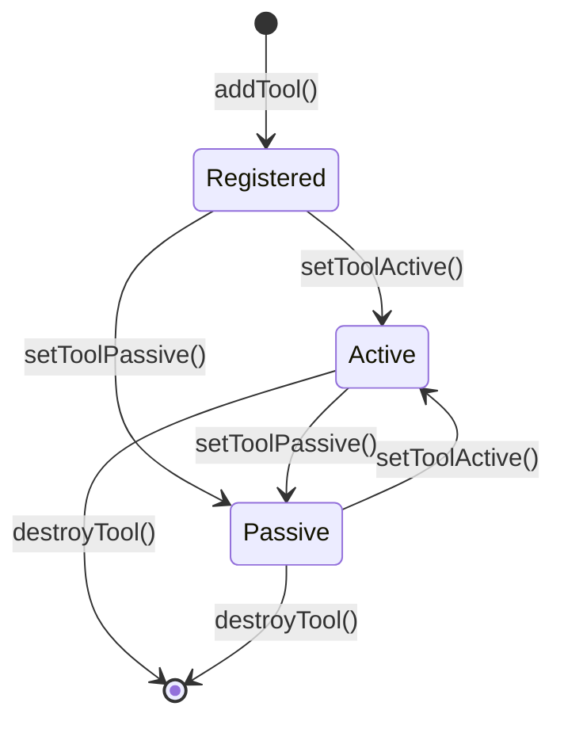

# 自定义工具开发指南

**目标**: 学习如何为 Cornerstone3D 开发自定义工具

**预计时间**: 90 分钟

**难度**: 高级

**前置要求**:
- [x] 已完成 [第一个影像查看器](../getting-started/first-viewer.md)
- [x] 已完成 [基本交互](../getting-started/basic-interactions.md)
- [x] 已完成 [标注工具](./annotations.md)
- [x] 熟悉 TypeScript 和面向对象编程

---

## 概述

Cornerstone3D 提供了丰富的内置工具，但在某些情况下，你可能需要开发自定义工具来满足特定需求。

**自定义工具的应用场景**:
- 🎨 **自定义标注**: 特定领域的标注需求
- 🔬 **专业测量**: 医疗、科研等专业测量工具
- 🤖 **智能交互**: AI 辅助的交互工具
- 📊 **数据分析**: 影像数据分析工具
- 🖌️ **特殊效果**: 自定义渲染效果

**工具类型**:
- **Tool（工具）**: 基础工具类
- **AnnotationTool（标注工具）**: 创建标注的工具
- **ManipulationTool（操作工具）**: 操作影像的工具（缩放、平移等）
- **SegmentationTool（分割工具）**: 图像分割工具

---

## 工具架构

### 工具继承层次



### 工具生命周期



---

## 2. 开发自定义操作工具

### 2.1 基础工具模板

```typescript
import { Tool } from '@cornerstonejs/tools';

// 自定义工具类
class CustomTool extends Tool {
  // 工具名称
  static readonly toolName = 'CustomTool';

  // 工具配置
  protected configuration = {
    // 默认配置
  };

  // 构造函数
  constructor(toolProps = {}, defaultConfiguration = {}) {
    super(toolProps, defaultConfiguration);
  }

  // 工具激活时调用
  public toolActiveCallback = (
    toolName: string,
    isToolActive: boolean
  ): void => {
    console.log('工具激活状态改变:', toolName, isToolActive);
  };

  // 鼠标按下事件
  public preMouseDownCallback = (
    event: Types.EventTypes.MouseMouseEvent,
    toolName: string
  ): boolean => {
    // 返回 false 阻止事件传播
    return true;
  };

  // 鼠标移动事件
  public mouseMoveCallback = (
    event: Types.EventTypes.MouseMoveMouseEvent,
    toolName: string
  ): void => {
    // 处理鼠标移动
  };

  // 鼠标释放事件
  public mouseUpCallback = (
    event: Types.EventTypes.MouseMouseEvent,
    toolName: string
  ): void => {
    // 处理鼠标释放
  };
}

// 导出工具
export default CustomTool;
```

### 2.2 示例：十字线工具

```typescript
import { Tool } from '@cornerstonejs/tools';

// 十字线工具：在影像上显示可移动的十字线
class CrosshairTool extends Tool {
  static readonly toolName = 'CrosshairTool';

  protected configuration = {
    // 十字线颜色
    color: 'rgb(255, 0, 0)',
    // 十字线宽度
    lineWidth: 1,
  };

  private crosshairPosition: Types.Point2 = { x: 0, y: 0 };

  public toolActiveCallback = (
    toolName: string,
    isToolActive: boolean
  ): void => {
    if (isToolActive) {
      console.log('十字线工具已激活');
    }
  };

  public mouseMoveCallback = (
    event: Types.EventTypes.MouseMoveMouseEvent,
    toolName: string
  ): void => {
    // 更新十字线位置
    this.crosshairPosition = {
      x: event.currentPoints.canvas.x,
      y: event.currentPoints.canvas.y,
    };

    // 触发自定义事件通知工具位置更新
    const eventDetails = {
      ...event,
      crosshairPosition: this.crosshairPosition,
    };

    // 触发自定义事件
    this._triggerEvent(this.EVENTS.CROSSHAIR_MOVED, eventDetails);
  };

  // 自定义事件类型
  private EVENTS = {
    CROSSHAIR_MOVED: 'CROSSHAIR_MOVED',
  };

  private _triggerEvent(
    eventType: string,
    eventDetails: any
  ): void {
    // 触发自定义事件
    // 具体实现取决于 Cornerstone3D 版本
  }
}

export default CrosshairTool;
```

---

## 3. 开发自定义标注工具

### 3.1 标注工具模板

```typescript
import { AnnotationTool } from '@cornerstonejs/tools';

// 自定义标注工具
class CustomAnnotationTool extends AnnotationTool {
  static readonly toolName = 'CustomAnnotationTool';

  protected configuration = {
    // 默认标注样式
    color: 'rgb(0, 255, 0)',
    lineWidth: 2,
  };

  // 工具是否正在编辑
  protected isEditing: boolean = false;

  // 当前正在绘制的标注
  protected currentAnnotation: Types.Annotation | null = null;

  // 鼠标按下：开始绘制标注
  public mouseMouseDownCallback = (
    event: Types.EventTypes.MouseMouseDownActivateMouseEvent,
    toolName: string
  ): void => {
    const { currentPoints, viewportId } = event.detail;

    // 创建新标注
    const newAnnotation = {
      metadata: {
        toolName: this.toolName,
        viewportId,
        // 其他元数据
      },
      data: {
        // 标注数据
        points: [currentPoints.world],
        label: {
          value: '自定义标注',
        },
      },
    };

    this.currentAnnotation = newAnnotation;
    this.isEditing = true;
  };

  // 鼠标移动：更新标注
  public mouseMouseMoveCallback = (
    event: Types.EventTypes.MouseMoveMouseEvent,
    toolName: string
  ): void => {
    if (!this.isEditing || !this.currentAnnotation) {
      return;
    }

    const { currentPoints } = event.detail;

    // 更新标注数据
    this.currentAnnotation.data.points.push(currentPoints.world);

    // 重新渲染
    const viewport = this.getViewport(event.detail.viewportId);
    viewport.render();
  };

  // 鼠标释放：完成标注
  public mouseMouseUpCallback = (
    event: Types.EventTypes.MouseMouseUpMouseEvent,
    toolName: string
  ): void => {
    if (!this.isEditing || !this.currentAnnotation) {
      return;
    }

    // 添加标注到存储
    const { annotationState } = await import('@cornerstonejs/tools');
    annotationState.addAnnotation(this.currentAnnotation);

    // 重置状态
    this.currentAnnotation = null;
    this.isEditing = false;

    // 触发标注完成事件
    const eventDetail = {
      annotation: this.currentAnnotation,
    };

    // 触发事件
    this._triggerEvent(Enums.Events.ANNOTATION_COMPLETED, eventDetail);
  };

  // 渲染标注
  public renderAnnotation = (
    viewport: Types.IViewport,
    annotation: Types.Annotation
  ): void => {
    const { data } = annotation;
    const { points } = data;

    // 获取 Canvas 上下文
    const canvas = this.getCanvas(viewport);
    const ctx = canvas.getContext('2d')!;

    // 转换世界坐标到 Canvas 坐标
    const canvasPoints = points.map(point =>
      this.worldToCanvas(viewport, point)
    );

    // 绘制标注
    ctx.beginPath();
    ctx.strokeStyle = this.configuration.color;
    ctx.lineWidth = this.configuration.lineWidth;

    canvasPoints.forEach((point, index) => {
      if (index === 0) {
        ctx.moveTo(point.x, point.y);
      } else {
        ctx.lineTo(point.x, point.y);
      }
    });

    ctx.stroke();

    // 绘制标签
    if (data.label) {
      const lastPoint = canvasPoints[canvasPoints.length - 1];
      ctx.fillStyle = this.configuration.color;
      ctx.font = '14px Arial';
      ctx.fillText(data.label.value, lastPoint.x + 10, lastPoint.y);
    }
  };

  // 辅助方法：世界坐标转 Canvas 坐标
  private worldToCanvas(
    viewport: Types.IViewport,
    worldPoint: Types.Point3
  ): Types.Point2 {
    // 实现坐标转换
    // 具体实现取决于 Cornerstone3D 版本
    return { x: 0, y: 0 };
  }

  // 辅助方法：获取 Canvas
  private getCanvas(viewport: Types.IViewport): HTMLCanvasElement {
    // 获取 Canvas 元素
    // 具体实现取决于 Cornerstone3D 版本
    return document.createElement('canvas');
  }

  // 辅助方法：获取视口
  private getViewport(viewportId: string): Types.IViewport {
    // 获取视口实例
    const renderingEngine = this.getRenderingEngine();
    return renderingEngine.getViewport(viewportId);
  }

  // 辅助方法：获取渲染引擎
  private getRenderingEngine(): Types.IRenderingEngine {
    // 获取渲染引擎实例
    // 具体实现取决于应用架构
    return {} as Types.IRenderingEngine;
  }
}

export default CustomAnnotationTool;
```

### 3.2 示例：箭头标注工具

```typescript
import { AnnotationTool } from '@cornerstonejs/tools';

// 箭头标注工具：带箭头的直线标注
class ArrowAnnotationTool extends AnnotationTool {
  static readonly toolName = 'ArrowAnnotationTool';

  protected configuration = {
    // 箭头颜色
    color: 'rgb(255, 0, 0)',
    // 线宽
    lineWidth: 2,
    // 箭头大小
    arrowSize: 10,
  };

  private startPoint: Types.Point3 | null = null;
  private endPoint: Types.Point3 | null = null;

  public mouseMouseDownCallback = (
    event: Types.EventTypes.MouseMouseDownActivateMouseEvent,
    toolName: string
  ): void => {
    const { currentPoints, viewportId } = event.detail;

    this.startPoint = currentPoints.world;
    this.endPoint = currentPoints.world;
  };

  public mouseMouseMoveCallback = (
    event: Types.EventTypes.MouseMoveMouseEvent,
    toolName: string
  ): void => {
    if (!this.startPoint) {
      return;
    }

    const { currentPoints, viewportId } = event.detail;
    this.endPoint = currentPoints.world;

    // 重新渲染
    const viewport = this.getViewport(viewportId);
    viewport.render();

    // 绘制临时箭头
    this.drawTemporaryArrow(viewport);
  };

  public mouseMouseUpCallback = (
    event: Types.EventTypes.MouseMouseUpMouseEvent,
    toolName: string
  ): void => {
    if (!this.startPoint || !this.endPoint) {
      return;
    }

    // 创建箭头标注
    const annotation = {
      metadata: {
        toolName: this.toolName,
        viewportId: event.detail.viewportId,
      },
      data: {
        startPoint: this.startPoint,
        endPoint: this.endPoint,
        label: {
          value: '箭头标注',
        },
      },
    };

    // 添加标注
    const { annotationState } = await import('@cornerstonejs/tools');
    annotationState.addAnnotation(annotation);

    // 重置状态
    this.startPoint = null;
    this.endPoint = null;

    // 渲染
    const viewport = this.getViewport(event.detail.viewportId);
    viewport.render();
  };

  // 绘制临时箭头（在鼠标移动时）
  private drawTemporaryArrow(viewport: Types.IViewport): void {
    if (!this.startPoint || !this.endPoint) {
      return;
    }

    const canvas = this.getCanvas(viewport);
    const ctx = canvas.getContext('2d')!;

    const start = this.worldToCanvas(viewport, this.startPoint);
    const end = this.worldToCanvas(viewport, this.endPoint);

    // 绘制箭头
    ctx.beginPath();
    ctx.strokeStyle = this.configuration.color;
    ctx.lineWidth = this.configuration.lineWidth;
    ctx.moveTo(start.x, start.y);
    ctx.lineTo(end.x, end.y);
    ctx.stroke();

    // 绘制箭头头部
    this.drawArrowHead(ctx, start, end);
  }

  // 绘制箭头头部
  private drawArrowHead(
    ctx: CanvasRenderingContext2D,
    start: Types.Point2,
    end: Types.Point2
  ): void {
    const angle = Math.atan2(end.y - start.y, end.x - start.x);
    const arrowSize = this.configuration.arrowSize;

    ctx.beginPath();
    ctx.moveTo(end.x, end.y);
    ctx.lineTo(
      end.x - arrowSize * Math.cos(angle - Math.PI / 6),
      end.y - arrowSize * Math.sin(angle - Math.PI / 6)
    );
    ctx.moveTo(end.x, end.y);
    ctx.lineTo(
      end.x - arrowSize * Math.cos(angle + Math.PI / 6),
      end.y - arrowSize * Math.sin(angle + Math.PI / 6)
    );
    ctx.stroke();
  }
}

export default ArrowAnnotationTool;
```

---

## 4. 注册和使用自定义工具

### 4.1 注册工具

```typescript
import { addTool, ToolGroupManager } from '@cornerstonejs/tools';
import CustomTool from './tools/CustomTool';
import ArrowAnnotationTool from './tools/ArrowAnnotationTool';

// 添加自定义工具到工具库
addTool(CustomTool);
addTool(ArrowAnnotationTool);

// 创建工具组
const customToolGroup = ToolGroupManager.createToolGroup('customToolGroup');

// 添加工具到工具组
customToolGroup.addTool(CustomTool.toolName);
customToolGroup.addTool(ArrowAnnotationTool.toolName);

// 添加视口到工具组
customToolGroup.addViewport('my-viewport', 'my-engine');

// 激活工具
customToolGroup.setToolActive(CustomTool.toolName, {
  bindings: [{ mouseButton: Enums.MouseBindings.Primary }],
});
```

### 4.2 在 React 中使用

```typescript
import React, { useEffect } from 'react';
import { ToolGroupManager, Enums } from '@cornerstonejs/tools';
import CustomTool from './tools/CustomTool';

const CustomToolButton = () => {
  useEffect(() => {
    // 添加工具
    addTool(CustomTool);

    return () => {
      // 清理工具（可选）
    };
  }, []);

  const toggleCustomTool = () => {
    const toolGroup = ToolGroupManager.getToolGroup('myToolGroup');

    // 切换工具激活状态
    const isActive = toolGroup.isToolActive(CustomTool.toolName);

    if (isActive) {
      toolGroup.setToolPassive(CustomTool.toolName);
    } else {
      toolGroup.setToolActive(CustomTool.toolName, {
        bindings: [{ mouseButton: Enums.MouseBindings.Primary }],
      });
    }
  };

  return (
    <button onClick={toggleCustomTool}>
      自定义工具
    </button>
  );
};

export default CustomToolButton;
```

---

## 5. 高级功能

### 5.1 工具配置

```typescript
// 允许用户自定义工具配置
interface CustomToolConfiguration {
  color: string;
  lineWidth: number;
  opacity: number;
}

class ConfigurableTool extends Tool {
  protected configuration: CustomToolConfiguration;

  constructor(
    toolProps = {},
    defaultConfiguration: CustomToolConfiguration = {
      color: 'rgb(255, 0, 0)',
      lineWidth: 2,
      opacity: 1,
    }
  ) {
    super(toolProps, defaultConfiguration);
    this.configuration = { ...defaultConfiguration, ...defaultConfiguration };
  }

  // 允许运行时修改配置
  public setConfiguration(config: Partial<CustomToolConfiguration>): void {
    this.configuration = { ...this.configuration, ...config };

    // 重新渲染视口
    this.triggerRenderingToolModification();
  }

  // 获取当前配置
  public getConfiguration(): CustomToolConfiguration {
    return { ...this.configuration };
  }
}
```

### 5.2 工具快捷键

```typescript
import { keyboardEventManager } from '@cornerstonejs/tools';

// 注册快捷键
keyboardEventManager.setKeyboardShortcut({
  keys: ['a'], // 按 'a' 键
  commandName: 'activateCustomTool',
  commandCallback: () => {
    const toolGroup = ToolGroupManager.getToolGroup('myToolGroup');
    toolGroup.setToolActive(CustomTool.toolName, {
      bindings: [{ mouseButton: Enums.MouseBindings.Primary }],
    });
  },
});

// 移除快捷键
keyboardEventManager.removeKeyboardShortcut('activateCustomTool');
```

### 5.3 工具提示和光标

```typescript
class ToolWithCursor extends Tool {
  // 设置工具光标
  public getCursor = (): string => {
    return 'crosshair'; // 或 'pointer', 'move', 'grab' 等
  };

  // 设置工具提示
  public getTooltip = (): string => {
    return '自定义工具：点击并拖动以创建标注';
  };
}
```

---

## 6. 完整示例：角度测量工具

```typescript
import { AnnotationTool } from '@cornerstonejs/tools';

// 角度测量工具：测量两条线之间的角度
class AngleMeasurementTool extends AnnotationTool {
  static readonly toolName = 'AngleMeasurementTool';

  protected configuration = {
    color: 'rgb(0, 255, 0)',
    lineWidth: 2,
    showArc: true, // 是否显示角度弧线
  };

  private points: Types.Point3[] = [];

  public mouseMouseDownCallback = (
    event: Types.EventTypes.MouseMouseDownActivateMouseEvent
  ): void => {
    const { currentPoints } = event.detail;

    this.points.push(currentPoints.world);

    // 需要三个点：起点、顶点、终点
    if (this.points.length === 3) {
      this.completeAnnotation(event.detail.viewportId);
    }
  };

  public mouseMouseMoveCallback = (
    event: Types.EventTypes.MouseMoveMouseEvent
  ): void => {
    if (this.points.length === 0) {
      return;
    }

    const viewport = this.getViewport(event.detail.viewportId);
    viewport.render();

    // 绘制临时角度
    this.drawTemporaryAngle(viewport, event.detail.currentPoints.world);
  };

  private completeAnnotation(viewportId: string): void {
    const [startPoint, vertexPoint, endPoint] = this.points;

    // 计算角度
    const angle = this.calculateAngle(startPoint, vertexPoint, endPoint);

    // 创建标注
    const annotation = {
      metadata: {
        toolName: this.toolName,
        viewportId,
      },
      data: {
        points: [startPoint, vertexPoint, endPoint],
        angle: angle,
        label: {
          value: `${angle.toFixed(1)}°`,
        },
      },
    };

    // 添加标注
    const { annotationState } = await import('@cornerstonejs/tools');
    annotationState.addAnnotation(annotation);

    // 重置
    this.points = [];

    // 渲染
    const viewport = this.getViewport(viewportId);
    viewport.render();
  }

  // 计算角度
  private calculateAngle(
    p1: Types.Point3,
    vertex: Types.Point3,
    p2: Types.Point3
  ): number {
    const v1 = {
      x: p1.x - vertex.x,
      y: p1.y - vertex.y,
    };

    const v2 = {
      x: p2.x - vertex.x,
      y: p2.y - vertex.y,
    };

    const dot = v1.x * v2.x + v1.y * v2.y;
    const mag1 = Math.sqrt(v1.x * v1.x + v1.y * v1.y);
    const mag2 = Math.sqrt(v2.x * v2.x + v2.y * v2.y);

    const cosAngle = dot / (mag1 * mag2);
    const angleRad = Math.acos(Math.max(-1, Math.min(1, cosAngle)));

    return (angleRad * 180) / Math.PI; // 转换为度
  }

  // 绘制临时角度
  private drawTemporaryAngle(
    viewport: Types.IViewport,
    currentPoint: Types.Point3
  ): void {
    if (this.points.length === 0) {
      return;
    }

    const canvas = this.getCanvas(viewport);
    const ctx = canvas.getContext('2d')!;

    ctx.strokeStyle = this.configuration.color;
    ctx.lineWidth = this.configuration.lineWidth;

    // 绘制已有点的连线
    const canvasPoints = this.points.map(p => this.worldToCanvas(viewport, p));

    if (this.points.length === 1) {
      // 只有一个点，绘制从该点到鼠标位置的线
      const currentCanvas = this.worldToCanvas(viewport, currentPoint);
      ctx.beginPath();
      ctx.moveTo(canvasPoints[0].x, canvasPoints[0].y);
      ctx.lineTo(currentCanvas.x, currentCanvas.y);
      ctx.stroke();
    } else if (this.points.length === 2) {
      // 有两个点，绘制两条线和角度弧
      const currentCanvas = this.worldToCanvas(viewport, currentPoint);

      ctx.beginPath();
      ctx.moveTo(canvasPoints[0].x, canvasPoints[0].y);
      ctx.lineTo(canvasPoints[1].x, canvasPoints[1].y);
      ctx.lineTo(currentCanvas.x, currentCanvas.y);
      ctx.stroke();

      // 绘制角度弧线（可选）
      if (this.configuration.showArc) {
        this.drawAngleArc(ctx, canvasPoints[0], canvasPoints[1], currentCanvas);
      }
    }
  }

  // 绘制角度弧线
  private drawAngleArc(
    ctx: CanvasRenderingContext2D,
    p1: Types.Point2,
    vertex: Types.Point2,
    p2: Types.Point2
  ): void {
    const radius = 30;
    const startAngle = Math.atan2(p1.y - vertex.y, p1.x - vertex.x);
    const endAngle = Math.atan2(p2.y - vertex.y, p2.x - vertex.x);

    ctx.beginPath();
    ctx.arc(vertex.x, vertex.y, radius, startAngle, endAngle);
    ctx.stroke();
  }
}

export default AngleMeasurementTool;
```

---

## 7. 调试和测试

### 7.1 调试工具

```typescript
// 启用工具调试模式
const toolGroup = ToolGroupManager.getToolGroup('myToolGroup');

// 获取工具状态
const toolState = toolGroup.getToolState();
console.log('工具状态:', toolState);

// 获取工具配置
const tool = toolGroup.getToolInstance(CustomTool.toolName);
console.log('工具配置:', tool.getConfiguration());
```

### 7.2 单元测试

```typescript
import CustomTool from './CustomTool';

describe('CustomTool', () => {
  let tool: CustomTool;

  beforeEach(() => {
    tool = new CustomTool();
  });

  test('工具名称正确', () => {
    expect(CustomTool.toolName).toBe('CustomTool');
  });

  test('配置正确应用', () => {
    const config = { color: 'rgb(255, 0, 0)' };
    tool = new CustomTool({}, config);

    expect(tool.getConfiguration().color).toBe('rgb(255, 0, 0)');
  });
});
```

---

## 8. 常见问题

### Q1: 工具不响应鼠标事件？

**检查清单**:
- ✅ 工具已添加到工具库（`addTool`）
- ✅ 工具已添加到工具组（`toolGroup.addTool`）
- ✅ 视口已添加到工具组（`toolGroup.addViewport`）
- ✅ 工具已激活（`toolGroup.setToolActive`）

### Q2: 自定义标注不显示？

**解决方案**:
- ✅ 检查 `renderAnnotation` 方法实现
- ✅ 确保坐标转换正确
- ✅ 检查 Canvas 绘图上下文

### Q3: 如何共享工具状态？

**解决方案**: 使用全局状态管理或工具组共享配置

```typescript
// 使用工具组共享配置
toolGroup.setConfiguration({
  sharedColor: 'rgb(255, 0, 0)',
  sharedLineWidth: 2,
});
```

---

## 9. 最佳实践

- ✅ **命名规范**: 工具名称使用 PascalCase，以 "Tool" 结尾
- ✅ **类型安全**: 使用 TypeScript 类型定义所有数据结构
- ✅ **错误处理**: 添加适当的错误处理和边界检查
- ✅ **性能优化**: 避免在 `mouseMove` 中进行昂贵操作
- ✅ **文档化**: 添加 JSDoc 注释说明工具用法
- ✅ **可测试性**: 编写单元测试确保工具正确性
- ✅ **可配置性**: 提供配置选项让用户自定义工具行为

---

## 10. 下一步

- 📝 [标注工具](./annotations.md) - 查看更多标注工具示例
- 🤖 [AI 集成](./ai-integration.md) - 集成 AI 到自定义工具
- ⚡ [性能优化](./performance-optimization.md) - 优化工具性能

---

## 相关资源

- 📚 [官方文档 - Custom Tools](https://www.cornerstonejs.org/docs/tools/customTools)
- 💻 [示例项目 - 自定义工具](../examples/advanced-viewer/)
- 🔍 [API 文档 - Tool Base Class](https://www.cornerstonejs.org/docs/api/classes/tools.Tool)

---

**需要帮助？** 查看 [故障排查文档](../troubleshooting/common-errors.md)
