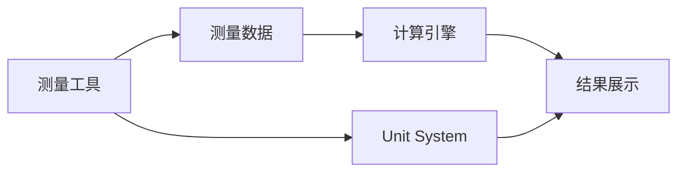

# 测量工具集成指南

**目标**: 学习如何在 Cornerstone3D 应用中集成和使用测量（Measurement）工具

**预计时间**: 50 分钟

**难度**: 中级

**前置要求**:
- [x] 已完成 [第一个影像查看器](../getting-started/first-viewer.md)
- [x] 已完成 [基本交互](../getting-started/basic-interactions.md)
- [x] 已完成 [标注工具](./annotations.md)（推荐）

---

## 概述

医学影像测量是诊断和评估的关键功能。Cornerstone3D 提供了全面的测量工具，包括：

- **长度测量**: 测量两点之间的直线距离
- **角度测量**: 测量三条线形成的角度
- **面积测量**: 测量 ROI 的面积
- **短轴/长轴测量**: 测量椭圆的长短轴
- **Cobb 角测量**: 脊柱侧弯角度测量
- **矩形/椭圆测量**: 测量规则形状的尺寸

测量工具在临床应用中非常重要：
- 肿瘤大小评估
- 器官尺寸测量
- 角度评估（如脊柱侧弯、关节角度）
- 治疗效果对比

---

## 测量工具基础

### 1. 测量系统架构



**关键概念**:

- **Measurement Tool（测量工具）**: 执行测量的工具
- **Measurement Data（测量数据）**: 存储测量点的坐标和元数据
- **Unit System（单位系统）**: 管理测量单位（mm、cm、英寸等）
- **Calculation Engine（计算引擎）**: 计算测量结果的核心逻辑

---

## 2. 启用基础测量工具

### 步骤 1: 导入测量工具

```typescript
import {
  addTool,
  ToolGroupManager,
  Enums,
} from '@cornerstonejs/tools';

// 导入测量工具
import { LengthTool } from '@cornerstonejs/tools';
import { AngleTool } from '@cornerstonejs/tools';
import { RectangleROITool } from '@cornerstonejs/tools'; // 可测量面积
import { EllipseROITool } from '@cornerstonejs/tools';   // 可测量面积和长短轴
import { CobbAngleTool } from '@cornerstonejs/tools';
```

### 步骤 2: 添加工具到工具库

```typescript
// 添加测量工具到工具库
addTool(LengthTool);
addTool(AngleTool);
addTool(CobbAngleTool);
// RectangleROITool 和 EllipseROITool 通常已在标注工具中添加
```

### 步骤 3: 创建测量工具组

```typescript
// 创建专门的测量工具组
const measurementToolGroup = ToolGroupManager.createToolGroup('measurementToolGroup');

// 添加测量工具
measurementToolGroup.addTool(LengthTool.toolName);
measurementToolGroup.addTool(AngleTool.toolName);
measurementToolGroup.addTool(CobbAngleTool.toolName);

// 将视口添加到工具组
measurementToolGroup.addViewport('myViewportId', 'myRenderingEngineId');
```

### 步骤 4: 激活测量工具

```typescript
// 激活长度测量工具
measurementToolGroup.setToolActive(LengthTool.toolName, {
  bindings: [{ mouseButton: Enums.MouseBindings.Primary }],
});

// 激活角度测量工具
measurementToolGroup.setToolActive(AngleTool.toolName, {
  bindings: [{ mouseButton: Enums.MouseBindings.Primary }],
});
```

---

## 3. 测量工具类型详解

### 3.1 长度测量工具 (LengthTool)

**用途**: 测量两点之间的直线距离

**使用场景**: 测量肿瘤大小、病灶直径、器官尺寸

```typescript
// 激活长度测量工具
measurementToolGroup.setToolActive(LengthTool.toolName, {
  bindings: [{ mouseButton: Enums.MouseBindings.Primary }],
});

// 监听测量完成事件
import { eventTarget } from '@cornerstonejs/tools';

eventTarget.addEventListener(
  Enums.Events.MEASUREMENT_COMPLETED,
  (event) => {
    const annotation = event.detail.annotation;

    if (annotation.metadata.toolName === LengthTool.toolName) {
      const { points } = annotation.data;
      const distance = annotation.data.cachedStats.linearLength;

      console.log('起点:', points[0]);
      console.log('终点:', points[1]);
      console.log('距离:', distance, 'mm');
    }
  }
);
```

**测量结果展示**:

```typescript
// 在 UI 中显示测量结果
const displayLength = (annotation: Types.Annotation) => {
  const distance = annotation.data.cachedStats.linearLength;
  const unit = 'mm';

  return `距离: ${distance.toFixed(2)} ${unit}`;
};
```

### 3.2 角度测量工具 (AngleTool)

**用途**: 测量三条线形成的角度

**使用场景**: 关节角度测量、骨折角度评估

```typescript
// 激活角度测量工具
measurementToolGroup.setToolActive(AngleTool.toolName, {
  bindings: [{ mouseButton: Enums.MouseBindings.Primary }],
});

// 监听测量完成事件
eventTarget.addEventListener(
  Enums.Events.MEASUREMENT_COMPLETED,
  (event) => {
    const annotation = event.detail.annotation;

    if (annotation.metadata.toolName === AngleTool.toolName) {
      const { points } = annotation.data; // 三个点
      const angle = annotation.data.cachedStats.angle;

      console.log('点 1:', points[0]);
      console.log('顶点:', points[1]);
      console.log('点 3:', points[2]);
      console.log('角度:', angle.toFixed(2), '°');
    }
  }
);
```

**角度计算说明**:
- 角度由三个点定义：起点、顶点、终点
- 角度 = ∠(起点 - 顶点 - 终点)

### 3.3 Cobb 角测量工具 (CobbAngleTool)

**用途**: 测量脊柱侧弯角度（Cobb 角）

**使用场景**: 脊柱侧弯诊断和评估

```typescript
// 激活 Cobb 角测量工具
measurementToolGroup.setToolActive(CobbAngleTool.toolName, {
  bindings: [{ mouseButton: Enums.MouseBindings.Primary }],
});

// Cobb 角需要测量四条线（两对平行线）
eventTarget.addEventListener(
  Enums.Events.MEASUREMENT_COMPLETED,
  (event) => {
    const annotation = event.detail.annotation;

    if (annotation.metadata.toolName === CobbAngleTool.toolName) {
      const cobbAngle = annotation.data.cachedStats.angle;

      console.log('Cobb 角:', cobbAngle.toFixed(2), '°');
    }
  }
);
```

### 3.4 矩形 ROI 测量 (RectangleROITool)

**用途**: 测量矩形区域的尺寸和面积

```typescript
// 激活矩形 ROI 工具
measurementToolGroup.setToolActive(RectangleROITool.toolName, {
  bindings: [{ mouseButton: Enums.MouseBindings.Primary }],
});

// 监听测量完成事件
eventTarget.addEventListener(
  Enums.Events.MEASUREMENT_COMPLETED,
  (event) => {
    const annotation = event.detail.annotation;

    if (annotation.metadata.toolName === RectangleROITool.toolName) {
      const { rectangle } = annotation.data;
      const stats = annotation.data.cachedStats;

      console.log('宽度:', stats.width, 'mm');
      console.log('高度:', stats.height, 'mm');
      console.log('面积:', stats.area, 'mm²');
      console.log('平均像素值:', stats.mean);
      console.log('标准差:', stats.stdDev);
      console.log('最小值:', stats.min);
      console.log('最大值:', stats.max);
    }
  }
);
```

### 3.5 椭圆 ROI 测量 (EllipseROITool)

**用途**: 测量椭圆区域的尺寸和面积

```typescript
// 激活椭圆 ROI 工具
measurementToolGroup.setToolActive(EllipseROITool.toolName, {
  bindings: [{ mouseButton: Enums.MouseBindings.Primary }],
});

// 监听测量完成事件
eventTarget.addEventListener(
  Enums.Events.MEASUREMENT_COMPLETED,
  (event) => {
    const annotation = event.detail.annotation;

    if (annotation.metadata.toolName === EllipseROITool.toolName) {
      const stats = annotation.data.cachedStats;

      console.log('长轴:', stats.majorAxis, 'mm');
      console.log('短轴:', stats.minorAxis, 'mm');
      console.log('面积:', stats.area, 'mm²');
      console.log('平均像素值:', stats.mean);
      console.log('标准差:', stats.stdDev);
    }
  }
);
```

---

## 4. 单位系统配置

Cornerstone3D 支持多种测量单位。正确配置单位系统非常重要。

### 4.1 配置单位系统

```typescript
import { configurable } from '@cornerstonejs/core';

// 设置全局单位系统
configurable.units.unitService.setUnitSystem('metric');

// 支持的单位系统：
// - 'metric': 公制（mm, cm, m）
// - 'imperial': 英制（in, ft, yd）
// - 'si': 国际单位制（m, kg, s）
```

### 4.2 自定义单位显示

```typescript
// 配置特定工具的单位
const unitOptions = {
  length: 'mm',   // 或 'cm', 'm'
  area: 'mm²',    // 或 'cm²', 'm²'
  angle: '°',     // 度
};

// 在显示测量结果时应用单位
const formatMeasurement = (value: number, unit: string): string => {
  return `${value.toFixed(2)} ${unit}`;
};
```

---

## 5. 测量结果管理

### 5.1 获取所有测量结果

```typescript
import { annotationState } from '@cornerstonejs/tools';

// 获取特定影像的所有测量
const imageId = 'wadors:https://...';
const annotations = annotationState.getAnnotations(imageId);

// 过滤出测量类型的标注
const measurements = annotations.filter((annotation) => {
  const toolName = annotation.metadata.toolName;
  return [
    LengthTool.toolName,
    AngleTool.toolName,
    RectangleROITool.toolName,
    EllipseROITool.toolName,
  ].includes(toolName);
});

console.log('测量结果数量:', measurements.length);
```

### 5.2 导出测量报告

```typescript
// 生成测量报告
const generateMeasurementReport = (imageId: string) => {
  const annotations = annotationState.getAnnotations(imageId);
  const measurements = annotations.filter((annotation) =>
    annotation.metadata.toolName.includes('Tool')
  );

  const report = {
    imageId,
    timestamp: new Date().toISOString(),
    measurements: measurements.map((annotation) => ({
      toolName: annotation.metadata.toolName,
      label: annotation.data.label?.value || '未命名',
      stats: annotation.data.cachedStats,
    })),
  };

  return JSON.stringify(report, null, 2);
};

// 下载报告
const downloadReport = (report: string) => {
  const blob = new Blob([report], { type: 'application/json' });
  const url = URL.createObjectURL(blob);
  const a = document.createElement('a');
  a.href = url;
  a.download = `measurement-report-${Date.now()}.json`;
  a.click();
  URL.revokeObjectURL(url);
};
```

### 5.3 测量结果对比

```typescript
// 对比不同时间的测量结果
const compareMeasurements = (
  currentMeasurements: Types.Annotation[],
  previousMeasurements: Types.Annotation[]
) => {
  const comparison = currentMeasurements.map((current) => {
    const previous = previousMeasurements.find(
      (prev) => prev.annotationUID === current.annotationUID
    );

    if (!previous) return null;

    const currentValue = current.data.cachedStats.linearLength;
    const previousValue = previous.data.cachedStats.linearLength;
    const change = currentValue - previousValue;
    const percentChange = (change / previousValue) * 100;

    return {
      label: current.data.label?.value || '未命名',
      currentValue,
      previousValue,
      change,
      percentChange,
    };
  });

  return comparison.filter(Boolean);
};
```

---

## 6. 完整示例：测量工具面板

下面是一个完整的 React 组件示例：

```typescript
import React, { useState, useEffect } from 'react';
import {
  ToolGroupManager,
  Enums,
  eventTarget,
  Types,
} from '@cornerstonejs/tools';
import {
  LengthTool,
  AngleTool,
  CobbAngleTool,
  RectangleROITool,
  EllipseROITool,
} from '@cornerstonejs/tools';

interface Measurement {
  annotationUID: string;
  toolName: string;
  label: string;
  value: number;
  unit: string;
}

const MeasurementPanel = () => {
  const [activeTool, setActiveTool] = useState<string | null>(null);
  const [measurements, setMeasurements] = useState<Measurement[]>([]);

  // 初始化工具组
  useEffect(() => {
    const toolGroup = ToolGroupManager.createToolGroup('measurementGroup');
    toolGroup.addTool(LengthTool.toolName);
    toolGroup.addTool(AngleTool.toolName);
    toolGroup.addTool(CobbAngleTool.toolName);
    toolGroup.addTool(RectangleROITool.toolName);
    toolGroup.addTool(EllipseROITool.toolName);
    toolGroup.addViewport('myViewportId', 'myEngineId');

    // 监听测量完成事件
    const handleMeasurementCompleted = (event: any) => {
      const annotation = event.detail.annotation;
      const measurement = extractMeasurementData(annotation);

      setMeasurements((prev) => [...prev, measurement]);
    };

    eventTarget.addEventListener(
      Enums.Events.MEASUREMENT_COMPLETED,
      handleMeasurementCompleted
    );

    return () => {
      ToolGroupManager.destroyToolGroup('measurementGroup');
      eventTarget.removeEventListener(
        Enums.Events.MEASUREMENT_COMPLETED,
        handleMeasurementCompleted
      );
    };
  }, []);

  // 提取测量数据
  const extractMeasurementData = (annotation: Types.Annotation): Measurement => {
    const { toolName, annotationUID } = annotation.metadata;
    const { cachedStats, label } = annotation.data;

    let value = 0;
    let unit = '';

    switch (toolName) {
      case LengthTool.toolName:
        value = cachedStats.linearLength;
        unit = 'mm';
        break;
      case AngleTool.toolName:
      case CobbAngleTool.toolName:
        value = cachedStats.angle;
        unit = '°';
        break;
      case RectangleROITool.toolName:
      case EllipseROITool.toolName:
        value = cachedStats.area;
        unit = 'mm²';
        break;
    }

    return {
      annotationUID,
      toolName,
      label: label?.value || '未命名',
      value,
      unit,
    };
  };

  // 切换工具
  const toggleTool = (toolName: string) => {
    const toolGroup = ToolGroupManager.getToolGroup('measurementGroup');

    if (activeTool === toolName) {
      toolGroup.setToolPassive(toolName);
      setActiveTool(null);
    } else {
      if (activeTool) {
        toolGroup.setToolPassive(activeTool);
      }
      toolGroup.setToolActive(toolName, {
        bindings: [{ mouseButton: Enums.MouseBindings.Primary }],
      });
      setActiveTool(toolName);
    }
  };

  // 删除测量
  const deleteMeasurement = (annotationUID: string) => {
    const { annotationState } = require('@cornerstonejs/tools');
    annotationState.removeAnnotation(annotationUID);

    setMeasurements((prev) =>
      prev.filter((m) => m.annotationUID !== annotationUID)
    );
  };

  // 清除所有测量
  const clearAllMeasurements = () => {
    const { annotationState } = require('@cornerstonejs/tools');
    measurements.forEach((m) => {
      annotationState.removeAnnotation(m.annotationUID);
    });
    setMeasurements([]);
  };

  // 导出报告
  const exportReport = () => {
    const report = {
      timestamp: new Date().toISOString(),
      measurements,
    };

    const blob = new Blob([JSON.stringify(report, null, 2)], {
      type: 'application/json',
    });
    const url = URL.createObjectURL(blob);
    const a = document.createElement('a');
    a.href = url;
    a.download = `measurement-report-${Date.now()}.json`;
    a.click();
    URL.revokeObjectURL(url);
  };

  return (
    <div style={{ padding: '16px', border: '1px solid #ccc' }}>
      <h3>测量工具</h3>

      <div style={{ marginBottom: '16px' }}>
        <button
          onClick={() => toggleTool(LengthTool.toolName)}
          style={{
            backgroundColor:
              activeTool === LengthTool.toolName ? '#e0f7fa' : 'white',
            margin: '4px',
          }}
        >
          📏 长度测量
        </button>

        <button
          onClick={() => toggleTool(AngleTool.toolName)}
          style={{
            backgroundColor:
              activeTool === AngleTool.toolName ? '#e0f7fa' : 'white',
            margin: '4px',
          }}
        >
          📐 角度测量
        </button>

        <button
          onClick={() => toggleTool(CobbAngleTool.toolName)}
          style={{
            backgroundColor:
              activeTool === CobbAngleTool.toolName ? '#e0f7fa' : 'white',
            margin: '4px',
          }}
        >
          Cobb 角
        </button>

        <button
          onClick={() => toggleTool(RectangleROITool.toolName)}
          style={{
            backgroundColor:
              activeTool === RectangleROITool.toolName ? '#e0f7fa' : 'white',
            margin: '4px',
          }}
        >
          ⬜ 矩形 ROI
        </button>

        <button
          onClick={() => toggleTool(EllipseROITool.toolName)}
          style={{
            backgroundColor:
              activeTool === EllipseROITool.toolName ? '#e0f7fa' : 'white',
            margin: '4px',
          }}
        >
          ⭕ 椭圆 ROI
        </button>
      </div>

      <div style={{ marginBottom: '16px' }}>
        <button onClick={clearAllMeasurements} style={{ margin: '4px' }}>
          🗑️ 清除所有
        </button>
        <button onClick={exportReport} style={{ margin: '4px' }}>
          📄 导出报告
        </button>
      </div>

      <div style={{ marginTop: '16px' }}>
        <h4>测量结果 ({measurements.length})</h4>
        {measurements.length === 0 ? (
          <p>暂无测量结果</p>
        ) : (
          <ul style={{ listStyle: 'none', padding: 0 }}>
            {measurements.map((measurement) => (
              <li
                key={measurement.annotationUID}
                style={{
                  padding: '8px',
                  margin: '4px 0',
                  backgroundColor: '#f5f5f5',
                }}
              >
                <strong>{measurement.label}</strong>: {measurement.value.toFixed(2)} {measurement.unit}
                <button
                  onClick={() => deleteMeasurement(measurement.annotationUID)}
                  style={{ marginLeft: '8px' }}
                >
                  ❌
                </button>
              </li>
            ))}
          </ul>
        )}
      </div>
    </div>
  );
};

export default MeasurementPanel;
```

---

## 7. 高级功能

### 7.1 测量精度控制

```typescript
// 配置测量精度
const measurementPrecision = {
  length: 2,     // 保留 2 位小数
  area: 2,       // 保留 2 位小数
  angle: 1,      // 保留 1 位小数
};

const formatValue = (value: number, precision: number): string => {
  return value.toFixed(precision);
};
```

### 7.2 测量参考线

```typescript
// 某些工具支持显示参考线
// 参考线有助于提高测量精度和可重复性
```

### 7.3 自动测量建议

```typescript
// 基于影像内容自动建议测量工具
// 例如：检测到圆形结构时建议使用椭圆 ROI
const suggestMeasurementTool = (imageData: any): string => {
  // 实现基于影像分析的自动建议逻辑
  return EllipseROITool.toolName;
};
```

---

## 8. 常见问题

### Q1: 测量结果不准确？

**可能原因**:
- 像素间距（Pixel Spacing）元数据缺失或不正确
- 影像缩放比例不正确
- 单位系统配置错误

**解决方案**:
```typescript
// 检查元数据
const metadata = cornerstone.getMetaData('imagePixelModule', imageId);
console.log('像素间距:', metadata.pixelSpacing);
console.log('切片厚度:', metadata.sliceThickness);
```

### Q2: 如何测量 3D 结构？

**解决方案**: 使用 VolumeViewport 和 3D 测量工具（详见 [3D 体渲染](./volume-rendering.md)）

### Q3: 测量结果如何保存到 DICOM 文件？

**解决方案**: 使用 DICOM SR (Structured Report) 标准保存测量结果

```typescript
// 需要额外的库支持（如 dcmtk、fo-dicom）
// 这是高级功能，需要深入了解 DICOM SR 标准
```

---

## 9. 临床应用示例

### 9.1 肿瘤 RECIST 评估

```typescript
// RECIST (Response Evaluation Criteria in Solid Tumors)
// 标准化的肿瘤测量和评估方法

const recistMeasurement = {
  targetLesions: [
    {
      id: 'lesion-1',
      longestDiameter: 23.5, // mm
      location: '右肺上叶',
    },
    {
      id: 'lesion-2',
      longestDiameter: 18.2,
      location: '肝脏',
    },
  ],
  sumOfDiameters: 41.7, // mm
  response: 'PD', // Progressive Disease
};
```

### 9.2 脊柱 Cobb 角测量

```typescript
// 脊柱侧弯的 Cobb 角测量
// 需要测量四条线形成两个角度

const cobbAngleMeasurement = {
  upperEndPlate: {
    startPoint: { x: 100, y: 150 },
    endPoint: { x: 200, y: 150 },
  },
  lowerEndPlate: {
    startPoint: { x: 100, y: 250 },
    endPoint: { x: 200, y: 250 },
  },
  cobbAngle: 35.2, // 度
  severity: '中度', // < 25: 轻度, 25-40: 中度, > 40: 重度
};
```

---

## 10. 下一步

- 🎯 [3D 体渲染](./volume-rendering.md) - 学习 3D 测量
- 📊 [多视口同步](./multi-viewport.md) - 在多个视口中同步测量
- 🛠️ [自定义工具](./custom-tools.md) - 开发自定义测量工具

---

## 相关资源

- 📚 [官方文档 - 测量工具](https://www.cornerstonejs.org/docs/tools/measurement)
- 💻 [示例项目 - 测量工具](../examples/advanced-viewer/)
- 🔍 [API 文档 - Measurement API](https://www.cornerstonejs.org/docs/api/interfaces/types.Measurement)

---

**需要帮助？** 查看 [故障排查文档](../troubleshooting/common-errors.md)
