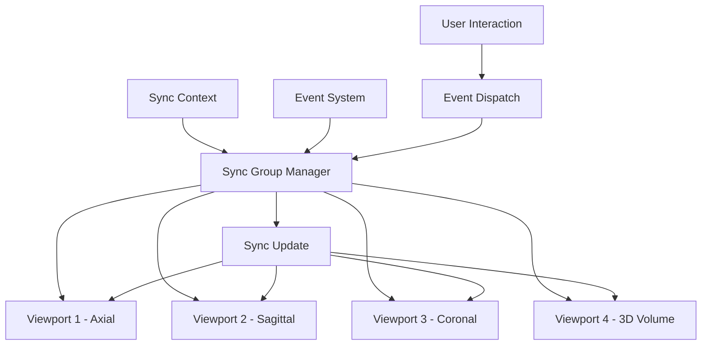

# 多视口同步指南

**目标**: 学习如何在 Cornerstone3D 中实现多视口联动和同步

**预计时间**: 45 分钟

**难度**: 高级

**前置要求**:
- [x] 已完成 [第一个影像查看器](../getting-started/first-viewer.md)
- [x] 已完成 [基本交互](../getting-started/basic-interactions.md)
- [x] 了解 RenderingEngine 和 Viewport 的概念

---

## 概述

多视口同步（Multi-Viewport Synchronization）是医学影像应用的核心功能之一，允许用户在多个视口中同时查看不同角度或不同序列的影像，并保持它们的同步。

**主要应用场景**:
- **MPR（多平面重建）**: 同一影像的横断面、冠状面、矢状面同时显示
- **序列对比**: 对比不同时间的影像（如治疗前后的 CT）
- **双能成像**: 同一部位的不同能谱影像对比
- **融合影像**: PET/CT、SPECT/CT 融合显示
- **协同读片**: 多个医生同时查看同一影像

**同步内容**:
- 🖼️ **影像同步**: 视口间影像索引同步
- 🔍 **缩放同步**: 视口间缩放级别同步
- 👆 **平移同步**: 视口间平移位置同步
- 🖱️ **窗宽窗位同步**: 视口间窗宽窗位值同步
- 📐 **标注同步**: 标注在不同视口间同步显示

---

## 多视口架构

### 架构图



**关键组件**:

- **SyncGroup**: 同步组，管理需要同步的视口
- **SyncContext**: 同步上下文，定义同步的范围和类型
- **SyncEvent**: 同步事件，触发同步的操作

---

## 2. 基础多视口设置

### 步骤 1: 创建多个 Viewport

```typescript
import { RenderingEngine, Enums } from '@cornerstonejs/core';

// 创建渲染引擎
const renderingEngine = new RenderingEngine('multi-viewport-engine');

// 创建 4 个视口容器
const axialContainer = document.getElementById('axial-viewport');
const sagittalContainer = document.getElementById('sagittal-viewport');
const coronalContainer = document.getElementById('coronal-viewport');
const volumeContainer = document.getElementById('volume-viewport');

// 启用 4 个视口
const viewportInputs = [
  {
    viewportId: 'axial-viewport',
    element: axialContainer,
    type: Enums.ViewportType.STACK,
  },
  {
    viewportId: 'sagittal-viewport',
    element: sagittalContainer,
    type: Enums.ViewportType.STACK,
  },
  {
    viewportId: 'coronal-viewport',
    element: coronalContainer,
    type: Enums.ViewportType.STACK,
  },
  {
    viewportId: 'volume-viewport',
    element: volumeContainer,
    type: Enums.ViewportType.VOLUME,
  },
];

renderingEngine.enableElements(viewportInputs);

// 获取视口实例
const axialViewport = renderingEngine.getViewport('axial-viewport');
const sagittalViewport = renderingEngine.getViewport('sagittal-viewport');
const coronalViewport = renderingEngine.getViewport('coronal-viewport');
const volumeViewport = renderingEngine.getViewport('volume-viewport');
```

### 步骤 2: 为不同视口加载影像

```typescript
// 为不同视口加载不同的影像序列
// 横断面（Axial）
axialViewport.setStack(axialImageIds, 0);

// 矢状面（Sagittal）
sagittalViewport.setStack(sagittalImageIds, 0);

// 冠状面（Coronal）
coronalViewport.setStack(coronalImageIds, 0);

// 3D 体积
volumeViewport.setVolumes([{ volumeId: 'my-volume-id' }]);

// 渲染所有视口
axialViewport.render();
sagittalViewport.render();
coronalViewport.render();
volumeViewport.render();
```

---

## 3. 创建同步组

Cornerstone3D 提供了强大的同步系统，可以轻松实现多视口同步。

### 3.1 基础同步组

```typescript
import { createSyncGroup, addToSyncGroup } from '@cornerstonejs/core';

// 创建同步组
const syncGroup = createSyncGroup('mpr-sync-group');

// 添加视口到同步组
addToSyncGroup('mpr-sync-group', 'axial-viewport');
addToSyncGroup('mpr-sync-group', 'sagittal-viewport');
addToSyncGroup('mpr-sync-group', 'coronal-viewport');
addToSyncGroup('mpr-sync-group', 'volume-viewport');
```

### 3.2 配置同步选项

```typescript
import { createSyncGroup, Enums } from '@cornerstonejs/core';

// 创建同步组并指定同步的内容
const syncGroup = createSyncGroup('mpr-sync-group', {
  // 同步缩放
  zoom: true,

  // 同步平移
  pan: true,

  // 同步窗宽窗位
  voiRange: true,

  // 同步影像索引（用于 StackViewport）
  stackScroll: true,
});
```

---

## 4. 实现不同类型的同步

### 4.1 影像索引同步（Stack Scroll Sync）

**用途**: 在横断面、矢状面、冠状面之间同步切片位置

```typescript
import { createSyncGroup } from '@cornerstonejs/core';

// 创建同步组
const syncGroup = createSyncGroup('stack-scroll-sync', {
  stackScroll: true, // 启用切片滚动同步
});

// 添加视口
syncGroup.addViewport('axial-viewport');
syncGroup.addViewport('sagittal-viewport');
syncGroup.addViewport('coronal-viewport');

// 当用户在一个视口中滚动切片时，其他视口会自动滚动到对应位置
```

### 4.2 缩放同步（Zoom Sync）

```typescript
import { createSyncGroup } from '@cornerstonejs/core';

const syncGroup = createSyncGroup('zoom-sync', {
  zoom: true, // 启用缩放同步
});

syncGroup.addViewport('axial-viewport');
syncGroup.addViewport('sagittal-viewport');

// 当用户在一个视口中缩放时，其他视口会同步缩放
```

### 4.3 平移同步（Pan Sync）

```typescript
import { createSyncGroup } from '@cornerstonejs/core';

const syncGroup = createSyncGroup('pan-sync', {
  pan: true, // 启用平移同步
});

syncGroup.addViewport('axial-viewport');
syncGroup.addViewport('sagittal-viewport');
syncGroup.addViewport('coronal-viewport');

// 当用户在一个视口中平移时，其他视口会同步平移
```

### 4.4 窗宽窗位同步（Window Level Sync）

```typescript
import { createSyncGroup } from '@cornerstonejs/core';

const syncGroup = createSyncGroup('wl-sync', {
  voiRange: true, // 启用窗宽窗位同步
});

syncGroup.addViewport('axial-viewport');
syncGroup.addViewport('sagittal-viewport');
syncGroup.addViewport('coronal-viewport');

// 当用户在一个视口中调整窗宽窗位时，其他视口会同步调整
```

### 4.5 综合同步（All Sync）

```typescript
import { createSyncGroup } from '@cornerstonejs/core';

// 创建综合同步组，同步所有内容
const syncGroup = createSyncGroup('full-sync', {
  zoom: true,
  pan: true,
  voiRange: true,
  stackScroll: true,
});

syncGroup.addViewport('axial-viewport');
syncGroup.addViewport('sagittal-viewport');
syncGroup.addViewport('coronal-viewport');
syncGroup.addViewport('volume-viewport');
```

---

## 5. MPR（多平面重建）实现

MPR 是多视口同步的经典应用，同时显示同一影像的三个正交平面。

### 5.1 MPR 视口布局

```html
<!-- 2x2 网格布局 -->
<div style="display: grid; grid-template-columns: 1fr 1fr; gap: 8px;">
  <div id="axial-viewport" style="width: 256px; height: 256px;"></div>
  <div id="sagittal-viewport" style="width: 256px; height: 256px;"></div>
  <div id="coronal-viewport" style="width: 256px; height: 256px;"></div>
  <div id="volume-viewport" style="width: 256px; height: 256px;"></div>
</div>
```

### 5.2 MPR 同步实现

```typescript
import { createSyncGroup } from '@cornerstonejs/core';

// 创建 MPR 同步组
const mprSyncGroup = createSyncGroup('mpr-sync', {
  zoom: true,
  pan: true,
  voiRange: true,
  stackScroll: true,
});

// 添加三个 2D 视口
mprSyncGroup.addViewport('axial-viewport');
mprSyncGroup.addViewport('sagittal-viewport');
mprSyncGroup.addViewport('coronal-viewport');

// 可选：添加 3D 视口
mprSyncGroup.addViewport('volume-viewport');

// 添加定位线（定位线显示当前切片在正交平面中的位置）
// 定位线会自动更新，指示当前切片位置
```

---

## 6. 自定义同步行为

### 6.1 监听同步事件

```typescript
import { eventTarget, Enums } from '@cornerstonejs/core';

// 监听视口同步事件
eventTarget.addEventListener(
  Enums.Events.SYNCStateChanged,
  (event) => {
    const { syncGroupId, sourceViewportId, targetViewportId, syncContext } = event.detail;

    console.log('同步状态改变:', {
      syncGroupId,
      source: sourceViewportId,
      target: targetViewportId,
      context: syncContext,
    });
  }
);
```

### 6.2 添加同步前的钩子

```typescript
// 在同步执行前拦截或修改同步行为
const syncGroup = createSyncGroup('custom-sync');

syncGroup.addViewport('viewport-1');
syncGroup.addViewport('viewport-2');

// 添加同步前钩子
syncGroup.addSyncCallback((event) => {
  const { sourceViewportId, targetViewportId, syncType } = event;

  // 可以在这里添加自定义逻辑
  // 例如：检查视口是否应该同步
  if (targetViewportId === 'locked-viewport') {
    return false; // 阻止同步到锁定视口
  }

  return true; // 允许同步
});
```

### 6.3 条件同步

```typescript
// 根据视口类型或状态决定是否同步
const syncGroup = createSyncGroup('conditional-sync');

syncGroup.addViewport('viewport-1');
syncGroup.addViewport('viewport-2');

syncGroup.addSyncCallback((event) => {
  const { sourceViewportId, syncType } = event;

  // 只同步缩放和平移，不同步窗宽窗位
  if (syncType === 'voiRange') {
    return false;
  }

  return true;
});
```

---

## 7. 完整示例：多视口 MPR 查看器

```typescript
import React, { useEffect, useRef } from 'react';
import { RenderingEngine, Enums, createSyncGroup } from '@cornerstonejs/core';

interface MPRViewerProps {
  axialImageIds: string[];
  sagittalImageIds: string[];
  coronalImageIds: string[];
  volumeId: string;
}

const MPRViewer: React.FC<MPRViewerProps> = ({
  axialImageIds,
  sagittalImageIds,
  coronalImageIds,
  volumeId,
}) => {
  const axialRef = useRef<HTMLDivElement>(null);
  const sagittalRef = useRef<HTMLDivElement>(null);
  const coronalRef = useRef<HTMLDivElement>(null);
  const volumeRef = useRef<HTMLDivElement>(null);

  useEffect(() => {
    if (!axialRef.current || !sagittalRef.current || !coronalRef.current || !volumeRef.current) {
      return;
    }

    let renderingEngine: RenderingEngine;
    const renderingEngineId = 'mpr-engine';

    const initializeMPR = async () => {
      // 创建渲染引擎
      renderingEngine = new RenderingEngine(renderingEngineId);

      // 启用视口
      const viewportInputs = [
        {
          viewportId: 'axial',
          element: axialRef.current!,
          type: Enums.ViewportType.STACK,
        },
        {
          viewportId: 'sagittal',
          element: sagittalRef.current!,
          type: Enums.ViewportType.STACK,
        },
        {
          viewportId: 'coronal',
          element: coronalRef.current!,
          type: Enums.ViewportType.STACK,
        },
        {
          viewportId: 'volume',
          element: volumeRef.current!,
          type: Enums.ViewportType.VOLUME,
        },
      ];

      renderingEngine.enableElements(viewportInputs);

      // 加载影像
      const axialViewport = renderingEngine.getViewport('axial');
      const sagittalViewport = renderingEngine.getViewport('sagittal');
      const coronalViewport = renderingEngine.getViewport('coronal');
      const volumeViewport = renderingEngine.getViewport('volume');

      await axialViewport.setStack(axialImageIds, 0);
      await sagittalViewport.setStack(sagittalImageIds, 0);
      await coronalViewport.setStack(coronalImageIds, 0);
      await volumeViewport.setVolumes([{ volumeId }]);

      // 渲染
      axialViewport.render();
      sagittalViewport.render();
      coronalViewport.render();
      volumeViewport.render();

      // 创建同步组
      const syncGroup = createSyncGroup('mpr-sync', {
        zoom: true,
        pan: true,
        voiRange: true,
        stackScroll: true,
      });

      syncGroup.addViewport('axial');
      syncGroup.addViewport('sagittal');
      syncGroup.addViewport('coronal');
      syncGroup.addViewport('volume');

      // 添加定位线
      // 定位线会自动显示在每个 2D 视口中，指示当前切片位置
    };

    initializeMPR();

    return () => {
      if (renderingEngine) {
        renderingEngine.destroy();
      }
    };
  }, [axialImageIds, sagittalImageIds, coronalImageIds, volumeId]);

  return (
    <div style={{ display: 'grid', gridTemplateColumns: '1fr 1fr', gap: '8px' }}>
      <div>
        <h4>横断面 (Axial)</h4>
        <div ref={axialRef} style={{ width: '256px', height: '256px', border: '1px solid black' }} />
      </div>

      <div>
        <h4>矢状面 (Sagittal)</h4>
        <div ref={sagittalRef} style={{ width: '256px', height: '256px', border: '1px solid black' }} />
      </div>

      <div>
        <h4>冠状面 (Coronal)</h4>
        <div ref={coronalRef} style={{ width: '256px', height: '256px', border: '1px solid black' }} />
      </div>

      <div>
        <h4>3D 体积</h4>
        <div ref={volumeRef} style={{ width: '256px', height: '256px', border: '1px solid black' }} />
      </div>
    </div>
  );
};

export default MPRViewer;
```

---

## 8. 高级功能

### 8.1 动态添加/移除视口

```typescript
// 动态添加视口到同步组
const syncGroup = createSyncGroup('dynamic-sync');

// 添加视口
syncGroup.addViewport('new-viewport');

// 移除视口
syncGroup.removeViewport('old-viewport');
```

### 8.2 临时禁用同步

```typescript
// 暂停同步
syncGroup.pauseSync();

// 执行一些不同步的操作

// 恢复同步
syncGroup.resumeSync();
```

### 8.3 销毁同步组

```typescript
// 销毁同步组
// 注意：销毁同步组不会销毁视口本身
syncGroup.destroy();
```

---

## 9. 性能优化

### 9.1 减少同步频率

```typescript
// 使用防抖减少同步事件频率
import { debounce } from 'lodash';

const debouncedSync = debounce((viewportId) => {
  // 执行同步
}, 100); // 100ms 防抖
```

### 9.2 懒加载视口

```typescript
// 只在视口可见时才加载和渲染
const observer = new IntersectionObserver((entries) => {
  entries.forEach((entry) => {
    if (entry.isIntersecting) {
      // 视口可见，加载影像
      const viewport = renderingEngine.getViewport(entry.target.id);
      viewport.render();
    }
  });
});

observer.observe(document.getElementById('viewport-1')!);
```

---

## 10. 常见问题

### Q1: 视口不同步？

**检查清单**:
- ✅ 视口已添加到同步组
- ✅ 同步选项已正确配置（zoom、pan、voiRange、stackScroll）
- ✅ 视口类型兼容（StackViewport 和 VolumeViewport 的同步选项不同）

### Q2: 定位线不显示？

**解决方案**: 定位线功能需要在 MPR 模式下启用

```typescript
// 启用定位线
const viewport = renderingEngine.getViewport('axial-viewport');
await viewport.setProperties({
  referenceLines: {
    enabled: true,
  },
});
```

### Q3: 同步性能差？

**解决方案**:
- 减少同步的视口数量
- 使用防抖减少同步频率
- 降低渲染质量

---

## 11. 下一步

- 🎯 [MPR 查看器实现指南](./mpr-viewer.md) - 完整的 MPR（多平面重建）实现教程，包含定位线、联动导航、层厚调节等高级功能
- ⚡ [性能优化](./performance-optimization.md) - 优化多视口性能
- 🎯 [自定义工具](./custom-tools.md) - 开发跨视口工具
- 🤖 [AI 集成](./ai-integration.md) - 在多视口中集成 AI 辅助诊断

---

## 相关资源

- 📚 [官方文档 - Sync Group](https://www.cornerstonejs.org/docs/api/classes/synchronization.SyncGroup)
- 💻 [示例项目 - MPR Viewer](../examples/advanced-viewer/)
- 🔍 [API 文档 - Viewport Synchronization](https://www.cornerstonejs.org/docs/concepts/synchronization)

---

**需要帮助？** 查看 [故障排查文档](../troubleshooting/common-errors.md)
