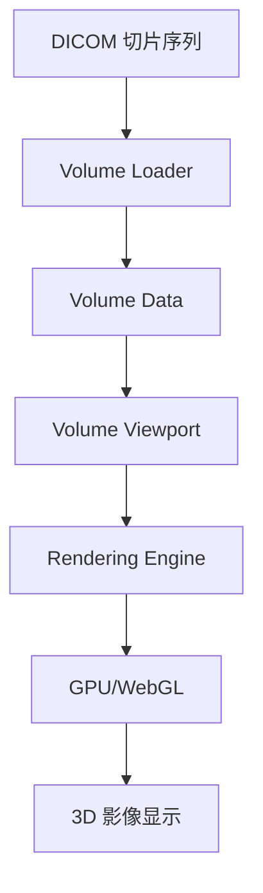

# 3D 体渲染指南

**目标**: 学习如何在 Cornerstone3D 中实现 3D 体渲染（Volume Rendering）

**预计时间**: 60 分钟

**难度**: 高级

**前置要求**:
- [x] 已完成 [第一个影像查看器](../getting-started/first-viewer.md)
- [x] 已完成 [基本交互](../getting-started/basic-interactions.md)
- [x] 了解 WebGL 和 3D 渲染基础
- [x] 拥有多张 DICOM 切片影像

---

## 概述

3D 体渲染（Volume Rendering）是医学影像的核心功能之一，它将一系列 2D DICOM 切片重建为 3D 立体影像。

**主要应用场景**:
- **CT 3D 重建**: 骨骼、器官的 3D 可视化
- **MRI 3D 重建**: 软组织、脑部结构的 3D 展示
- **术前规划**: 手术前的 3D 评估和测量
- **教学演示**: 医学教育和患者沟通

**Cornerstone3D 的 3D 渲染能力**:
- ✅ 支持 VolumeViewport（体积视口）
- ✅ 基于 VTK.js 的体渲染引擎
- ✅ 多种渲染模式：MPR、VR、MIP
- ✅ 可调节的不透明度传递函数
- ✅ GPU 加速的实时渲染

---

## 3D 渲染架构

### 渲染流程



**关键组件**:

- **Volume Loader**: 加载和构建体积数据
- **Volume Data**: 存储体素数据的 3D 数组
- **Volume Viewport**: 支持 3D 渲染的视口类型
- **Transfer Function**: 控制体素值到颜色/不透明度的映射

---

## 2. 准备工作

### 2.1 数据准备

3D 体渲染需要一系列连续的 DICOM 切片影像。

**数据要求**:
- ✅ 同一系列（Series）的连续切片
- ✅ 切片间厚度均匀
- ✅ 包含位置信息（Image Position Patient）
- ✅ 包含方向信息（Image Orientation Patient）

**示例数据源**:
```typescript
// 获取同一系列的所有影像 ID
const seriesImageIds = [
  'wadors:https://dicomserver.com/wado-rs/studies/1.2.3/series/4.5.6/instances/1',
  'wadors:https://dicomserver.com/wado-rs/studies/1.2.3/series/4.5.6/instances/2',
  'wadors:https://dicomserver.com/wado-rs/studies/1.2.3/series/4.5.6/instances/3',
  // ... 更多切片
];
```

### 2.2 依赖检查

确保已安装必要的依赖：

```bash
# 核心包（应该已安装）
yarn add @cornerstonejs/core @cornerstonejs/tools @cornerstonejs/dicom-image-loader

# VTK.js 用于 3D 渲染
yarn add @kitware/vtk.js
```

---

## 3. 创建 VolumeViewport

### 步骤 1: 创建 Volume Viewport

```typescript
import { RenderingEngine, Enums } from '@cornerstonejs/core';

// 创建渲染引擎
const renderingEngine = new RenderingEngine('my-volume-engine');

// 启用 Volume Viewport
const viewportId = 'my-volume-viewport';
const viewportInput = {
  viewportId,
  element: document.getElementById('volume-container')!,
  type: Enums.ViewportType.VOLUME, // 关键：使用 VOLUME 类型
};

renderingEngine.enableElement(viewportInput);

// 获取 Volume Viewport 实例
const viewport = renderingEngine.getViewport(viewportId) as Types.IVolumeViewport;
```

### 步骤 2: 加载体积数据

```typescript
import { createVolumeActor } from '@cornerstonejs/core';

// 创建体积数据
const volumeId = 'my-volume-id';

// 创建 Volume Actor
const volumeActor = createVolumeActor(volumeId, {
  dimensions: { x: 256, y: 256, z: 100 }, // 体积尺寸
  spacing: { x: 1, y: 1, z: 2 },          // 体素间距（mm）
  origin: { x: 0, y: 0, z: 0 },           // 原点位置
  direction: [                            // 方向矩阵
    1, 0, 0,
    0, 1, 0,
    0, 0, 1,
  ],
  scalarData: new Int16Array(256 * 256 * 100), // 体素数据
});

// 将体积添加到视口
await viewport.setVolumes([{ volumeId, actor: volumeActor }]);

// 渲染
viewport.render();
```

### 步骤 3: 从 DICOM 切片创建体积

```typescript
import { createAndCacheVolume } from '@cornerstonejs/core';

// 从 DICOM 切片序列创建体积
const volumeId = 'my-dicom-volume';
const volume = await createAndCacheVolume(volumeId, {
  imageIds: seriesImageIds, // DICOM 切片 ID 列表
});

// 将体积加载到视口
await viewport.setVolumes([{ volumeId }]);

// 渲染
viewport.render();
```

---

## 4. 渲染模式

Cornerstone3D 支持多种 3D 渲染模式：

### 4.1 VR（Volume Rendering）- 体渲染

**特点**: 展示体积的内部结构，支持透明度调节

```typescript
import { Enums as CSEnums } from '@cornerstonejs/core';

// 设置渲染模式为 VR
viewport.setProperties({
  renderingMode: CSEnums.RenderingMode.VR,
});

// 配置不透明度传递函数（Transfer Function）
const viewport = renderingEngine.getViewport(viewportId) as Types.IVolumeViewport;

// VR 模式的传递函数
const vrProperties = {
  volumeId: 'my-volume-id',
  vtkColormap: null, // 颜色映射
  transferFunction: {
    // 预设传递函数（CT 骨骼）
    preset: 'Bone-Basic',
  },
};

await viewport.setProperties(vrProperties);
viewport.render();
```

### 4.2 MIP（Maximum Intensity Projection）- 最大密度投影

**特点**: 只显示最高密度的体素，常用于血管造影

```typescript
// 设置渲染模式为 MIP
await viewport.setProperties({
  renderingMode: CSEnums.RenderingMode.MAXIMUM_INTENSITY_PROJECTION,
});

viewport.render();
```

### 4.3 MinIP（Minimum Intensity Projection）- 最小密度投影

**特点**: 只显示最低密度的体素，常用于肺部气道

```typescript
// 设置渲染模式为 MinIP
await viewport.setProperties({
  renderingMode: CSEnums.RenderingMode.MINIMUM_INTENSITY_PROJECTION,
});

viewport.render();
```

### 4.4 MPR（Multi-Planar Reconstruction）- 多平面重建

**特点**: 显示横断面、冠状面、矢状面的 2D 切片

```typescript
// MPR 通常使用 StackViewport，但可以与 VolumeViewport 同步
// 详见 [多视口同步](./multi-viewport.md)
```

---

## 5. 传递函数（Transfer Function）

传递函数控制体素值到颜色和不透明度的映射，是体渲染的核心。

### 5.1 预设传递函数

Cornerstone3D 提供了多种预设传递函数：

```typescript
import { Enums as CSEnums } from '@cornerstonejs/core';

// CT 骨骼预设
await viewport.setProperties({
  volumeId: 'my-volume-id',
  transferFunction: {
    preset: CSEnums.TransferFunctionPresets.BONE,
  },
});

// CT 胸部预设
await viewport.setProperties({
  volumeId: 'my-volume-id',
  transferFunction: {
    preset: CSEnums.TransferFunctionPresets.CHEST_CT,
  },
});

// CT 头部预设
await viewport.setProperties({
  volumeId: 'my-volume-id',
  transferFunction: {
    preset: CSEnums.TransferFunctionPresets.HEAD_NECK,
  },
});

// MRI 预设
await viewport.setProperties({
  volumeId: 'my-volume-id',
  transferFunction: {
    preset: CSEnums.TransferFunctionPresets.MRI,
  },
});
```

### 5.2 自定义传递函数

```typescript
// 自定义传递函数
const customTransferFunction = {
  // 不透明度映射点（体素值 -> 不透明度）
  opacityPoints: [
    { value: -1000, opacity: 0 },   // 空气：完全透明
    { value: -500, opacity: 0.1 },  // 肺组织：轻微不透明
    { value: 0, opacity: 0 },       // 水/软组织：透明
    { value: 100, opacity: 0 },
    { value: 300, opacity: 0.5 },   // 肌肉：半透明
    { value: 1000, opacity: 1 },    // 骨骼：完全不透明
    { value: 3000, opacity: 1 },
  ],
  // 颜色映射点（体素值 -> RGB）
  colorPoints: [
    { value: -1000, color: [0, 0, 0] },       // 空气：黑色
    { value: -500, color: [0.8, 0.8, 1] },    // 肺：浅蓝色
    { value: 300, color: [0.9, 0.7, 0.6] },   // 肌肉：肉色
    { value: 1000, color: [1, 1, 0.8] },      // 骨骼：浅黄色
  ],
};

await viewport.setProperties({
  volumeId: 'my-volume-id',
  transferFunction: customTransferFunction,
});

viewport.render();
```

### 5.3 动态调节传递函数

```typescript
// 添加滑块控制不透明度
const opacitySlider = document.getElementById('opacity-slider');

opacitySlider.addEventListener('input', async (event) => {
  const opacity = parseFloat(event.target.value);

  // 调整传递函数
  const currentProperties = viewport.getProperties();
  const updatedTransferFunction = {
    ...currentProperties.transferFunction,
    opacityPoints: currentProperties.transferFunction.opacityPoints.map(
      (point) => ({ ...point, opacity: point.opacity * opacity })
    ),
  };

  await viewport.setProperties({
    volumeId: 'my-volume-id',
    transferFunction: updatedTransferFunction,
  });

  viewport.render();
});
```

---

## 6. 相机控制

3D 渲染需要控制相机位置和方向。

### 6.1 相机基本操作

```typescript
// 设置相机位置
await viewport.setCamera({
  position: [0, 0, -500],      // 相机位置（x, y, z）
  focalPoint: [0, 0, 0],        // 焦点位置（看向哪里）
  viewUp: [0, 1, 0],           // 相机上方向（定义相机旋转）
});

viewport.render();
```

### 6.2 相机预设视角

```typescript
// 前视图（Anterior）
await viewport.setCamera({
  position: [0, 0, -500],
  focalPoint: [0, 0, 0],
  viewUp: [0, 1, 0],
});

// 侧视图（Lateral）
await viewport.setCamera({
  position: [-500, 0, 0],
  focalPoint: [0, 0, 0],
  viewUp: [0, 1, 0],
});

// 顶视图（Superior）
await viewport.setCamera({
  position: [0, -500, 0],
  focalPoint: [0, 0, 0],
  viewUp: [0, 0, -1],
});

viewport.render();
```

### 6.3 相机旋转动画

```typescript
// 围绕物体旋转相机
let angle = 0;
const radius = 500;
const rotateCamera = () => {
  angle += 0.01;

  const x = Math.sin(angle) * radius;
  const z = Math.cos(angle) * radius;

  viewport.setCamera({
    position: [x, 0, z],
    focalPoint: [0, 0, 0],
    viewUp: [0, 1, 0],
  });

  viewport.render();

  requestAnimationFrame(rotateCamera);
};

rotateCamera();
```

---

## 7. 3D 交互工具

### 7.1 添加 3D 交互工具

```typescript
import {
  addTool,
  ToolGroupManager,
  Enums as ToolEnums,
} from '@cornerstonejs/tools';

// 导入 3D 工具
import {
  RotateCameraTool,
  PanTool,
  ZoomTool,
} from '@cornerstonejs/tools';

// 添加工具
addTool(RotateCameraTool);
addTool(PanTool);
addTool(ZoomTool);

// 创建工具组
const toolGroup = ToolGroupManager.createToolGroup('3d-tool-group');

// 添加工具到工具组
toolGroup.addTool(RotateCameraTool.toolName);
toolGroup.addTool(PanTool.toolName);
toolGroup.addTool(ZoomTool.toolName);

// 添加视口到工具组
toolGroup.addViewport(viewportId, renderingEngineId);

// 激活工具
toolGroup.setToolActive(RotateCameraTool.toolName, {
  bindings: [{ mouseButton: ToolEnums.MouseBindings.Primary }], // 左键旋转
});

toolGroup.setToolActive(PanTool.toolName, {
  bindings: [{ mouseButton: ToolEnums.MouseBindings.Auxiliary }], // 中键平移
});

toolGroup.setToolActive(ZoomTool.toolName, {
  bindings: [{ mouseButton: ToolEnums.MouseBindings.Secondary }], // 右键缩放
});
```

---

## 8. 完整示例：3D 查看器组件

```typescript
import React, { useEffect, useRef } from 'react';
import { RenderingEngine, Enums } from '@cornerstonejs/core';
import { ToolGroupManager } from '@cornerstonejs/tools';
import { RotateCameraTool, PanTool, ZoomTool } from '@cornerstonejs/tools';

interface VolumeViewerProps {
  seriesImageIds: string[];
}

const VolumeViewer: React.FC<VolumeViewerProps> = ({ seriesImageIds }) => {
  const containerRef = useRef<HTMLDivElement>(null);
  const renderingEngineRef = useRef<RenderingEngine | null>(null);

  useEffect(() => {
    if (!containerRef.current) return;

    let renderingEngine: RenderingEngine;
    const viewportId = 'my-volume-viewport';
    const renderingEngineId = 'my-volume-engine';

    const initializeVolumeViewer = async () => {
      // 创建渲染引擎
      renderingEngine = new RenderingEngine(renderingEngineId);
      renderingEngineRef.current = renderingEngine;

      // 启用 Volume Viewport
      const viewportInput = {
        viewportId,
        element: containerRef.current!,
        type: Enums.ViewportType.VOLUME,
      };

      renderingEngine.enableElement(viewportInput);

      // 创建体积数据
      const volumeId = 'my-dicom-volume';
      const volume = await createAndCacheVolume(volumeId, {
        imageIds: seriesImageIds,
      });

      // 加载体积到视口
      const viewport = renderingEngine.getViewport(viewportId) as Types.IVolumeViewport;
      await viewport.setVolumes([{ volumeId }]);

      // 设置 VR 渲染模式
      await viewport.setProperties({
        volumeId,
        transferFunction: {
          preset: Enums.TransferFunctionPresets.BONE,
        },
      });

      // 设置相机
      await viewport.setCamera({
        position: [0, 0, -500],
        focalPoint: [0, 0, 0],
        viewUp: [0, 1, 0],
      });

      // 渲染
      viewport.render();

      // 添加交互工具
      addTool(RotateCameraTool);
      addTool(PanTool);
      addTool(ZoomTool);

      const toolGroup = ToolGroupManager.createToolGroup('3d-tool-group');
      toolGroup.addTool(RotateCameraTool.toolName);
      toolGroup.addTool(PanTool.toolName);
      toolGroup.addTool(ZoomTool.toolName);
      toolGroup.addViewport(viewportId, renderingEngineId);

      toolGroup.setToolActive(RotateCameraTool.toolName, {
        bindings: [{ mouseButton: Enums.MouseBindings.Primary }],
      });
      toolGroup.setToolActive(PanTool.toolName, {
        bindings: [{ mouseButton: Enums.MouseBindings.Auxiliary }],
      });
      toolGroup.setToolActive(ZoomTool.toolName, {
        bindings: [{ mouseButton: Enums.MouseBindings.Secondary }],
      });
    };

    initializeVolumeViewer();

    return () => {
      if (renderingEngine) {
        renderingEngine.destroy();
      }
      ToolGroupManager.destroyToolGroup('3d-tool-group');
    };
  }, [seriesImageIds]);

  return (
    <div>
      <div
        ref={containerRef}
        style={{ width: '512px', height: '512px', border: '1px solid black' }}
      />
    </div>
  );
};

export default VolumeViewer;
```

---

## 9. 性能优化

### 9.1 降低分辨率

```typescript
// 降低体积分辨率以提高性能
const downsampledVolume = await createAndCacheVolume(volumeId, {
  imageIds: seriesImageIds,
  downsampling: [2, 2, 2], // 每个维度降采样 2 倍
});
```

### 9.2 使用体积裁剪

```typescript
// 只渲染感兴趣区域
await viewport.setProperties({
  volumeId: 'my-volume-id',
  clip: {
    plane: {
      normal: [0, 0, 1], // 裁剪平面法向量
      position: [0, 0, 50], // 裁剪平面位置
    },
  },
});
```

### 9.3 渲染质量调节

```typescript
// 降低渲染质量以提高帧率
const viewport = renderingEngine.getViewport(viewportId) as Types.IVolumeViewport;

await viewport.setProperties({
  volumeId: 'my-volume-id',
  lowResRendering: true, // 使用低分辨率渲染
});
```

---

## 10. 常见问题

### Q1: 3D 渲染很慢？

**可能原因**:
- 体积数据太大
- 渲染质量设置过高
- GPU 性能不足

**解决方案**:
- 降低体积分辨率
- 启用低分辨率渲染模式
- 使用体积裁剪

### Q2: 看不到 3D 影像？

**检查清单**:
- ✅ 切片数据完整且连续
- ✅ 元数据（ImagePositionPatient、ImageOrientationPatient）正确
- ✅ 传递函数配置正确
- ✅ 相机位置和焦点设置合理

### Q3: 如何导出 3D 影像？

**解决方案**: 使用 VTK.js 的截图功能

```typescript
// 导出当前视角的 3D 影像截图
const canvas = element.querySelector('canvas');
const imageData = canvas.toDataURL('image/png');

// 下载图片
const a = document.createElement('a');
a.href = imageData;
a.download = '3d-volume.png';
a.click();
```

---

## 11. 下一步

- 🔗 [多视口同步](./multi-viewport.md) - 同步 2D 和 3D 视口
- ⚡ [性能优化](./performance-optimization.md) - 优化 3D 渲染性能
- 🛠️ [自定义工具](./custom-tools.md) - 开发 3D 交互工具

---

## 相关资源

- 📚 [官方文档 - Volume Rendering](https://www.cornerstonejs.org/docs/concepts/volumeRendering)
- 💻 [示例项目 - 3D Viewer](../examples/advanced-viewer/)
- 🔍 [VTK.js 文档](https://kitware.github.io/vtk-js/)

---

**需要帮助？** 查看 [故障排查文档](../troubleshooting/common-errors.md)
