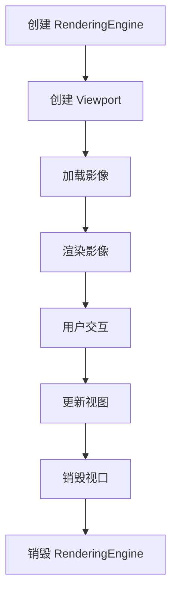
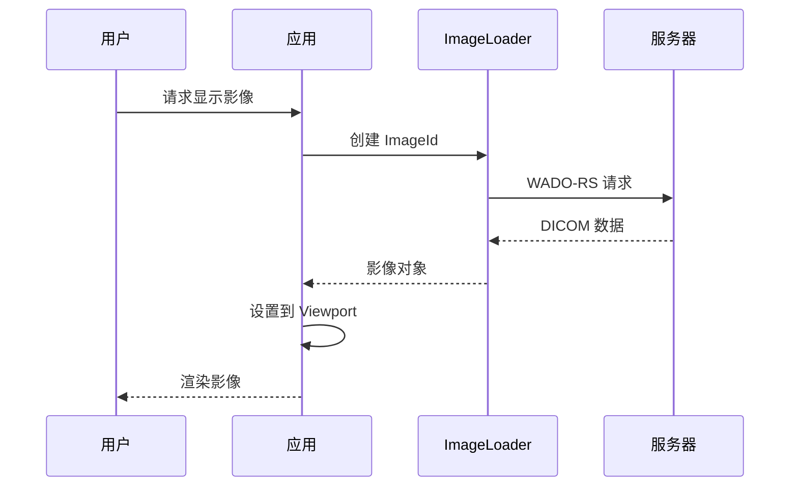
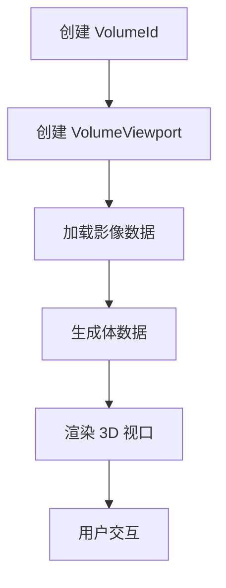
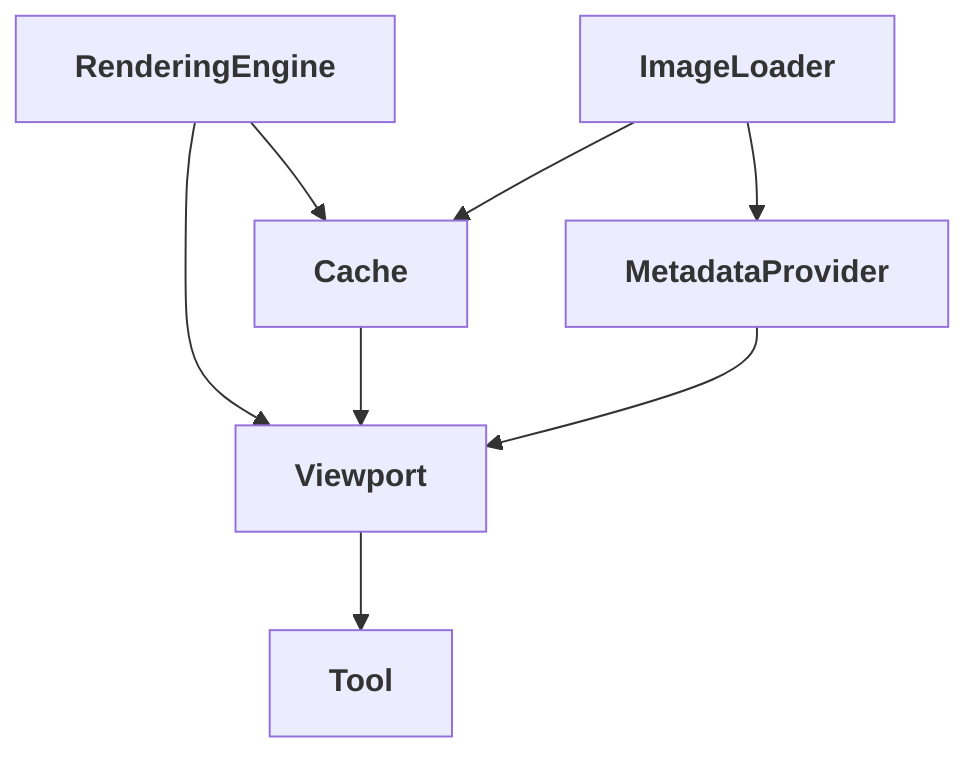

# 架构概念

## 概述

本文档深入探讨 Cornerstone3D 的核心架构概念，帮助开发者理解渲染引擎、视口、影像加载、缓存、元数据和工具系统。掌握这些核心概念是有效使用 Cornerstone3D 的关键。

---

## 渲染引擎（RenderingEngine）

### 核心职责

**RenderingEngine** 是 Cornerstone3D 的核心渲染管理器，负责：

- 🎨 管理 WebGL 上下文和渲染生命周期
- 🖥️ 创建和销毁视口
- 🔄 协调渲染循环
- 🚀 优化渲染性能

### 创建渲染引擎

```typescript
import { RenderingEngine } from '@cornerstoneCore';

// 创建渲染引擎（自动管理 WebGL 上下文）
const renderingEngine = new RenderingEngine('my-engine');
```

### 渲染引擎模式

**两种渲染模式**:

1. **ContextPoolRenderingEngine**（推荐） - 使用 WebGL 上下文池优化性能
2. **TiledRenderingEngine** - 传统的平铺渲染模式

### 渲染引擎配置

```typescript
await init({
  core: {
    renderingEngineMode: Enums.RenderingEngineMode.CONTEXT_POOL,
    webGLContextCount: 7,  // WebGL 上下文数量
  },
});
```

### 渲染引擎生命周期



**关键点**:
- ✅ 先创建 RenderingEngine，再创建 Viewport
- ✵� 所有视口必须通过 RenderingEngine 创建
- ✅ 销毁视口后再销毁 RenderingEngine

---

## 视口（Viewport）

### 视口类型

Cornerstone3D 支持多种视口类型，满足不同应用场景：

#### 1. StackViewport（2D 栈式视口）

**用途**: 显示 2D 单帧影像或影像序列

**特性**:
- ✅ 显示单帧或序列
- ✅ 支持平移、缩放、旋转、翻转发
- ✅ 窗宽窗位调整

**使用示例**:

```typescript
import { Enums } from '@cornerstonejs/core';

// 创建 StackViewport
const viewportInput = {
  viewportId: 'CT_STACK',
  element: htmlElement,
  type: Enums.ViewportType.STACK,
};

renderingEngine.enableElement(viewportInput);
```

#### 2. VolumeViewport（3D 体视口）

**用途**: 显示 3D 体数据渲染

**特性**:
- ✅ 显示 3D 体渲染
- ✅ 多平面重建（轴位、冠状、矢状）
- ✅ 体渲染传递函数
- ✅ MPR/VR (多平面重建)

**使用示例**:

```typescript
// 创建 VolumeViewport
const viewportInput = {
  viewportId: 'CT_VOLUME',
  element: 上下文元素,
  type: Enums.ViewportType.VOLUME,
};

renderingEngine.enableElement(viewportInput);
```

### 视口配置

```typescript
// 设置视口属性
viewport.setProperties({
  background: [0, 0, 0],  // 背景色
  orientation: { axial: 'axial' },  // 默认朝向
});
```

### 视口交互

**常用操作**:

```typescript
// 缩放
toolGroupManager.setToolActive('Zoom');

// 平移
toolGroupManager.setToolActive('Pan');

// 窗宽窗位调整
toolGroupManager.setToolActive('WindowLevel');
```

---

## 影像加载器（ImageLoader）

### 核心职责

**ImageLoader** 是负责从不同数据源加载 DICOM 影像的扩展机制。

### 内置加载器

Cornerstone3D 内置了 3 种主要加载器：

#### 1. CornerstoneStreamingImageVolumeLoader（推荐）

**用途**: 流式加载 3D 体数据

**数据源**: WADO-RS 服务器、本地文件

#### 2. CornerstoneStreamingDynamicImageVolumeLoader

**用途**: 流式加载动态影像

**数据源**: WADO-RS 服务器、本地文件

#### 3. CornerstoneStreamingImageLoader

**用途**: 流式加载 2D 栈式影像

**数据源**: WADO-RS 服务器、本地文件

### 使用 ImageLoader

**配置 WADO-RS 加载器**:

```typescript
import { wadorsImageLoader } from '@cornerstonejs/dicom-image-loader';

// 初始化
wadorsImageLoader.init({
  // 配置 WADO-RS 端点
  wadoRsRoot: 'https://dicomserver.com/wado-rs',
  // 其他配置...
});
```

**创建 ImageId**:

```typescript
// WADO-RS ImageId
const imageId = `wadors:https://dicomserver.com/wado-rs/studies/1/series/1/image.dcm`;
```

---

## 缓存（Cache）

### 缓存类型

Cornerstone3D 有 3 种缓存类型：

#### 1. Image Cache（影像缓存）

**用途**: 缓存已解码的影像数据

**配置**:

```typescript
import { cache as imageCache } from '@cornerstonejs/core';

imageCache.setCacheSize(500 * 1024 * 1024); // 500MB
```

#### 2. Volume Cache（体缓存）

**用途**: 缓存 3D 体数据

**配置**:

```typescript
import { cache as volumeCache } from '@cornerstonejs/core';

volumeCache.setCacheSize(1024 * 1024 * 1024); // 1GB
```

#### 3. Geometry Cache（几何缓存）

**用途**: 缓存几何数据

---

### 缓存管理策略

**默认配置**:

| 缓存类型 | 默认大小 | 最大限制 | 说明 |
|---------|----------|----------|------|
| Image Cache | 50MB | 1GB | 系统自动管理 |
| Volume Cache | 256MB | 1GB | 系统自动管理 |
| Geometry Cache | 按需分配 | 系统自动管理 |

---

## 元数据提供器（MetadataProvider）

### 核心职责

**MetadataProvider** 负责存储和提供 DICOM 元数据。

### 获取元数据

```typescript
import { metadataProvider } from '@cornerstonejs/core';

// 获取影像平面元数据
const imagePlaneModule = metadataProvider.get(imageId, 'imagePlaneModule');
```

### 元数据类型

#### 1. 影像平面元数据（Image Plane Module）

**包含信息**:

- **像素间距** (Pixel Spacing): x、y 方向的像素间距
- **图像尺寸** (Image Size): 行、列数
- **窗宽窗位** (Window Level): 窗宽和窗位值

#### 2. 系统元数据（Image Plane Module）

**包含信息**:

- **患者信息** - 患者姓名、ID、出生日期等
- **检查信息** - 检查日期、设备、医生
- **序列信息** - 序列描述、模态、部位

### 元数据设置

```typescript
// 设置元数据
metadataProvider.add(imageId, imagePlaneModule, metadata);
```

---

## 工具（Tool）

### 工具类型

Cornerstone3D 提供了丰富的交互工具：

#### 1. 标注工具（Annotation Tools）

- **RectangleROI** - 矩形感兴趣区
- **EllipticalROI** - 椭圆形感兴趣区
- **FreehandROI** - 自由绘制感兴趣区

#### 2. 测量工具（Measurement Tools）

- **Length** - 长度测量
- **Angle** - 角度测量
- **Area** - 面积测量（2D）
- **Shortest Axis** - 最短轴测量
- **Elliptical ROI** - 椭圆 ROI 测量

#### 3. 操作工具（Manipulation Tools）

- **Zoom** - 缩放
- **Pan** - 平移
- **Rotate** - 旋转
- **Flip** - 翻转
- **WindowLevel** - 窗宽窗位调整

### 工具组（ToolGroup）

**功能**: 管理工具的组织和激活

```typescript
import { ToolGroupManager } from '@cornerstonejs/tools';

// 创建工具组
const toolGroup = ToolGroupManager.createToolGroup('MyGroup');

// 添加工具
toolGroup.addTool(RectangleROITool);
toolGroup.addTool(EllipticalROITool);

// 激活工具组
ToolGroupManager.setToolGroupActive('MyGroup');
```

### 工具激活和状态管理

```typescript
// 激活工具
toolGroupManager.setToolActive('Zoom');

// 获取活动工具
const activeTool = toolGroupManager.getActiveTool();
```

---

## 数据流

### 影像加载流程



### 3D 体渲染流程



---

## 架构关系总结

### 核心组件关系



---

## 最佳实践

### 1. 渲染引擎管理

```typescript
// ✅ 正确：创建并销毁
const renderingEngine = new RenderingEngine('my-engine');
// ... 使用引擎
renderingEngine.destroy();

// ❌ 错误：创建多个引擎
const engine1 = new RenderingEngine('engine1');
const engine2 = new RenderingEngine('engine2'); // 不推荐
```

### 2. 视口管理

```typescript
// ✅ 正确：批量创建视口
const viewportInputs = [
  { viewportId: 'CT1', element: elem1, type: ViewportType.STACK },
  { viewportId: 'CT2', element: elem2, type: ViewportType.STACK },
];

renderingEngine.enableElements(viewportInputs);
```

### 3. 缓存优化

```typescript
// 根据可用内存调整缓存
const availableMemory = navigator.hardwareConcurrency
  ? 4 * 1024 * 1024 * 1024  // 4GB for 4 threads
  : 1 * 1024 * 1024 *  1024; // 1GB for single thread

imageCache.setCacheSize(availableMemory / 2);
```

---

## 常见问题

### Q: 如何选择视口类型？

**A**:
- **2D 影像查看**: 使用 `StackViewport`
- **3D 体渲染**: 使用 `VolumeViewport` 或 `VolumeViewport3D`
- **动态影像**: 使用 `DynamicImageVolumeViewport`

### Q: 如何优化渲染性能？

**A**:
- 使用 `ContextPoolRenderingEngine` 模式
- 合理设置缓存大小
- 使用 Web Worker 处理计算密集型任务
- 避免频繁创建和销毁视口

### Q: 如何处理大影像数据？

**A**:
- 使用流式加载
- 增加缓存大小
- 使用懒加载策略
- 使用 Web Worker 处理数据

---

## 相关资源

- [架构概述](overview.md)
- [核心包职责说明](core-packages.md)
- [外部依赖说明](dependencies.md)
- [术语表](glossary.md)

---

**下一步**: 了解 [外部依赖说明](dependencies.md)
