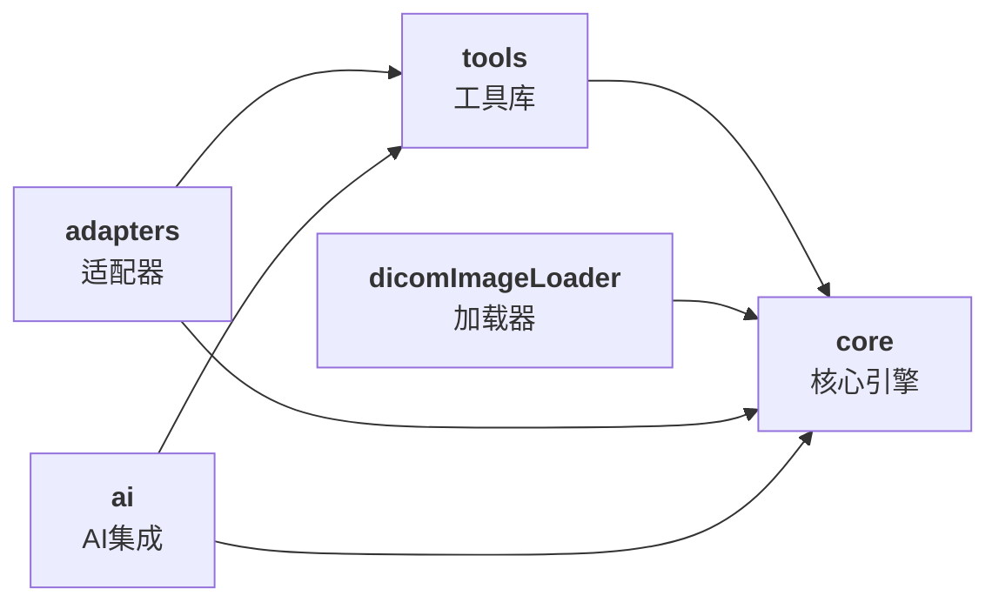

# 核心包职责说明

## 概述

Cornerstone3D 由 5 个核心包组成，每个包都有明确的职责和功能边界。理解这些包的职责是正确使用 Cornerstone3D 的关键。

---

## 包的总览



---

## @cornerstonejs/core

### 核心职责

提供 Cornerstone3D 的**基础渲染引擎和架构框架**。

### 主要模块

#### 1. 渲染引擎（RenderingEngine）

**功能**: 管理 WebGL 上下文和视口生命周期

```typescript
import { RenderingEngine } from '@cornerstonejs/core';

// 创建渲染引擎
const renderingEngine = new RenderingEngine('my-engine');
```

**能力**:
- 管理多个 WebGL 上下文
- 创建和销毁视口
- 协调渲染循环
- 优化渲染性能

#### 2. 视口（Viewport）

**功能**: 提供不同类型的视口用于显示影像

**视口类型**:

| 视口类型 | 说明 | 使用场景 |
|---------|------|----------|
| **StackViewport** | 2D 栈式视口 | 单帧影像查看 |
| **VolumeViewport** | 3D 体视口 | 体数据渲染 |
| **VolumeViewport3D** | 增强 3D 视口 | 高级 3D 渲染 |

```typescript
// 启用 StackViewport
const viewportInput = {
  viewportId: 'CT_STACK',
  element: htmlElement,
  type: ViewportType.STACK,
};

renderingEngine.enableElement(viewportInput);
```

#### 3. 缓存（Cache）

**功能**: 管理已加载的影像和体数据

**缓存类型**:
- **imageCache**: 单帧影像缓存
- **volumeCache**: 3D 体数据缓存
- **geometryCache**: 几何数据缓存

**配置**:

```typescript
// 默认缓存配置
const cacheConfig = {
  maximumSizeInBytes: 1073741824, // 1GB
  cacheSizeInBytes: 52428800,     // 50MB
};
```

#### 4. 元数据提供器（Metadata Provider）

**功能**: 提供和管理 DICOM 元数据

**使用**:

```typescript
// 获取影像元数据
const metadata = metadataProvider.get(imageId, 'imagePlaneModule');
```

#### 5. 影像加载器（Image Loader）

**功能**: 定义影像加载接口和扩展点

**扩展**:

```typescript
// 注册自定义 ImageLoader
registerImageLoader('custom', customImageLoader);
```

---

## @cornerstonejs/tools

### 核心职责

提供**交互工具库**，用于构建用户交互界面。

### 主要功能模块

#### 1. 标注工具（Annotation Tools）

**提供的工具**:

- **RectangleROI** - 矩形感兴趣区
- **EllipticalROI** - 椭圆形感兴趣区
- **FreehandROI** - 自由绘制感兴趣区

**使用示例**:

```typescript
import { RectangleROITool } from '@cornerstonejs/tools';

// 添加工具
addTool(RectangleROITool);

// 启用工具
toolGroup.setToolActive('RectangleROI');
```

#### 2. 测量工具（Measurement Tools）

**提供的工具**:

- **Length** - 长度测量
- **Angle** - 角度测量
- **Area** - 面积测量（2D）
- **Shortest Axis** - 最短轴测量
- **Elliptical ROI** - 椭圆 ROI 测量

#### 3. 操作工具（Manipulation Tools）

**提供的工具**:

- **Zoom** - 缩放
- **Pan** - 平移
- **Rotate** - 旋转
- **Flip** - 翻转
- **WindowLevel** - 窗宽窗位调整
- **Rotate** - 旋转

#### 4. 工具组（Tool Groups）

**功能**: 管理工具的组织和激活

```typescript
// 创建工具组
const toolGroup = ToolGroupManager.createToolGroup('myGroup');

// 添加工具到工具组
toolGroup.addTool(RectangleROITool, { toolName: 'RectangleROI' });

// 激活工具组
toolGroupManager.setToolGroupActive('myGroup');
```

#### 5. 事件系统（Event System）

**支持的事件**:

- 影像渲染事件
- 标注完成事件
- 工具激活事件
- 视口状态变化事件

**监听事件**:

```typescript
EVENT_LISTENER.forEach((listener) => {
  listener.addEventListener(
    Events.IMAGE_RENDERED,
    (event) => {
      console.log('影像渲染完成', event);
    }
  );
});
```

---

## @cornerstonejs/dicom-image-loader

### 核心职责

提供 **DICOM 影像加载功能**，支持多种加载协议。

### 主要功能

#### 1. WADO-RS 加载

**功能**: 从 DICOMweb 服务器加载影像

**使用**:

```typescript
import { wadorsImageLoader } from '@cornerstone/dicom-image-loader';

// 初始化
wadorsImageLoader.init({
  // 配置 WADO-RS 端点
  wadoRsRoot: 'https://dicomserver.com/wado-rs',
});
```

#### 2. WADO-URI 加载

**功能**: 从传统 WADO 服务器加载影像

#### 3. 本地文件加载

**功能**: 从本地文件系统加载 DICOM 文件

**使用**:

```typescript
// 拖放加载
import importLocalImage from '@cornerstonejs/core';

// 从 File API 加载
const imageIds = await importLocalImage(file);
```

### Codec 支持

内置支持的压缩格式:

- **JPEG** - 基础 JPEG 压缩
- **JPEG 2000** - 无损压缩
- **JPEG LS** - 医学影像专用压缩

---

## @cornerstonejs/adapters

### 核心职责

提供**适配器层**，用于兼容性和集成。

### 主要功能

#### 1. Cornerstone.js 适配

**功能**: 兼容旧版 Cornerstone.js API

#### 2. DICOM SR 适配

**功能**: 处理 DICOM Structured Report

#### 3. 测量数据转换

**功能**: 转换不同格式的标注和测量数据

---

## @cornerstonejs/ai

### 核心职责

提供 **AI/ML 集成**功能，用于智能分析。

### 主要功能

#### 1. ONNX Runtime 集成

**功能**: 运行 ONNX 格式的 AI 模型

**使用**:

```typescript
import { segment } from '@cornerstonejs/ai';

// AI 分割
const segmentation = await segment(imageId, 'liver-segmentation.onnx');
```

#### 2. 自动分割工具

**功能**: 基于模型的自动分割

#### 3. 切片传播（Slice Propagation）

**功能**: 自动传播分割结果到相邻切片

---

## 包之间的协作示例

### 完整的工作流程

```typescript
// 1. 初始化核心库
import { init } from '@cornerstonejs/core';
await init();

// 2. 初始化 DICOM 加载器
import { wadorsImageLoader } from '@cornerstonejs/dicom-image-loader';
wadorsImageLoader.init();

// 3. 初始化工具库
import { init as initTools } from '@cornerstonejs/tools';
initTools();

// 4. 创建渲染引擎和视口
import { RenderingEngine, Enums } from '@cornerstonejs/core';

const renderingEngine = new RenderingEngine('my-engine');
const viewportInput = {
  viewportId: 'CT',
  element: htmlElement,
  type: Enums.ViewportType.STACK,
};
renderingEngine.enableElement(viewportInput);

// 5. 加载和显示影像
const viewport = renderingEngine.getViewport('CT');
await viewport.setStack([imageId]);

// 6. 激活交互工具
import { ZoomTool, PanTool } from '@cornerstonejs/tools';
toolGroupManager.setToolActive('Zoom');
```

---

## 选择合适的包

### 基本应用

**需要的包**:

```bash
yarn add @cornerstonejs/core @cornerstonejs/dicom-image-loader
```

**适用场景**: 简单的影像查看器

### 交互应用

**需要的包**:

```bash
yarn add @cornerstonejs/core @cornerstonejs/tools @cornerstonejs/dicom-image-loader
```

**适用场景**: 需要标注、测量等交互功能

### AI 应用

**需要的包**:

```bash
yarn add @cornerstonejs/core @cornerstonejs/tools @cornerstonejs/ai @cornerstonejs/dicom-image-loader
```

**适用场景**: 需要 AI 辅助功能

---

## API 设计原则

### 一致性

所有包遵循统一的设计模式：

- ✅ **TypeScript 优先** - 完整的类型定义
- ✅ **异步编程** - 使用 async/await
- ✅ **事件驱动** - 统一的事件系统
- ✅ **错误处理** - 明确的错误信息

### 可扩展性

- ✅ **插件机制** - 支持自定义扩展
- ✅ **配置化** - 灵活的配置选项
- ✅ **中间件模式** - 支持中间件扩展

---

## 相关资源

- [Monorepo 结构详解](monorepo-structure.md)
- [架构概念](architectural-concepts.md)
- [外部依赖说明](dependencies.md)

---

**下一步**: 了解 [架构概念](architectural-concepts.md)
