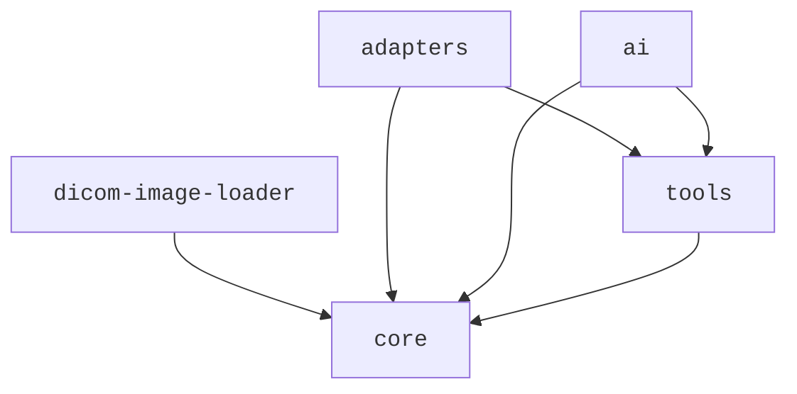

# Monorepo 结构详解

## 概述

Cornerstone3D 采用 **Monorepo（单体仓库）** 架构，将所有相关的包组织在一个 Git 仓库中。这种架构使得代码共享、版本管理和依赖管理更加高效。

---

## 仓库结构

### 顶层目录结构

```text
cornerstone3D/
├── packages/              # 核心包目录
│   ├── core/            # 核心渲染引擎
│   ├── tools/           # 交互工具库
│   ├── dicomImageLoader/ # DICOM 影像加载器
│   ├── adapters/        # 适配器库
│   └── ai/              # AI/ML 集成库
├── addOns/               # 附加组件
│   ├── externals/       # 外部依赖
│   └── local/           # 本地扩展
├── guides/              # 开发指南（本文档）
├── utils/               # 工具脚本
├── package.json          # 根 package.json
├── lerna.json           # Lerna 配置
└── ...
```

---

## 核心包详解

### 1. @cornerstonejs/core

**职责**: 核心渲染引擎和基础架构

**主要功能**:
- 渲染引擎（RenderingEngine）管理
- 视口（Viewport）系统
- 缓存（Cache）管理
- 元数据（Metadata Provider）系统
- 影像加载器（ImageLoader）框架
- Web Worker 管理

**依赖**: 无依赖（最基础的包）

---

### 2. @cornerstonejs/tools

**职责**: 交互工具库

**主要功能**:
- 标注工具（RectangleROI、EllipticalROI、FreehandROI 等）
- 测量工具（长度、角度、面积、体积）
- 操作工具（缩放、平移、旋转、窗宽窗位）
- 工具组（Tool Groups）管理
- 标注状态管理
- 事件系统

**依赖**: `@cornerstonejs/core`

---

### 3. @cornerstonejs/dicom-image-loader

**职责**: DICOM 影像加载器

**主要功能**:
- WADO-RS 协议支持（DICOMweb）
- WADO-URI 协议支持（传统 WADO）
- 本地文件加载
- DICOM 文件解析
- 多种 Codec 支持（JPEG、JPEG 2000、JPEG LS 等）

**依赖**: `@cornerstonejs/core`, `dicom-parser`

---

### 4. @cornerstonejs/adapters

**职责**: 适配器和兼容性层

**主要功能**:
- Cornerstone.js 到 Cornerstone3D 的适配
- DICOM SR（Structured Report）支持
- 测量和标注数据转换
- 第三方系统集成接口

**依赖**: `@cornerstonejs/core`, `@cornerstonejs/tools`

---

### 5. @cornerstonejs/ai

**职责**: AI/ML 集成库

**主要功能**:
- ONNX Runtime 集成
- AI 模型管理
- 自动分割工具
- 切片传播（Slice Propagation）
- AI 辅助标注

**依赖**: `@cornerstonejs/core`, `@cornerstonejs/tools`, `onnxruntime-web`

---

## 依赖关系图



**依赖规则**:
- ✅ **核心独立**: `core` 包不依赖任何其他包
- ✅ **单向依赖**: 依赖关系从上到下单向流动
- ✅ **清晰边界**: 包之间通过明确定义的 API 交互

---

## 工作空间配置

### Yarn Workspaces

使用 Yarn Workspaces 管理 Monorepo：

**package.json** (根目录):

```json
{
  "name": "root",
  "private": true,
  "workspaces": [
    "packages/adapters",
    "packages/core",
    "packages/dicomImageLoader",
    "packages/tools",
    "packages/ai",
    "addOns/externals/*",
    "addOns/local/*"
  ]
}
```

**优势**:
- ✅ 统一的依赖管理
- ✅ 原地包链接（npm link 替代）
- ✅ 简化的发布流程
- ✅ 共享的构建工具

### Lerna 配置

使用 Lerna 进行 Monorepo 管理：

**lerna.json**:

```json
{
  "version": "independent",
  "npmClient": "yarn",
  "useWorkspaces": true,
  "command": {
    "publish": {
      "conventionalCommits": true,
      "message": "chore(release): publish",
      "registry": "https://registry.npmjs.org/"
    }
  }
}
```

---

## 包的独立性

### 独立使用

每个包都可以独立使用和发布：

```bash
# 只安装核心包
yarn add @cornerstonejs/core

# 只安装工具包（会自动安装核心包）
yarn add @cornerstonejs/tools

# 只安装加载器（会自动安装核心包）
yarn add @cornerstonejs/dicom-image-loader
```

### 按需引入

```typescript
// 只导入需要的功能
import { RenderingEngine } from '@cornerstonejs/core';
import { RectangleROITool } from '@cornerstonejs/tools';

// 独立初始化
await init();
```

---

## 开发流程

### 本地开发

1. **克隆仓库**:

```bash
git clone https://github.com/cornerstonejs/cornerstone3D.git
cd cornerstone3D
```

2. **安装依赖**:

```bash
yarn install
```

3. **构建所有包**:

```bash
yarn build
```

4. **运行测试**:

```bash
yarn test
```

### 单包开发

在特定包目录下工作：

```bash
cd packages/core
yarn build
yarn test
```

---

## 版本管理

### 独立版本

每个包有独立的版本号：

- `@cornerstonejs/core`: 1.0.0
- `@cornerstonejs/tools`: 1.0.0
- `@cornerstonejs/dicom-image-loader`: 1.0.0

### 统一发布

使用 Lerna 统一发布所有包：

```bash
yarn lerna publish
```

---

## 常见问题

### Q: 为什么选择 Monorepo？

**A**: Monorepo 架构的优势：
- ✅ **代码共享** - 避免代码重复
- ✅ **简化依赖** - 统一的依赖管理
- ✅ **原子提交** - 跨包的变更在单个 PR 中
- ✅ **简化开发** - 无需多个仓库切换

### Q: 如何选择需要的包？

**A**: 根据功能选择：
- **基本渲染**: `@cornerstonejs/core` + `@cornerstonejs/dicom-image-loader`
- **添加工具**: `@cornerstonejs/tools`
- **AI 功能**: `@cornerstonejs/ai`
- **兼容性**: `@cornerstonejs/adapters`

### Q: 如何避免打包整个 Monorepo？

**A**:
- 使用 Yarn Workspaces 的原生包引用
- 按需引入特定包
- 利用 Tree Shaking 减少打包体积

---

## 相关资源

- [项目根目录](../../)
- [核心包职责说明](core-packages.md)
- [架构概念](architectural-concepts.md)
- [外部依赖说明](dependencies.md)

---

**下一步**: 了解 [核心包职责](core-packages.md)
