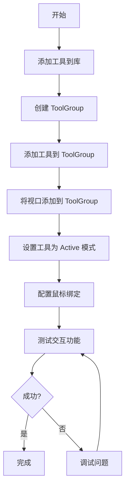

# 基本交互

## 概述

在创建好第一个影像查看器后，我们需要添加用户交互功能，让用户可以：

- **缩放**（Zoom）- 放大和缩小影像
- **平移**（Pan）- 移动影像位置
- **窗宽窗位调整**（Window/Level）- 调整影像显示的对比度和亮度
- **影像滚动**（Stack Scroll）- 在多张影像之间切换

本文档将详细介绍如何使用 Cornerstone3D 的工具系统（Tools）和工具组（ToolGroup）来实现这些基本交互。

---

## 前置条件

在开始之前，请确保您已经：

- ✅ 完成了 [项目初始化](project-setup.md)
- ✅ 完成了 [Cornerstone3D 初始化](initialization.md)
- ✅ 完成了 [第一个影像查看器](first-viewer.md)
- ✅ 理解 RenderingEngine 和 Viewport 的基本概念

---

## 核心概念

### Tool（工具）

**工具（Tool）** 是 Cornerstone3D 中处理用户交互的核心组件。每种工具实现一种特定的交互功能，例如：

- `ZoomTool` - 缩放工具
- `PanTool` - 平移工具
- `WindowLevelTool` - 窗宽窗位调整工具
- `StackScrollTool` - 鼠标滚轮滚动工具

### ToolGroup（工具组）

**工具组（ToolGroup）** 用于管理和组织工具，定义工具的行为模式。一个视口只能属于一个工具组，但一个工具组可以包含多个视口。

### Tool Modes（工具模式）

工具有四种工作模式：

| 模式 | 说明 | 使用场景 |
|------|------|----------|
| `Active` | 激活状态，响应用户交互 | 当前正在使用的工具 |
| `Passive` | 被动状态，可以选择和移动 | 已创建的标注对象 |
| `Enabled` | 启用状态，可见但不可交互 | 显示但不允许修改 |
| `Disabled` | 禁用状态，不可见也不可交互 | 暂时隐藏的工具 |

---

## 整体流程图



---

## 步骤 1: 添加工具到工具库

### 1.1 导入工具类

**文件**: `src/cornerstone/tools/index.ts`

```typescript
// 导入核心工具
import {
  PanTool,
  ZoomTool,
  WindowLevelTool,
  StackScrollTool,
  addTool,
} from '@cornerstonejs/tools';

/**
 * 添加基本交互工具到工具库
 * 工具必须先添加到工具库，才能在 ToolGroup 中使用
 */
export function addBasicTools(): void {
  // 添加平移工具
  addTool(PanTool);

  // 添加缩放工具
  addTool(ZoomTool);

  // 添加窗宽窗位调整工具
  addTool(WindowLevelTool);

  // 添加影像滚动工具（鼠标滚轮）
  addTool(StackScrollTool);

  console.log('✅ 基本交互工具已添加到工具库');
}
```

**代码说明**:
- `addTool()` 将工具类注册到 Cornerstone3D 工具库
- 工具必须先注册，才能在 ToolGroup 中使用
- 这个步骤通常在应用初始化时执行一次

---

## 步骤 2: 创建 ToolGroup

### 2.1 理解 ToolGroupManager

**ToolGroupManager** 是用于创建和管理工具组的工具。通过它，您可以：

- 创建新的工具组
- 获取视口对应的工具组
- 销毁不再使用的工具组

### 2.2 创建工具组

**文件**: `src/cornerstone/tools/toolGroup.ts`

```typescript
import { ToolGroupManager } from '@cornerstonejs/tools';

/**
 * 创建工具组
 * @param toolGroupId - 工具组的唯一标识符
 * @returns 工具组实例
 */
export function createToolGroup(toolGroupId: string) {
  // 创建工具组
  const toolGroup = ToolGroupManager.createToolGroup(toolGroupId);

  console.log(`✅ 工具组创建成功: ${toolGroupId}`);

  return toolGroup;
}

/**
 * 销毁工具组
 * @param toolGroupId - 要销毁的工具组 ID
 */
export function destroyToolGroup(toolGroupId: string): void {
  ToolGroupManager.destroyToolGroup(toolGroupId);
  console.log(`✅ 工具组已销毁: ${toolGroupId}`);
}

/**
 * 获取视口对应的工具组
 * @param viewportId - 视口 ID
 * @param renderingEngineId - 渲染引擎 ID
 * @returns 工具组实例
 */
export function getToolGroupForViewport(
  viewportId: string,
  renderingEngineId: string
) {
  return ToolGroupManager.getToolGroupForViewport(
    viewportId,
    renderingEngineId
  );
}
```

**代码说明**:
- `toolGroupId` 在整个应用中必须唯一
- 工具组创建后，可以向其添加工具和视口

---

## 步骤 3: 添加工具到 ToolGroup

### 3.1 添加基本工具

**文件**: `src/cornerstone/tools/setupTools.ts`

```typescript
import {
  PanTool,
  ZoomTool,
  WindowLevelTool,
  StackScrollTool,
} from '@cornerstonejs/tools';
import type { IToolGroup } from '@cornerstonejs/tools';

/**
 * 为工具组添加基本交互工具
 * @param toolGroup - 工具组实例
 */
export function addToolsToGroup(toolGroup: IToolGroup): void {
  // 添加平移工具
  toolGroup.addTool(PanTool.toolName);

  // 添加缩放工具
  toolGroup.addTool(ZoomTool.toolName);

  // 添加窗宽窗位调整工具
  toolGroup.addTool(WindowLevelTool.toolName);

  // 添加影像滚动工具
  toolGroup.addTool(StackScrollTool.toolName);

  console.log('✅ 工具已添加到工具组');
}
```

**代码说明**:
- `addTool()` 将工具添加到工具组
- 使用 `Tool.toolName` 获取工具的名称
- 添加工具后，还需要将其设置为激活状态才能使用

---

## 步骤 4: 将视口添加到 ToolGroup

### 4.1 关联视口和工具组

**文件**: `src/cornerstone/tools/setupTools.ts`（继续添加）

```typescript
/**
 * 将视口添加到工具组
 * @param toolGroup - 工具组实例
 * @param viewportId - 视口 ID
 * @param renderingEngineId - 渲染引擎 ID
 */
export function addViewportToToolGroup(
  toolGroup: IToolGroup,
  viewportId: string,
  renderingEngineId: string
): void {
  // 将视口添加到工具组
  toolGroup.addViewport(viewportId, renderingEngineId);

  console.log(`✅ 视口已添加到工具组: ${viewportId}`);
}
```

**代码说明**:
- 一个视口只能属于一个工具组
- 视口添加到工具组后，工具组中的所有工具都可以在该视口上使用
- 需要同时提供 `viewportId` 和 `renderingEngineId`

> **⚠️ 注意**: 一个视口不能同时属于多个工具组。如果尝试将视口添加到第二个工具组，会抛出错误。

---

## 步骤 5: 设置工具为激活状态

### 5.1 理解工具绑定

工具需要绑定到特定的输入设备（如鼠标按钮、键盘按键）才能响应用户交互。Cornerstone3D 支持以下绑定类型：

| 绑定类型 | 说明 | 示例 |
|---------|------|------|
| `MouseButton.Primary` | 鼠标左键 | 左键拖动缩放 |
| `MouseButton.Auxiliary` | 鼠标中键 | 中键拖动平移 |
| `MouseButton.Secondary` | 鼠标右键 | 右键拖动调整窗宽窗位 |
| `MouseWheel` | 鼠标滚轮 | 滚动切换影像 |

### 5.2 激活工具并配置绑定

**文件**: `src/cornerstone/tools/activateTools.ts`

```typescript
import { Enums as CsEnums } from '@cornerstonejs/core';
import type { IToolGroup } from '@cornerstonejs/tools';

/**
 * 激活基本交互工具并配置鼠标绑定
 * @param toolGroup - 工具组实例
 */
export function activateBasicTools(toolGroup: IToolGroup): void {
  // 激活平移工具 - 绑定到鼠标中键
  toolGroup.setToolActive(PanTool.toolName, {
    bindings: [
      {
        mouseButton: CsEnums.Events.MouseBindings.Auxiliary, // 鼠标中键
      },
    ],
  });

  // 激活缩放工具 - 绑定到鼠标右键
  toolGroup.setToolActive(ZoomTool.toolName, {
    bindings: [
      {
        mouseButton: CsEnums.Events.MouseBindings.Secondary, // 鼠标右键
      },
    ],
  });

  // 激活窗宽窗位调整工具 - 绑定到鼠标左键
  toolGroup.setToolActive(WindowLevelTool.toolName, {
    bindings: [
      {
        mouseButton: CsEnums.Events.MouseBindings.Primary, // 鼠标左键
      },
    ],
  });

  // 激活影像滚动工具（鼠标滚轮）- 无需额外绑定配置
  toolGroup.setToolActive(StackScrollTool.toolName, {
    bindings: [
      {
        mouseButton: CsEnums.Events.MouseBindings.Wheel,
      },
    ],
  });

  console.log('✅ 基本交互工具已激活');
}
```

**代码说明**:
- `setToolActive()` 将工具设置为激活状态
- `bindings` 数组指定工具响应哪些输入
- 可以为一个工具配置多个绑定

### ⚠️ 重要：StackScrollTool 的滚轮绑定

**关键配置**：
```typescript
// ✅ 正确 - 必须明确配置 Wheel 绑定
toolGroup.setToolActive(StackScrollTool.toolName, {
  bindings: [
    {
      mouseButton: ToolsEnums.MouseBindings.Wheel, // 这是必需的！
    },
  ],
});

// ❌ 错误 - 缺少滚轮绑定，滚轮无法工作
toolGroup.setToolActive(StackScrollTool.toolName);
```

**为什么需要明确配置？**

与其他工具不同，`StackScrollTool` 需要明确绑定到 `MouseBindings.Wheel` 才能响应滚轮事件：

1. **工具系统设计**：Cornerstone3D 的工具系统要求明确指定工具响应哪些输入事件
2. **滚轮事件特殊**：滚轮事件通过 `MouseBindings.Wheel` 绑定路由到工具
3. **向后兼容**：保持工具配置的一致性和可预测性

**常见错误**：
- ❌ 忘记添加 `bindings` 配置
- ❌ 使用错误的枚举（如 `MouseBindings.Primary` 代替 `MouseBindings.Wheel`）
- ❌ 工具未添加到工具库（`addTool(StackScrollTool)`）
- ❌ 工具未添加到工具组（`toolGroup.addTool(StackScrollTool.toolName)`）

**验证配置成功**：
- ✅ 滚轮可以切换影像层
- ✅ 控制台显示 "交互工具已设置完成"
- ✅ 没有警告或错误信息

---

## 步骤 6: 完整示例 - 集成到影像查看器

### 6.1 创建工具管理器

**文件**: `src/cornerstone/tools/toolsManager.ts`

```typescript
import type { IToolGroup } from '@cornerstonejs/tools';
import {
  addBasicTools,
} from './tools';
import {
  createToolGroup,
  destroyToolGroup,
} from './toolGroup';
import {
  addToolsToGroup,
  addViewportToToolGroup,
} from './setupTools';
import {
  activateBasicTools,
} from './activateTools';

/**
 * 设置完整的工具系统
 * @param viewportId - 视口 ID
 * @param renderingEngineId - 渲染引擎 ID
 * @returns 工具组 ID
 */
export function setupTools(
  viewportId: string,
  renderingEngineId: string
): string {
  // 1. 添加工具到工具库
  addBasicTools();

  // 2. 创建工具组
  const toolGroupId = 'myToolGroup';
  const toolGroup = createToolGroup(toolGroupId);

  // 3. 添加工具到工具组
  addToolsToGroup(toolGroup);

  // 4. 将视口添加到工具组
  addViewportToToolGroup(toolGroup, viewportId, renderingEngineId);

  // 5. 激活工具
  activateBasicTools(toolGroup);

  return toolGroupId;
}

/**
 * 清理工具系统
 * @param toolGroupId - 工具组 ID
 */
export function cleanupTools(toolGroupId: string): void {
  if (toolGroupId) {
    destroyToolGroup(toolGroupId);
  }
}
```

### 6.2 在 App 组件中使用

**文件**: `src/App.tsx`

```typescript
import { useEffect, useRef, useState } from 'react';
import { Enums } from '@cornerstonejs/core';
import { createRenderingEngine, destroyRenderingEngine } from './cornerstone/renderingEngine';
import { enableStackViewport, displayImage } from './cornerstone/viewport';
import { createImageIds } from './cornerstone/images';
import { cacheMetadata } from './cornerstone/metadata';
import { setupTools, cleanupTools } from './cornerstone/tools/toolsManager';

function App() {
  const viewportRef = useRef<HTMLDivElement>(null);
  const [isImageLoaded, setIsImageLoaded] = useState(false);
  const [error, setError] = useState<string | null>(null);

  useEffect(() => {
    if (!viewportRef.current) return;

    let renderingEngine: any = null;
    let toolGroupId: string | null = null;

    const initializeViewer = async () => {
      try {
        // 1. 创建渲染引擎
        renderingEngine = createRenderingEngine('my-rendering-engine');

        // 2. 创建视口
        const viewport = enableStackViewport(
          renderingEngine,
          'my-viewport',
          viewportRef.current!
        );

        // 3. 设置工具系统
        toolGroupId = setupTools('my-viewport', 'my-rendering-engine');

        // 4. 准备影像数据
        const imageIds = createImageIds();

        // 5. 缓存元数据
        await cacheMetadata(imageIds);

        // 6. 显示影像
        await displayImage(viewport, imageIds, 0);

        setIsImageLoaded(true);
      } catch (err) {
        const errorMessage = err instanceof Error ? err.message : '未知错误';
        setError(errorMessage);
        console.error('❌ 影像查看器初始化失败:', err);
      }
    };

    initializeViewer();

    // 清理函数
    return () => {
      // 清理工具系统
      if (toolGroupId) {
        cleanupTools(toolGroupId);
      }

      // 清理渲染引擎
      if (renderingEngine) {
        destroyRenderingEngine(renderingEngine);
      }
    };
  }, []);

  if (error) {
    return (
      <div>
        <h1>❌ 错误</h1>
        <p>{error}</p>
      </div>
    );
  }

  return (
    <div>
      <h1>我的第一个影像查看器</h1>
      {isImageLoaded ? (
        <div>
          <p>✅ 影像加载成功！</p>
          <p>交互说明：</p>
          <ul>
            <li>🖱️ 左键拖动：调整窗宽窗位</li>
            <li>🖱️ 中键拖动：平移影像</li>
            <li>🖱️ 右键拖动：缩放影像</li>
            <li>🖱️ 滚轮滚动：切换影像</li>
          </ul>
        </div>
      ) : (
        <p>⏳ 正在加载影像...</p>
      )}
      <div
        ref={viewportRef}
        style={{
          width: '512px',
          height: '512px',
          border: '1px solid black',
          backgroundColor: 'black',
        }}
      />
    </div>
  );
}

export default App;
```

---

## 步骤 7: 自定义工具行为

### 7.1 修改工具配置

某些工具允许自定义配置参数。例如，可以调整缩放工具的缩放范围：

```typescript
import { zoom } from '@cornerstonejs/tools';

// 配置缩放工具
zoom.setConfiguration({
  // 最小缩放比例
  minScale: 0.1,
  // 最大缩放比例
  maxScale: 10,
  // 缩放步进
  scaleStep: 0.1,
});
```

### 7.2 切换工具激活状态

可以在运行时动态切换工具的激活状态：

```typescript
/**
 * 切换工具模式
 * @param toolGroup - 工具组实例
 * @param toolName - 工具名称
 * @param mode - 工具模式
 */
export function setToolMode(
  toolGroup: IToolGroup,
  toolName: string,
  mode: 'Active' | 'Passive' | 'Enabled' | 'Disabled'
): void {
  switch (mode) {
    case 'Active':
      // 需要提供绑定配置
      toolGroup.setToolActive(toolName, {
        bindings: [{ mouseButton: CsEnums.Events.MouseBindings.Primary }],
      });
      break;
    case 'Passive':
      toolGroup.setToolPassive(toolName);
      break;
    case 'Enabled':
      toolGroup.setToolEnabled(toolName);
      break;
    case 'Disabled':
      toolGroup.setToolDisabled(toolName);
      break;
  }
}
```

### 7.3 创建工具切换 UI

**文件**: `src/components/ToolSelector.tsx`

```typescript
import React from 'react';
import { PanTool, ZoomTool, WindowLevelTool } from '@cornerstonejs/tools';
import type { IToolGroup } from '@cornerstonejs/tools';

interface ToolSelectorProps {
  toolGroup: IToolGroup;
  onToolChange: (toolName: string) => void;
}

export function ToolSelector({ toolGroup, onToolChange }: ToolSelectorProps) {
  const tools = [
    { name: '窗宽窗位', toolName: WindowLevelTool.toolName },
    { name: '平移', toolName: PanTool.toolName },
    { name: '缩放', toolName: ZoomTool.toolName },
  ];

  return (
    <div>
      <h3>工具选择</h3>
      <div>
        {tools.map((tool) => (
          <button
            key={tool.toolName}
            onClick={() => onToolChange(tool.toolName)}
            style={{
              margin: '5px',
              padding: '10px',
            }}
          >
            {tool.name}
          </button>
        ))}
      </div>
    </div>
  );
}
```

---

## 步骤 8: 键盘快捷键

### 8.1 添加键盘快捷键

**文件**: `src/cornerstone/tools/keyboardShortcuts.ts`

```typescript
import { ToolGroupManager } from '@cornerstonejs/tools';
import { Enums as CsEnums } from '@cornerstonejs/core';
import { PanTool, ZoomTool, WindowLevelTool } from '@cornerstonejs/tools';

/**
 * 设置键盘快捷键
 * @param toolGroupId - 工具组 ID
 */
export function setupKeyboardShortcuts(toolGroupId: string): void {
  const toolGroup = ToolGroupManager.getToolGroup(toolGroupId);

  // 监听键盘事件
  document.addEventListener('keydown', (event) => {
    switch (event.key) {
      case 'z':
      case 'Z':
        // Z 键 - 激活缩放工具
        event.preventDefault();
        activateOnlyTool(toolGroup, ZoomTool.toolName);
        console.log('✅ 缩放工具已激活');
        break;

      case 'p':
      case 'P':
        // P 键 - 激活平移工具
        event.preventDefault();
        activateOnlyTool(toolGroup, PanTool.toolName);
        console.log('✅ 平移工具已激活');
        break;

      case 'w':
      case 'W':
        // W 键 - 激活窗宽窗位工具
        event.preventDefault();
        activateOnlyTool(toolGroup, WindowLevelTool.toolName);
        console.log('✅ 窗宽窗位工具已激活');
        break;

      case 'r':
      case 'R':
        // R 键 - 重置视图
        event.preventDefault();
        resetView(toolGroupId);
        console.log('✅ 视图已重置');
        break;
    }
  });

  console.log('✅ 键盘快捷键已设置');
}

/**
 * 激活指定工具，禁用其他工具
 * @param toolGroup - 工具组实例
 * @param toolName - 要激活的工具名称
 */
function activateOnlyTool(
  toolGroup: any,
  toolName: string
): void {
  // 禁用所有工具
  toolGroup.setToolPassive(PanTool.toolName);
  toolGroup.setToolPassive(ZoomTool.toolName);
  toolGroup.setToolPassive(WindowLevelTool.toolName);

  // 激活选定的工具
  toolGroup.setToolActive(toolName, {
    bindings: [{ mouseButton: CsEnums.Events.MouseBindings.Primary }],
  });
}

/**
 * 重置视图到初始状态
 * @param toolGroupId - 工具组 ID
 */
function resetView(toolGroupId: string): void {
  const toolGroup = ToolGroupManager.getToolGroup(toolGroupId);
  const viewports = toolGroup.getViewports();

  viewports.forEach((viewport: any) => {
    // 重置相机
    viewport.resetCamera();
    // 渲染视口
    viewport.render();
  });
}
```

---

## 常见问题

### Q: 工具添加后无法使用？

**A**: 检查以下几点：

1. **工具是否已添加到工具库**
   ```typescript
   addTool(PanTool); // 必须先执行
   ```

2. **工具是否已添加到 ToolGroup**
   ```typescript
   toolGroup.addTool(PanTool.toolName); // 必须执行
   ```

3. **工具是否已设置为激活状态**
   ```typescript
   toolGroup.setToolActive(PanTool.toolName, {
     bindings: [{ mouseButton: MouseBindings.Auxiliary }],
   }); // 必须执行
   ```

4. **视口是否已添加到 ToolGroup**
   ```typescript
   toolGroup.addViewport(viewportId, renderingEngineId); // 必须执行
   ```

### Q: 鼠标绑定不起作用？

**A**: 确保正确配置了鼠标绑定：

```typescript
// ❌ 错误：没有配置绑定
toolGroup.setToolActive(PanTool.toolName);

// ✅ 正确：配置了鼠标绑定
toolGroup.setToolActive(PanTool.toolName, {
  bindings: [{ mouseButton: CsEnums.Events.MouseBindings.Auxiliary }],
});
```

### Q: 如何禁用某个工具？

**A**: 使用 `setToolDisabled` 方法：

```typescript
// 禁用工具
toolGroup.setToolDisabled(ZoomTool.toolName);

// 重新启用
toolGroup.setToolEnabled(ZoomTool.toolName);
```

### Q: 可以为一个工具配置多个鼠标按钮吗？

**A**: 可以！在 `bindings` 数组中添加多个绑定：

```typescript
toolGroup.setToolActive(PanTool.toolName, {
  bindings: [
    { mouseButton: CsEnums.Events.MouseBindings.Auxiliary }, // 中键
    { mouseButton: CsEnums.Events.MouseBindings.Secondary }, // 右键
  ],
});
```

### Q: 如何在多个视口之间共享工具？

**A**: 将多个视口添加到同一个工具组：

```typescript
// 视口 1
toolGroup.addViewport('viewport1', 'my-rendering-engine');

// 视口 2
toolGroup.addViewport('viewport2', 'my-rendering-engine');

// 视口 3
toolGroup.addViewport('viewport3', 'my-rendering-engine');

// 三个视口共享相同的工具配置
```

---

## 最佳实践

### 1. 工具组织

根据功能将工具组织到不同的工具组：

```typescript
// CT 查看的工具组
const ctToolGroup = ToolGroupManager.createToolGroup('ctGroup');
ctToolGroup.addTool(PanTool.toolName);
ctToolGroup.addTool(ZoomTool.toolName);
ctToolGroup.addTool(WindowLevelTool.toolName);

// MRI 查看的工具组
const mriToolGroup = ToolGroupManager.createToolGroup('mriGroup');
mriToolGroup.addTool(PanTool.toolName);
mriToolGroup.addTool(ZoomTool.toolName);
// MRI 可能不需要窗宽窗位调整
```

### 2. 默认工具配置

为常见的使用场景提供预设的工具配置：

```typescript
/**
 * 标准影像查看配置
 * - 左键：窗宽窗位
 * - 中键：平移
 * - 右键：缩放
 * - 滚轮：滚动
 */
export function setupStandardViewingTools(toolGroupId: string) {
  const toolGroup = ToolGroupManager.getToolGroup(toolGroupId);

  toolGroup.setToolActive(WindowLevelTool.toolName, {
    bindings: [{ mouseButton: CsEnums.Events.MouseBindings.Primary }],
  });
  toolGroup.setToolActive(PanTool.toolName, {
    bindings: [{ mouseButton: CsEnums.Events.MouseBindings.Auxiliary }],
  });
  toolGroup.setToolActive(ZoomTool.toolName, {
    bindings: [{ mouseButton: CsEnums.Events.MouseBindings.Secondary }],
  });
  toolGroup.setToolActive(StackScrollTool.toolName, {
    bindings: [
      {
        mouseButton: CsEnums.Events.MouseBindings.Wheel,
      },
    ],
  });
}
```

### 3. 工具状态管理

维护工具的状态，避免冲突：

```typescript
// 全局工具状态
const toolState = {
  currentTool: 'WindowLevel',
  tools: {
    WindowLevel: { active: true },
    Pan: { active: true },
    Zoom: { active: true },
  },
};

/**
 * 激活单个工具，禁用其他工具
 */
export function activateSingleTool(
  toolGroup: IToolGroup,
  toolName: string
): void {
  // 禁用所有工具
  Object.keys(toolState.tools).forEach((key) => {
    toolGroup.setToolPassive(key);
    toolState.tools[key].active = false;
  });

  // 激活选定的工具
  toolGroup.setToolActive(toolName, {
    bindings: [{ mouseButton: CsEnums.Events.MouseBindings.Primary }],
  });
  toolState.tools[toolName].active = true;
  toolState.currentTool = toolName;
}
```

### 4. 性能优化

- 只添加需要的工具到工具库
- 及时销毁不再使用的工具组
- 避免频繁切换工具状态

```typescript
// ❌ 不好的做法：每次渲染都添加工具
useEffect(() => {
  addTool(PanTool); // 每次都添加
});

// ✅ 好的做法：只在初始化时添加一次
useEffect(() => {
  addTool(PanTool);
  return () => {
    // 清理时移除（如果需要）
  };
}, []);
```

---

## 相关资源

- [项目初始化](project-setup.md)
- [Cornerstone3D 初始化](initialization.md)
- [第一个影像查看器](first-viewer.md)
- [框架集成](framework-integration.md)
- [标注工具](../advanced/annotations.md)

---

**下一步**: [框架集成 - 在不同框架中使用 Cornerstone3D](framework-integration.md)

---

**导航**: [返回快速入门](../getting-started/) | [返回指南首页](../README.md)
