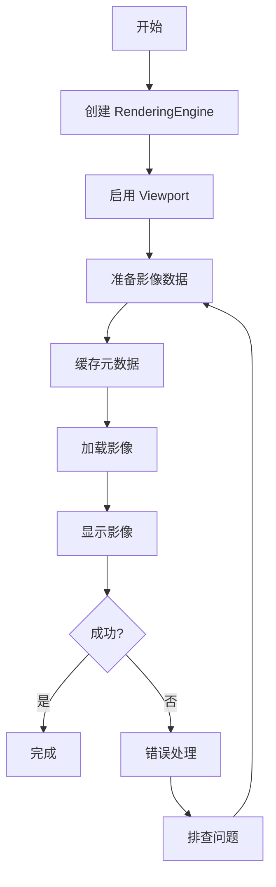

# 第一个影像查看器

## 概述

本文档将指导您从零开始创建一个完整的 DICOM 影像查看器。您将学习如何：

- 创建和配置 RenderingEngine（渲染引擎）
- 创建 StackViewport（2D 栈式视口）
- 加载和显示 DICOM 影像
- 处理影像元数据

完成本文档后，您将拥有一个可以显示 DICOM 影像的完整查看器。

---

## 前置条件

在开始之前，请确保您已经：

- ✅ 完成了 [项目初始化](project-setup.md)
- ✅ 完成了 [Cornerstone3D 初始化](initialization.md)
- ✅ 准备好了 DICOM 影像数据源或示例文件

---

## 整体流程图



---

## 步骤 1: 创建 RenderingEngine

### 1.1 理解 RenderingEngine

**RenderingEngine（渲染引擎）** 是 Cornerstone3D 的核心组件，负责：

- 管理 WebGL 上下文
- 创建和销毁 Viewport（视口）
- 处理渲染循环
- 管理视口生命周期

### 1.2 创建渲染引擎实例

**文件**: `src/cornerstone/renderingEngine.ts`

```typescript
import { RenderingEngine } from '@cornerstonejs/core';

/**
 * 创建渲染引擎
 * @param engineId - 渲染引擎的唯一标识符
 * @returns RenderingEngine 实例
 */
export function createRenderingEngine(engineId: string): RenderingEngine {
  // 创建渲染引擎实例
  const renderingEngine = new RenderingEngine(engineId);

  console.log(`✅ 渲染引擎创建成功: ${engineId}`);

  return renderingEngine;
}

/**
 * 销毁渲染引擎
 * @param renderingEngine - 要销毁的渲染引擎实例
 */
export function destroyRenderingEngine(
  renderingEngine: RenderingEngine
): void {
  if (renderingEngine && !renderingEngine.hasBeenDestroyed) {
    renderingEngine.destroy();
    console.log('✅ 渲染引擎已销毁');
  }
}
```

**代码说明**:
- `RenderingEngine` 需要一个唯一的 ID 来标识
- 每个应用可以有多个渲染引擎，但通常一个就足够了
- 使用完渲染引擎后应该调用 `destroy()` 释放资源

> **⚠️ 注意**: 渲染引擎 ID 在整个应用中必须唯一。如果创建具有相同 ID 的渲染引擎，会覆盖之前的实例。

---

## 步骤 2: 创建 Viewport

### 2.1 理解 Viewport 类型

Cornerstone3D 提供多种 Viewport 类型：

| 类型 | 说明 | 使用场景 |
|------|------|----------|
| `STACK` | 2D 栈式视口 | 显示单张或多张 2D 影像（如 X 光、CT 切片） |
| `VOLUME_3D` | 3D 体渲染视口 | 3D 体数据渲染（如 CT、MRI 3D 重建） |
| `VOLUME_2D` | 2D 体视口 | 从 3D 体数据中提取 2D 切片 |
| `VIDEO` | 视频视口 | 显示视频流（如超声视频） |

对于第一个查看器，我们将使用 **STACK** 类型的视口，它是最简单和最常用的类型。

### 2.2 准备 DOM 元素

**文件**: `src/App.tsx`

```typescript
import { useRef, useEffect } from 'react';

function App() {
  // 创建视口的容器元素引用
  const viewportRef = useRef<HTMLDivElement>(null);

  return (
    <div>
      <h1>我的第一个影像查看器</h1>
      {/* 视口容器 */}
      <div
        ref={viewportRef}
        style={{
          width: '512px',
          height: '512px',
          border: '1px solid black',
          backgroundColor: 'black',
        }}
      />
    </div>
  );
}

export default App;
```

**代码说明**:
- `viewportRef` 用于获取 DOM 元素的引用
- 视口容器必须有明确的宽度和高度
- 设置黑色背景可以更好地显示医学影像

### 2.3 启用视口

**文件**: `src/cornerstone/viewport.ts`

```typescript
import {
  RenderingEngine,
  Enums,
  type IStackViewport,
} from '@cornerstonejs/core';

/**
 * 创建并启用栈式视口
 * @param renderingEngine - 渲染引擎实例
 * @param viewportId - 视口的唯一标识符
 * @param element - DOM 元素
 * @returns 视口实例
 */
export function enableStackViewport(
  renderingEngine: RenderingEngine,
  viewportId: string,
  element: HTMLDivElement
): IStackViewport {
  // 定义视口输入配置
  const viewportInput = {
    viewportId: viewportId, // 视口 ID
    element: element, // DOM 元素
    type: Enums.ViewportType.STACK, // 视口类型：栈式
  };

  // 启用视口
  renderingEngine.enableElement(viewportInput);

  // 获取视口实例
  const viewport = renderingEngine.getStackViewport(viewportId);

  console.log(`✅ 视口创建成功: ${viewportId}`);

  return viewport;
}
```

**代码说明**:
- `viewportId` 在渲染引擎内必须唯一
- `element` 必须是一个有效的 DOM 元素（`div`）
- `type: Enums.ViewportType.STACK` 指定使用栈式视口

---

## 步骤 3: 准备影像数据

### 3.1 理解 ImageId

**ImageId（影像标识符）** 是 Cornerstone3D 中用于标识影像的唯一字符串。

**ImageId 格式示例**:

```typescript
// WADO-RS 协议（推荐用于生产环境）
const imageId =
  'wadors:https://dicomserver.com/wado-rs/studies/1.2.3/series/4.5.6/instances/7.8.9';

// WADO-URI 协议（传统方式）
const imageId =
  'wado:https://dicomserver.com/wado?requestType=WADO&studyUID=1.2.3&seriesUID=4.5.6&objectUID=7.8.9';

// 文件协议（用于本地开发）
const imageId = 'imageLoader:file://path/to/file.dcm';
```

### 3.2 创建 ImageId 列表

**文件**: `src/cornerstone/images.ts`

```typescript
/**
 * 创建示例 ImageId 列表
 * @returns ImageId 数组
 */
export function createImageIds(): string[] {
  // 示例：使用公开的 DICOM 测试数据
  const imageIds = [
    'wadors:https://dicomserver.com/wado-rs/studies/1.2.840.113619.2.55.3.2841205676.119.1135417040.362/series/1.2.840.113619.2.55.3.2841205676.119.1135417040.363/instances/1.2.840.113619.2.55.3.2841205676.119.1135417040.366',
    // 可以添加更多 ImageId...
  ];

  return imageIds;
}

/**
 * 从本地文件创建 ImageId
 * @param file - DICOM 文件
 * @returns ImageId
 */
export function createImageIdFromFile(file: File): string {
  // 使用 dicom-image-loader 的文件加载器
  const imageId = `imageLoader:file:${file.name}`;

  return imageId;
}
```

**代码说明**:
- `ImageIds` 是一个字符串数组，用于定义 Stack（影像栈）
- 可以混合使用不同协议的 ImageId
- 文件加载器用于本地开发测试

---

## 步骤 4: 缓存影像元数据

### 4.1 理解元数据

**元数据（Metadata）** 是关于影像的数据，包括：

- 患者信息（姓名、ID、出生日期）
- 检查信息（检查日期、检查类型）
- 序列信息（序列描述、影像数量）
- 影像信息（窗宽窗位、像素间距、影像方向）

### 4.2 缓存元数据

**文件**: `src/cornerstone/metadata.ts`

```typescript
import {
  MetadataProvider,
  metaDataManager,
} from '@cornerstonejs/core';

/**
 * 缓存影像元数据
 * @param imageIds - ImageId 列表
 */
export async function cacheMetadata(imageIds: string[]): Promise<void> {
  // 为每个 ImageId 缓存元数据
  const metadataPromises = imageIds.map(async (imageId) => {
    try {
      // 从 ImageLoader 获取元数据
      const metadata = await metaDataManager.get(imageId, 'imagePixelModule');

      // 添加到元数据提供器
      MetadataProvider.addMetadata(imageId, metadata);

      console.log(`✅ 元数据已缓存: ${imageId}`);
    } catch (error) {
      console.error(`❌ 元数据缓存失败: ${imageId}`, error);
    }
  });

  // 等待所有元数据缓存完成
  await Promise.all(metadataPromises);

  console.log('✅ 所有元数据缓存完成');
}
```

**代码说明**:
- 元数据缓存必须在加载影像之前完成
- 使用 `Promise.all` 并行缓存多个影像的元数据
- 缓存后的元数据将被存储在内存中，提高访问速度

> **💡 提示**: 在实际应用中，元数据通常由 PACS 服务器提供，无需手动缓存。此处代码用于演示元数据的工作原理。

---

## 步骤 5: 加载和显示影像

### 5.1 设置影像栈

**文件**: `src/cornerstone/viewport.ts`（继续添加）

```typescript
import type { IStackViewport } from '@cornerstonejs/core';

/**
 * 设置影像栈并显示第一帧
 * @param viewport - 视口实例
 * @param imageIds - ImageId 列表
 * @param currentImageIdIndex - 当前显示的影像索引（默认 0）
 */
export async function displayImage(
  viewport: IStackViewport,
  imageIds: string[],
  currentImageIdIndex: number = 0
): Promise<void> {
  try {
    // 设置影像栈
    const stack = {
      imageIds: imageIds, // ImageId 列表
      currentImageIdIndex: currentImageIdIndex, // 当前影像索引
    };

    // 将影像栈应用到视口
    viewport.setStack(stack);

    // 渲染视口
    viewport.render();

    console.log(`✅ 影像显示成功: ${imageIds[currentImageIdIndex]}`);
  } catch (error) {
    console.error('❌ 影像显示失败:', error);
    throw error;
  }
}
```

**代码说明**:
- `setStack()` 设置要显示的影像栈
- `currentImageIdIndex` 指定当前显示哪一张影像
- `render()` 触发渲染操作

### 5.2 完整示例：创建影像查看器

**文件**: `src/App.tsx`（完整版本）

```typescript
import { useEffect, useRef, useState } from 'react';
import { Enums } from '@cornerstonejs/core';
import { createRenderingEngine, destroyRenderingEngine } from './cornerstone/renderingEngine';
import { enableStackViewport } from './cornerstone/viewport';
import { createImageIds } from './cornerstone/images';
import { cacheMetadata } from './cornerstone/metadata';

function App() {
  const viewportRef = useRef<HTMLDivElement>(null);
  const [isImageLoaded, setIsImageLoaded] = useState(false);
  const [error, setError] = useState<string | null>(null);

  useEffect(() => {
    if (!viewportRef.current) return;

    let renderingEngine: any = null;

    const initializeViewer = async () => {
      try {
        // 1. 创建渲染引擎
        renderingEngine = createRenderingEngine('my-rendering-engine');

        // 2. 创建视口
        const viewport = enableStackViewport(
          renderingEngine,
          'my-viewport',
          viewportRef.current!
        );

        // 3. 准备影像数据
        const imageIds = createImageIds();

        // 4. 缓存元数据
        await cacheMetadata(imageIds);

        // 5. 显示影像
        await displayImage(viewport, imageIds, 0);

        setIsImageLoaded(true);
      } catch (err) {
        const errorMessage = err instanceof Error ? err.message : '未知错误';
        setError(errorMessage);
        console.error('❌ 影像查看器初始化失败:', err);
      }
    };

    initializeViewer();

    // 清理函数
    return () => {
      if (renderingEngine) {
        destroyRenderingEngine(renderingEngine);
      }
    };
  }, []);

  if (error) {
    return (
      <div>
        <h1>❌ 错误</h1>
        <p>{error}</p>
        <p>请检查浏览器控制台获取详细信息。</p>
      </div>
    );
  }

  return (
    <div>
      <h1>我的第一个影像查看器</h1>
      {isImageLoaded ? (
        <p>✅ 影像加载成功！</p>
      ) : (
        <p>⏳ 正在加载影像...</p>
      )}
      <div
        ref={viewportRef}
        style={{
          width: '512px',
          height: '512px',
          border: '1px solid black',
          backgroundColor: 'black',
        }}
      />
    </div>
  );
}

export default App;
```

---

## 步骤 6: 处理影像事件

### 6.1 监听视口事件

**文件**: `src/cornerstone/events.ts`

```typescript
import { eventTarget } from '@cornerstonejs/core';
import type { IImageLoadEvent } from '@cornerstonejs/core/dist/types/core/EventListeners';

/**
 * 注册影像加载事件监听器
 * @param callback - 影像加载完成时的回调函数
 * @returns 清理函数
 */
export function onImageLoaded(
  callback: (event: IImageLoadEvent) => void
): () => void {
  // 监听影像加载完成事件
  eventTarget.addEventListener(
    Enums.Events.IMAGE_LOADED,
    callback
  );

  // 返回清理函数
  return () => {
    eventTarget.removeEventListener(
      Enums.Events.IMAGE_LOADED,
      callback
    );
  };
}

/**
 * 注册影像加载失败事件监听器
 * @param callback - 影像加载失败时的回调函数
 * @returns 清理函数
 */
export function onImageLoadFailed(
  callback: (event: any) => void
): () => void {
  eventTarget.addEventListener(
    Enums.Events.IMAGE_LOAD_FAILED,
    callback
  );

  return () => {
    eventTarget.removeEventListener(
      Enums.Events.IMAGE_LOAD_FAILED,
      callback
    );
  };
}
```

### 6.2 在组件中使用事件

**文件**: `src/App.tsx`（添加事件处理）

```typescript
useEffect(() => {
  // ... 初始化代码 ...

  // 监听影像加载事件
  const cleanupImageLoaded = onImageLoaded((event) => {
    console.log('📸 影像加载完成:', event.detail.imageId);
    setIsImageLoaded(true);
  });

  // 监听影像加载失败事件
  const cleanupImageLoadFailed = onImageLoadFailed((event) => {
    console.error('❌ 影像加载失败:', event.detail.error);
    setError(event.detail.error.message);
  });

  return () => {
    // 清理事件监听器
    cleanupImageLoaded();
    cleanupImageLoadFailed();

    // 清理渲染引擎
    if (renderingEngine) {
      destroyRenderingEngine(renderingEngine);
    }
  };
}, []);
```

---

## 步骤 7: 完整工作流程

### 7.1 整合所有步骤

创建一个统一的初始化函数：

**文件**: `src/cornerstone/viewer.ts`

```typescript
import { RenderingEngine, type IStackViewport } from '@cornerstonejs/core';
import { createRenderingEngine } from './renderingEngine';
import { enableStackViewport, displayImage } from './viewport';
import { createImageIds } from './images';
import { cacheMetadata } from './metadata';

/**
 * 完整的影像查看器初始化流程
 * @param element - 视口容器 DOM 元素
 * @param engineId - 渲染引擎 ID
 * @param viewportId - 视口 ID
 * @returns 渲染引擎和视口实例
 */
export async function initializeViewer(
  element: HTMLDivElement,
  engineId: string,
  viewportId: string
): Promise<{
  renderingEngine: RenderingEngine;
  viewport: IStackViewport;
}> {
  // 1. 创建渲染引擎
  const renderingEngine = createRenderingEngine(engineId);

  // 2. 创建视口
  const viewport = enableStackViewport(
    renderingEngine,
    viewportId,
    element
  );

  // 3. 准备影像数据
  const imageIds = createImageIds();

  // 4. 缓存元数据
  await cacheMetadata(imageIds);

  // 5. 显示影像
  await displayImage(viewport, imageIds, 0);

  return {
    renderingEngine,
    viewport,
  };
}
```

### 7.2 在组件中使用

**文件**: `src/App.tsx`（最终版本）

```typescript
import { useEffect, useRef, useState } from 'react';
import { destroyRenderingEngine } from './cornerstone/renderingEngine';
import { initializeViewer } from './cornerstone/viewer';

function App() {
  const viewportRef = useRef<HTMLDivElement>(null);
  const [isImageLoaded, setIsImageLoaded] = useState(false);
  const [error, setError] = useState<string | null>(null);

  useEffect(() => {
    if (!viewportRef.current) return;

    let renderingEngine: any = null;

    const init = async () => {
      try {
        // 使用统一的初始化函数
        const result = await initializeViewer(
          viewportRef.current!,
          'my-rendering-engine',
          'my-viewport'
        );

        renderingEngine = result.renderingEngine;
        setIsImageLoaded(true);
      } catch (err) {
        const errorMessage = err instanceof Error ? err.message : '未知错误';
        setError(errorMessage);
        console.error('❌ 影像查看器初始化失败:', err);
      }
    };

    init();

    return () => {
      if (renderingEngine) {
        destroyRenderingEngine(renderingEngine);
      }
    };
  }, []);

  if (error) {
    return (
      <div>
        <h1>❌ 错误</h1>
        <p>{error}</p>
      </div>
    );
  }

  return (
    <div>
      <h1>我的第一个影像查看器</h1>
      {isImageLoaded ? (
        <p>✅ 影像加载成功！</p>
      ) : (
        <p>⏳ 正在加载影像...</p>
      )}
      <div
        ref={viewportRef}
        style={{
          width: '512px',
          height: '512px',
          border: '1px solid black',
          backgroundColor: 'black',
        }}
      />
    </div>
  );
}

export default App;
```

---

## 常见问题

### Q: 影像无法显示，出现黑屏？

**A**: 检查以下几点：

1. **ImageId 是否正确**：确认 ImageId 指向有效的 DICOM 影像
2. **元数据是否缓存**：确保在 `displayImage` 之前调用了 `cacheMetadata`
3. **DOM 元素尺寸**：视口容器必须有明确的宽度和高度
4. **浏览器控制台**：查看是否有错误信息

```typescript
// 调试：检查 ImageId
console.log('ImageId:', imageIds[0]);

// 调试：检查视口状态
console.log('视口:', viewport);

// 调试：检查渲染引擎
console.log('渲染引擎:', renderingEngine);
```

### Q: 如何加载本地的 DICOM 文件？

**A**: 使用文件加载器：

```typescript
// 1. 添加文件选择器
<input
  type="file"
  accept=".dcm"
  onChange={(e) => handleFileSelect(e)}
  multiple
/>

// 2. 处理文件选择
const handleFileSelect = async (event: React.ChangeEvent<HTMLInputElement>) => {
  const files = event.target.files;
  if (!files) return;

  const imageIds = Array.from(files).map((file) => {
    return `imageLoader:file:${file.name}`;
  });

  // 使用这些 ImageId...
};
```

### Q: 如何切换到下一张影像？

**A**: 使用视口的 `scroll` 方法：

```typescript
// 切换到下一张
viewport.scroll(1);

// 切换到上一张
viewport.scroll(-1);

// 跳转到指定索引
viewport.gotoImageIndex(5);
```

### Q: 影像加载很慢怎么办？

**A**: 使用缓存和预加载：

```typescript
// 预加载所有影像
const preloadImages = async (imageIds: string[]) => {
  const promises = imageIds.map((imageId) => {
    return imageLoader.loadImage(imageId);
  });

  await Promise.all(promises);
};

// 在显示影像之前预加载
await preloadImages(imageIds);
await displayImage(viewport, imageIds, 0);
```

---

## 最佳实践

### 1. 资源清理

始终在组件卸载时清理资源：

```typescript
useEffect(() => {
  // 初始化代码...

  return () => {
    // 清理渲染引擎
    if (renderingEngine && !renderingEngine.hasBeenDestroyed) {
      renderingEngine.destroy();
    }
  };
}, []);
```

### 2. 错误处理

为每个异步操作添加错误处理：

```typescript
try {
  await displayImage(viewport, imageIds, 0);
} catch (error) {
  console.error('影像显示失败:', error);
  // 显示用户友好的错误信息
  setError('影像加载失败，请重试');
}
```

### 3. 加载状态

向用户显示加载进度：

```typescript
const [loadingProgress, setLoadingProgress] = useState(0);

const loadWithProgress = async (imageIds: string[]) => {
  for (let i = 0; i < imageIds.length; i++) {
    await imageLoader.loadImage(imageIds[i]);
    setLoadingProgress(((i + 1) / imageIds.length) * 100);
  }
};
```

### 4. 性能优化

- 使用 `contextPool` 渲染引擎模式以提高性能
- 预加载影像以减少等待时间
- 使用缓存避免重复加载
- 限制同时加载的影像数量

---

## 相关资源

- [项目初始化](project-setup.md)
- [Cornerstone3D 初始化](initialization.md)
- [基本交互](basic-interactions.md)
- [故障排查 - 常见错误](../troubleshooting/common-errors.md)

---

**下一步**: [基本交互 - 添加缩放、平移、窗宽窗位调整](basic-interactions.md)

---

**导航**: [返回快速入门](../getting-started/) | [返回指南首页](../README.md)
