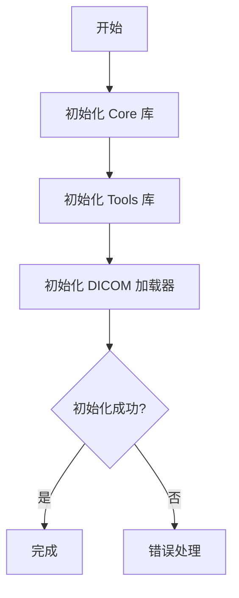

# Cornerstone3D 初始化

## 概述

本文档详细说明 Cornerstone3D 的初始化流程，包括核心库、工具库和 DICOM 加载器的初始化。

---

## 初始化流程图



---

## 步骤 1: 导入初始化函数

```typescript
// 导入核心库的初始化函数
import { init as initCore, enums as Enums } from '@cornerstonejs/core';
import { init as initTools } from '@cornerstonejs/tools';
import { wadorsImageLoader } from '@cornerstonejs/dicom-image-loader';
```

---

## 步骤 2: 初始化核心库

### 基础初始化

```typescript
// 基础配置
await initCore({
  core: {
    renderingEngineMode: Enums.RenderingEngineMode.CONTEXT_POOL,
  },
});
```

### 完整配置

```typescript
// 完整配置
await initCore({
  core: {
    renderingEngineMode: Enums.RenderingEngineMode.CONTEXT_POOL,
    webGlContextCount: 7,  // WebGL 上下文数量
  },
});
```

### 渲染引擎模式

| 模式 | 说明 | 适用场景 |
|------|------|----------|
| `CONTEXT_POOL` | 推荐 | 上下文池模式，性能优化 |
| `TILED` | 传统 | 平铺模式，兼容性模式 |

---

## 步骤 3: 初始化工具库

```typescript
// 初始化工具库
initTools();
```

### 初始化配置

```typescript
// 每个工具组可以独立初始化
initTools({
  [ToolGroups.ANNOTATION]: {
    tools: [RectangleROITool, EllipticalROITool],
  },
  [ToolGroups.MEASUREMENT]: {
    tools: [LengthTool, AngleTool, AreaTool, CobbAngleTool],
  },
  [ToolGroups.MANIPULATION]: {
    tools: [ZoomTool, PanTool, RotateTool, FlipTool, WindowLevelTool],
  },
});
```

---

## 步骤 4: 初始化 DICOM 加载器

### WADO-RS 加载器

```typescript
// 初始化 WADO-RS 加载器
wadorsImageLoader.init({
});
```

### 自定义配置

```typescript
// 自定义 WADO-RS 约束配置
wadorsInitOptions.wadoRsRoot = 'https://dicomserver.com/wado-rs';
```

---

## 步骤 5: 完整初始化函数

**文件**: `src/cornerstone/init.ts`

```typescript
import { init as initCore, enums as Enums } from '@cornerstonejs/core';
import { init as initTools } from '@cornerstonejs/tools';
import { wadorsImageLoader } from '@cornerstonejs/dicom-image-loader';

// 导出初始化函数
export async function initializeCornerstone3D(): Promise<void> {
  try {
    // 1. 初始化核心库
    await initCore({
      core: {
        renderingEngineMode: Enums.RenderingEngineMode.CONTEXT_POOL,
        webGlContextCount: 7,
      },
    });

    // 2. 初始化工具库
    initTools();

    // 3. 初始化 DICOM 加载器
    wadorsImageLoader.init({
      // 配置 WADO-RS 系列清单
      wadoRsRoot: 'https://dicomserver.com/wado-rs',
    });

    console.log('✅ Cornerstone3D 初始化成功！');
  } catch (error) {
    console.error('❌ 初始化失败:', error);
    throw error;
  }
}

// 使用
initializeCornerstone3D();
```

---

## 配置说明

### 渲染引擎配置

#### WebGL 上下文数量

```typescript
// 根据 GPU 能力调整
const webGlContextCount = navigator.hardwareConcurrency || 4;
```

#### 缓存配置

```typescript
// 调整缓存大小
const cacheConfig = {
  maximumSizeInBytes: 3 * 1024 * 1024 * 1024,  // 3GB
  cacheSizeInBytes: 256 * 1024 *  1024,        // 256MB
};

await initCore({
  core: {
    cache: cacheConfig,
  },
});
```

---

## 最佳实践

### 1. 优雅的错误处理

```typescript
try {
  await initCore();
} catch (error) {
  console.error('初始化失败:', error);
  // 显示用户友好的错误信息
}
```

### 2. 异步初始化

```typescript
// 在 React 组件中异步初始化
useEffect(() => {
  const init = async () => {
    await initializeCornerstone3D();
  };

  init();
}, []);
```

### 3. 按需加载

```typescript
// 只加载需要的部分
// 例如：只初始化标注工具
initTools({
  [ToolGroups.ANNOTATION]: {
    tools: [RectangleROITool],
  },
});
```

---

## 故障排查

### 常见错误

#### 错误 1: 初始化失败

**错误信息**: `CORNERSTONE_NOT_INITIALIZED`

**原因**: 在调用 Cornerstone3D API 之前没有调用 `init()` 函数

**解决方案**: 确保在应用启动时调用 `await init()`

#### 错误 2: 影像加载失败

**错误信息**: `ImageLoader not registered`

**原因**: 没有注册相应的 ImageLoader

**解决方案**:

```typescript
// 注册 ImageLoader
wadorsImageLoader.init();
```

---

## 相关资源

- [项目初始化](project-setup.md)
- [第一个影像查看器](first-viewer.md)
- [基本交互](basic-interactions.md)

---

**下一步**: [第一个影像查看器](first-viewer.md)
