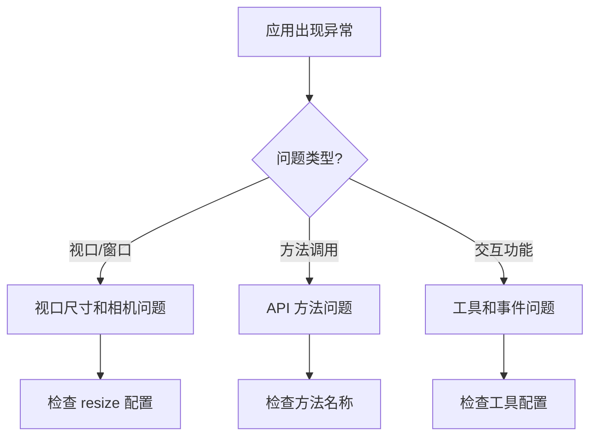
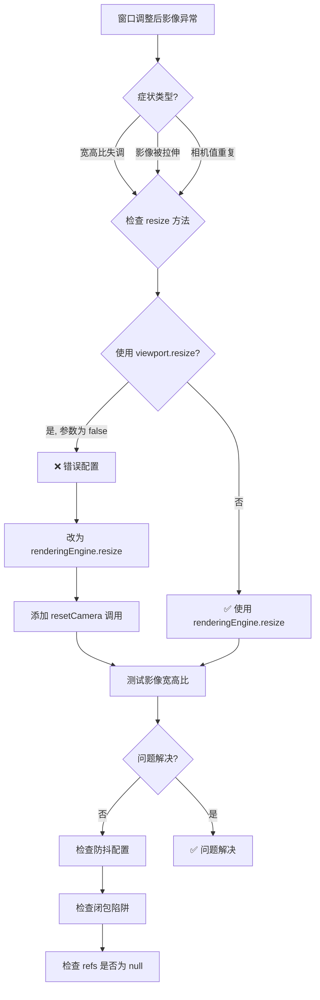
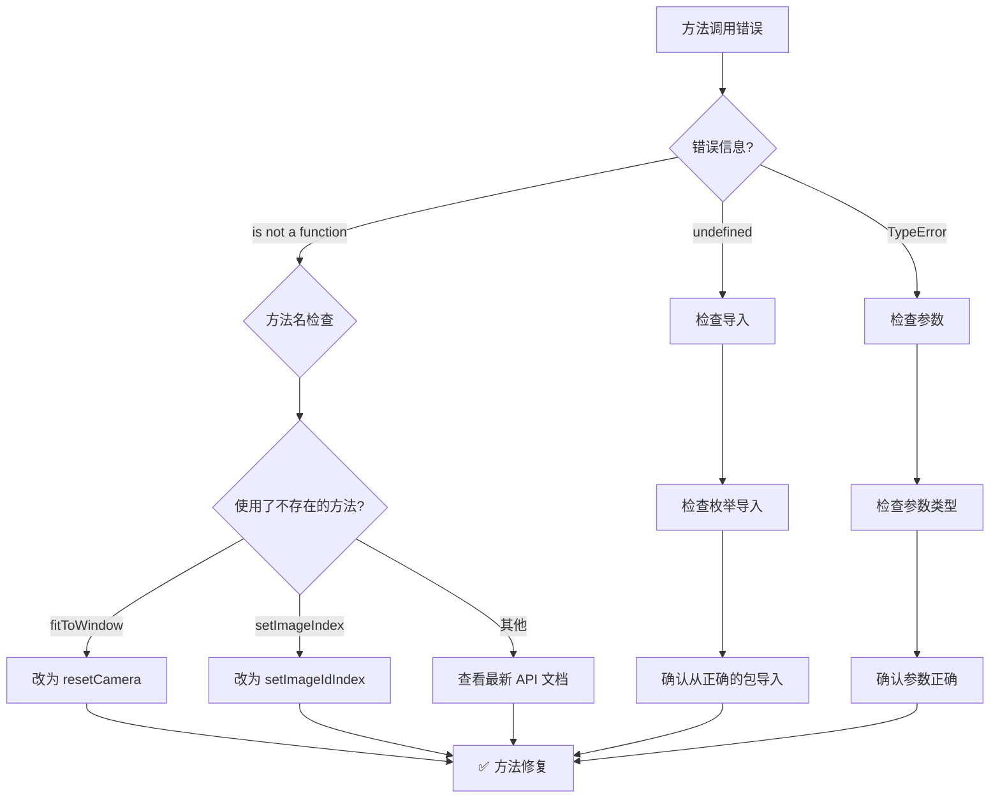
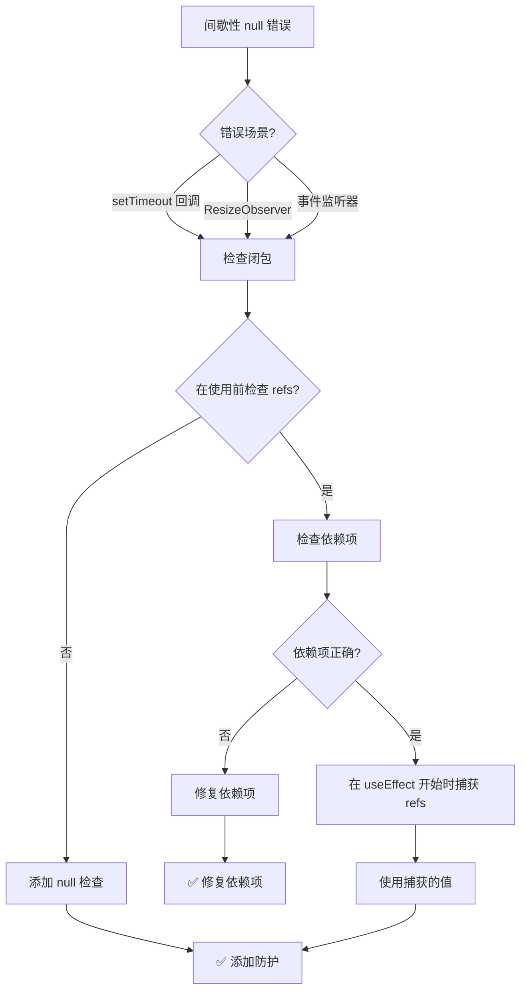

# 常见陷阱和解决方案

**Based on**: 实际调试经验总结
**Last Updated**: 2026-01-18
**Difficulty**: ⭐⭐⭐ (这些错误容易犯且难以排查)

本文档总结了在 Cornerstone3D 开发过程中最容易犯的错误，以及如何避免它们。

---

## 🎯 概述

在开发 Cornerstone3D 应用时，有一些 API 变更和配置细节容易被忽略，导致功能不正常但错误信息不明确。本文档旨在帮助开发者避免这些常见陷阱。

---

## 陷阱 1: StackScrollTool 的滚轮绑定 ⭐⭐⭐

### 错误现象

```typescript
// ❌ 错误配置 - 滚轮无法换层
toolGroup.setToolActive(StackScrollTool.toolName);
```

**症状**：
- 滚轮滚动没有任何反应
- 其他工具（缩放、平移）正常工作
- 没有错误提示

### 正确配置

```typescript
// ✅ 正确配置 - 必须包含 Wheel 绑定
toolGroup.setToolActive(StackScrollTool.toolName, {
  bindings: [
    {
      mouseButton: ToolsEnums.MouseBindings.Wheel,
    },
  ],
});
```

### 为什么会这样？

**设计原因**：
1. Cornerstone3D 的工具系统要求明确指定工具响应哪些输入事件
2. `StackScrollTool` 通过 `mouseWheelCallback` 处理滚轮事件
3. 但工具系统需要知道将滚轮事件路由到哪个工具

**类比**：
- 其他工具（如 PanTool、ZoomTool）通过鼠标按钮触发，所以必须绑定到特定的鼠标按钮（Primary、Secondary、Auxiliary）
- `StackScrollTool` 通过滚轮触发，所以必须绑定到 `MouseBindings.Wheel`
- 这保持了工具配置的一致性和可预测性

### 验证方法

```typescript
// 添加调试信息
console.log('🔧 工具组配置：');
console.log('  - 工具组ID:', toolGroup.id);
console.log('  - 视口列表:', toolGroup.getViewportIds());
```

**预期结果**：
- 滚轮可以切换影像层
- 控制台显示 "交互工具已设置完成"
- 没有警告或错误信息

### 相关文档

- [基本交互 - StackScrollTool 滚轮绑定](../getting-started/basic-interactions.md#-重要-stackscrolltool-的滚轮绑定)
- [基础查看器 README - 滚轮换层常见问题](../examples/basic-viewer/README.md#-q-滚轮无法切换影像层)

---

## 陷阱 2: DICOM 加载器初始化 API 变更 ⭐⭐

### 错误现象

```typescript
// ❌ 旧版本 API（已弃用）
import { wadorsImageLoader } from '@cornerstonejs/dicom-image-loader';
wadorsImageLoader.init();
```

**症状**：
- 编译错误：`does not provide an export named 'wadorsImageLoader'`

### 正确配置

```typescript
// ✅ 新版本 API
import { init as initDICOMLoader } from '@cornerstonejs/dicom-image-loader';
initDICOMLoader();
```

### API 变更对比

| 旧 API | 新 API | 说明 |
|-------|--------|------|
| `wadorsImageLoader.init()` | `initDICOMLoader()` | 简化为 `init` 函数 |
| 需要命名空间导入 | 直接导入 `init` 函数 | 更简洁，避免命名空间污染 |

### 验证方法

```typescript
// 添加调试信息
console.log('✅ Cornerstone3D 初始化成功！');
```

**预期结果**：
- 启动应用后立即看到 "✅ Cornerstone3D 初始化成功！"
- 没有初始化相关的错误

### 相关文档

- [快速开始 - 初始化部分](../specs/001-image-viewer-guide/quickstart.md#步骤-4-初始化-cornerstone3d)

---

## 陷阱 3: 工具名称变更 ⭐⭐

### 错误现象

```typescript
// ❌ 旧版本工具名称（已不存在）
import { StackScrollMouseWheelTool } from '@cornerstonejs/tools';
addTool(StackScrollMouseWheelTool);
```

**症状**：
- 编译错误：`does not provide an export named 'StackScrollMouseWheelTool'`

### 正确配置

```typescript
// ✅ 新版本工具名称
import { StackScrollTool } from '@cornerstonejs/tools';
addTool(StackScrollTool);
```

### 工具名称变更对比

| 旧名称（错误） | 新名称（正确） | 类型 |
|-------------|--------------|------|
| `StackScrollMouseWheelTool` | `StackScrollTool` | 滚动工具 |
| `wadorsImageLoader` | `init` | DICOM 加载器 |

### 为什么这样改名？

**设计原因**：
1. **简化命名**：移除冗余的 "MouseWheel" 后缀
2. **一致性**：所有工具都以简单名称命名（PanTool、ZoomTool、StackScrollTool）
3. **向后兼容**：这是重命名，不是移除功能

### 验证方法

```typescript
import { StackScrollTool } from '@cornerstonejs/tools';
console.log('StackScrollTool.toolName'); // 应该输出: StackScroll

// 验证工具是否正确注册
import { ToolGroupManager } from '@cornerstonejs/tools';
const toolGroup = ToolGroupManager.getToolGroup('myToolGroup');
console.log(toolGroup.hasTool('StackScroll')); // 应该输出: true
```

---

## 陷阱 4: MouseBindings 枚举导入 ⭐⭐

### 错误现象

```typescript
// ❌ 错误导入
import { Enums } from '@cornerstonejs/core';

// 使用时出错
bindings: [{ mouseButton: Enums.Events.MouseBindings.Primary }] // undefined
```

**症状**：
- 运行时错误：`Cannot read properties of undefined (reading 'Primary')`
- 其他鼠标绑定不工作

### 正确配置

```typescript
// ✅ 正确导入 - 从 tools 导入 Enums 并重命名
import { Enums as ToolsEnums } from '@cornerstonejs/tools';

// 使用时
bindings: [{ mouseButton: ToolsEnums.MouseBindings.Primary }]
```

### 为什么会这样？

**模块组织**：
- `@cornerstonejs/core` 的 `Enums` 不包含 `MouseBindings`
- `MouseBindings` 在 `@cornerstonejs/tools` 的 `Enums` 中
- 两个包都有 `Enums` 枚举，但包含不同的内容

### 枚举对比

| 枚举 | 位置 | 包含内容 |
|------|------|---------|
| `Enums.Events` (core) | `@cornerstonesource/core` | `ViewportType`, `Events` 等 |
| `Enums` (tools) | `@cornerstonejs/tools` | `MouseBindings`, `KeyboardBindings`, `ToolModes` 等 |

### 验证方法

```typescript
import { Enums as CoreEnums } from '@cornerstonejs/core';
import { Enums as ToolsEnums } from '@cornerstonejs/tools';

console.log('Core Enums:', CoreEnums.ViewportType);
console.log('Tools Enums:', ToolsEnums.MouseBindings);
```

**预期结果**：
- `Core Enums.STACK` 应该输出 `STACK`
- `ToolsEnums.MouseBindings.Wheel` 应该输出 `524288` (0x80000)

---

## 陷阱 5: ImageId 格式错误 ⭐

### 错误现象

```typescript
// ❌ 错误的 ImageId 格式
const imageId = 'imageLoader:file:image.dcm';
viewport.setStack([imageId], 0);
```

**症状**：
- 错误：`No image loader found for scheme 'imageLoader'`
- 影像无法显示

### 正确配置

#### 远程影像（WADO-RS）

```typescript
// ✅ 正确的 WADO-RS ImageId 格式
const imageId = 'wadors:https://example.com/wado-rs/studies/...';
viewport.setStack([imageId], 0);
```

#### 本地文件

```typescript
// ✅ 正确的本地文件 ImageId 格式
import { wadouri } from '@cornerstone3D/dicom-image-loader';

// 添加文件到文件管理器并获取 ImageId
const imageId = wadouri.fileManager.add(file);
viewport.setStack([imageId], 0);
```

### ImageId 格式说明

| 协议 | ImageId 前缀 | 示例 |
|------|------------|------|
| WADO-RS | `wadors:` | `wadors:https://.../image.dcm` |
| WADO-URI | `wadouri:` | `wadouri:file:image.dcm` (不推荐) |
| 本地文件 | `wadouri:file:` | 通过 `wadouri.fileManager.add(file)` 生成 |

### 验证方法

```typescript
// 检查 ImageId 是否有效
console.log('ImageId:', imageId);

// 检查视口状态
const viewport = renderingEngine.getStackViewport('my-viewport');
console.log('Viewport exists:', !!viewport);
console.log('Current image:', viewport.getCurrentImageId());
```

---

## 陷阱 6: 视口方法名变更 ⭐

### 错误现象

```typescript
// ❌ 旧版本方法名（已移除）
viewport.setImageIndex(1);
```

**症状**：
- 运行时错误：`viewport.setImageIndex is not a function`
- 无法通过编程方式切换影像层

### 正确配置

```typescript
// ✅ 新版本方法名
await viewport.setImageIdIndex(1);
```

### 方法变更对比

| 旧方法 | 新方法 | 说明 |
|--------|--------|------|
| `setImageIndex(index)` | `setImageIdIndex(index)` | 更准确的命名 |
| `getCurrentImageId()` | `getCurrentImageId()` | 保持不变 |

### 验证方法

```typescript
// 检查方法是否存在
console.log('setImageIdIndex' in viewport); // 应该输出: true
console.log('setImageIndex' in viewport);  // 应该输出: false
```

---

## 陷阱 7: 鼠标按钮枚举值错误 ⭐

### 错误现象

```typescript
// ❌ 错误 - 使用数字
bindings: [{ mouseButton: 1 }] // Primary
bindings: [{ mouseButton: 2 }] // Secondary
```

**症状**：
- 滚轮不能换层
- 鼠标绑定不工作
- 没有错误提示

### 正确配置

```typescript
// ✅ 正确 - 使用枚举
import { Enums as ToolsEnums } from '@cornerstonejs/tools';

bindings: [{ mouseButton: ToolsEnums.MouseBindings.Primary }]   // 左键
bindings: [{ mouseButton: ToolsEnums.MouseBindings.Secondary }] // 右键
bindings: [{ mouseButton: ToolsEnums.MouseBindings.Auxiliary }] // 中键
bindings: [{ mouseButton: ToolsEnums.MouseBindings.Wheel }]     // 滚轮
```

### 枚举值对照表

| 枚举值 | 数值 | 说明 |
|--------|------|------|
| `MouseBindings.Primary` | 1 | 左键 |
| `MouseBindings.Secondary` | 2 | 右键 |
| `MouseBindings.Auxiliary` | 4 | 中键 |
| `MouseBindings.Wheel` | 524288 (0x80000) | 滚轮 |

**为什么使用枚举？**

1. **可读性**：`MouseBindings.Wheel` 比数字 `524288` 清晰得多
2. **类型安全**：TypeScript 会检查枚举的有效性
3. **自文档化**：代码本身说明了意图

---

## 陷阱 8: 重复工具注册 ⭐

### 错误现象

```typescript
// React StrictMode 导致的双重执行
useEffect(() => {
  addTool(PanTool);
  addTool(ZoomTool);
  // ...
}, []);
```

**症状**：
- 控制台警告：`'Pan' is already registered for ToolGroup basic-tool-group.`
- 虽然不影响功能，但会在控制台显示警告

### 正确配置

```typescript
// ✅ 添加 try-catch 来处理重复注册
try {
  addTool(PanTool);
  addTool(ZoomTool);
  addTool(WindowLevelTool);
  addTool(StackScrollTool);
} catch (error) {
  // 工具已经注册，忽略错误
  console.debug('工具已经注册，跳过注册步骤');
}
```

### 替代方案：检查工具是否已添加

```typescript
// ✅ 先检查再添加
const toolsToAdd = [
  PanTool.toolName,
  ZoomTool.toolName,
  WindowLevelTool.toolName,
  StackScrollTool.toolName,
];

toolsToAdd.forEach((toolName) => {
  if (!toolGroup.hasTool(toolName)) {
    toolGroup.addTool(toolName);
  }
});
```

---

## 陷阱 9: 视口未添加到 ToolGroup ⭐⭐

### 错误现象

```typescript
// ✅ 工具已添加到工具组
toolGroup.setToolActive(PanTool.toolName, {
  bindings: [{ mouseButton: ToolsEnums.MouseBindings.Primary }],
});

// ❌ 但视口未添加到工具组
// renderingEngine.enableElement(viewportInput);
// 没有调用 toolGroup.addViewport()
```

**症状**：
- 控制台没有错误
- 但工具不工作
- 影像可以显示，但无法交互

### 正确配置

```typescript
// 确保添加视口到工具组
toolGroup.addViewport(viewportId, renderingEngine.id);
```

### 为什么需要添加视口？

**设计原因**：
- 工具组可以管理多个视口
- 视口必须显式地添加到工具组
- 这样可以实现多视口同步等高级功能

---

## 陷阱 10: 滚轮工具与其他工具冲突 ⭐

### 错误现象

```typescript
// ⚠️ 注意：滚轮工具与其他工具可能存在冲突
toolGroup.setToolActive(ZoomTool.toolName, {
  bindings: [{ mouseButton: ToolsEnums.MouseBindings.Secondary }],
});
toolGroup.setToolActive(StackScrollTool.toolName, {
  bindings: [{ mouseButton: ToolsEnums.MouseBindings.Wheel }],
});
```

**症状**：
- 滚轮换层功能不工作
- 缩放也不正常

### 解决方案：使用不同的绑定

```typescript
// ✅ 正确配置 - 每个工具绑定到不同的输入
// 左键：窗宽窗位
toolGroup.setToolActive(WindowLevelTool.toolName, {
  bindings: [{ mouseButton: ToolsEnums.MouseBindings.Primary }],
});

// 中键：平移
toolGroup.setToolActive(PanTool.toolName, {
  bindings: [{ mouseButton: ToolsEnums.MouseBindings.Auxiliary }],
});

// 右键：缩放
toolGroup.setToolActive(ZoomTool.toolName, {
  bindings: [{ mouseButton: ToolsEnums.MouseBindings.Secondary }],
});

// 滚轮：换层
toolGroup.setToolActive(StackScrollTool.toolName, {
  bindings: [
    {
      mouseButton: ToolsEnums.MouseBindings.Wheel,
    },
  ],
});
```

**为什么这样设计？**

1. **每个工具应该有自己的专属输入通道**
2. **避免冲突**：不同的工具不应该绑定到同一个输入
3. **用户体验**：让用户可以同时使用多个工具

---

## 陷阱 11: resize 方法的 keepCamera 参数使用不当 ⭐⭐⭐

### 错误现象

```typescript
// ❌ 错误配置 - 导致宽高比失调
viewport.resize([newWidth, newHeight], false);

if (imageIds.length > 0) {
  viewport.resetCamera({
    resetPan: true,
    resetZoom: true,
    resetToCenter: true,
  });
  viewport.render();
}
```

**症状**：
- 第一次显示影像正常
- 调整浏览器窗口大小后，影像宽高比例失调
- 影像被拉伸或压缩
- 控制台显示重复的 `resetCamera` 调用，每次都设置相同的相机值

### 正确配置

```typescript
// ✅ 正确配置 - 使用 RenderingEngine 的 resize 方法
if (viewport) {
  // 使用 RenderingEngine 的 resize 方法，它会自动处理所有视口
  renderingEngine.resize(true, true);

  // 如果有影像，让它适应新尺寸
  if (imageIds.length > 0) {
    // 使用 resetCamera 让影像自动适应新视口尺寸，保持正确的宽高比
    viewport.resetCamera({
      resetPan: true,
      resetZoom: true,
      resetToCenter: true,
    });
    viewport.render();
  }
}
```

### 为什么会这样？

**问题根源**：
1. **`viewport.resize([width, height], false)` 的参数冲突**：
   - 第二个参数 `false` 表示"不保持相机状态"
   - 但这会导致视口内部的相机计算出现问题
   - 相机状态被重置，但视口尺寸更新不正确

2. **`resetCamera` 的重复调用**：
   - 每次 resize 事件都会调用 `resetCamera`
   - 但由于 `viewport.resize` 使用 `false` 参数，相机计算基于错误的视口尺寸
   - 导致每次都设置相同的缩放值，无法适应新的窗口大小

**参数说明**：

```typescript
// viewport.resize 的第二个参数
viewport.resize([newWidth, newHeight], keepCamera);

// keepCamera:
//   true  - 保持当前的 pan、zoom 等相机状态
//   false - 重置相机状态，但可能导致宽高比计算错误
```

**RenderingEngine.resize 的参数**：

```typescript
// renderingEngine.resize 的参数
renderingEngine.resize(immediate, keepCamera);

// immediate:
//   true  - 立即执行 resize
//   false - 延迟执行（需要后续调用 render）

// keepCamera:
//   true  - 保持所有视口的相机状态（pan, zoom 等）
//   false - 重置相机状态
```

### 推荐方案

#### 方案 1: 使用 RenderingEngine.resize（推荐）

```typescript
// ✅ 最佳实践
window.addEventListener('resize', () => {
  if (resizeTimeout) clearTimeout(resizeTimeout);

  resizeTimeout = setTimeout(() => {
    const container = divRef.current;
    const renderingEngine = renderingEngineRef.current;

    if (!container || !renderingEngine) return;

    const viewport = renderingEngine.getViewport('main-viewport') as Types.IStackViewport;

    if (viewport) {
      // 使用 RenderingEngine 的 resize 方法
      renderingEngine.resize(true, true);

      // 如果有影像，重置相机以适应新尺寸
      if (imageIds.length > 0) {
        viewport.resetCamera({
          resetPan: true,
          resetZoom: true,
          resetToCenter: true,
        });
        viewport.render();
      }
    }
  }, 100);
});
```

**优点**：
- `RenderingEngine.resize()` 是更高级的方法，会自动处理所有视口
- 它会正确检测容器尺寸变化
- 配合 `resetCamera()` 可以正确重新计算相机位置和缩放
- 适用于单视口和多视口场景

#### 方案 2: 使用 ResizeObserver（更精确）

```typescript
// ✅ 适用于容器大小变化的场景
useEffect(() => {
  if (!divRef.current || !renderingEngineRef.current) return;

  const container = divRef.current;
  const renderingEngine = renderingEngineRef.current;

  const resizeObserver = new ResizeObserver(() => {
    const viewport = renderingEngine.getViewport('main-viewport') as Types.IStackViewport;

    if (viewport) {
      renderingEngine.resize(true, true);

      if (imageIds.length > 0) {
        viewport.resetCamera({
          resetPan: true,
          resetZoom: true,
          resetToCenter: true,
        });
        viewport.render();
      }
    }
  });

  resizeObserver.observe(container);

  return () => {
    resizeObserver.disconnect();
  };
}, [imageIds]);
```

**优点**：
- 可以检测容器本身的尺寸变化（不仅仅是窗口大小）
- 比窗口 resize 事件更准确
- 适用于响应式布局

### 验证方法

```typescript
// 添加调试信息
const handleResize = () => {
  const container = divRef.current;
  const newWidth = container.clientWidth;
  const newHeight = container.clientHeight;

  console.log('📐 视口尺寸变化:', { newWidth, newHeight });

  const viewport = renderingEngine.getViewport('main-viewport');

  if (viewport) {
    renderingEngine.resize(true, true);

    if (imageIds.length > 0) {
      viewport.resetCamera({
        resetPan: true,
        resetZoom: true,
        resetToCenter: true,
      });
      viewport.render();

      // 验证相机状态
      const camera = viewport.getCamera();
      console.log('📷 相机状态:', {
        width: newWidth,
        height: newHeight,
        zoom: camera.zoom,
      });
    }
  }
};
```

**预期结果**：
- 每次调整窗口大小，相机值应该根据新的视口尺寸重新计算
- 影像应该保持正确的宽高比
- 不会出现拉伸或压缩

### 调试技巧

1. **检查视口尺寸**：
```typescript
console.log('容器尺寸:', {
  width: container.clientWidth,
  height: container.clientHeight,
});
```

2. **检查相机状态**：
```typescript
const camera = viewport.getCamera();
console.log('相机状态:', {
  zoom: camera.zoom,
  parallelScale: camera.parallelScale,
});
```

3. **检查 resize 是否被调用**：
```typescript
let resizeCount = 0;
const handleResize = () => {
  resizeCount++;
  console.log(`🔄 Resize 被调用: ${resizeCount} 次`);
  // ... resize 逻辑
};
```

### 相关文档

- [视口和相机 - 详解](../getting-started/basic-interactions.md#视口和相机)
- [RenderingEngine API - resize 方法](https://www.cornerstonejs.org/apis/core/latest/enums/RenderingEngine)

---

## 陷阱 12: 不存在的 fitToWindow 方法 ⭐⭐

### 错误现象

```typescript
// ❌ 错误 - fitToWindow 方法不存在
viewport.resize([newWidth, newHeight], true);
if (imageIds.length > 0) {
  viewport.fitToWindow(); // ❌ 运行时错误
  viewport.render();
}
```

**症状**：
- 运行时错误：`viewport.fitToWindow is not a function`
- 影像无法适应窗口大小

### 正确配置

```typescript
// ✅ 正确 - 使用 resetCamera 方法
viewport.resize([newWidth, newHeight], true);
if (imageIds.length > 0) {
  viewport.resetCamera(); // ✅ 正确的方法
  viewport.render();
}
```

### 方法对比

| 错误方法 | 正确方法 | 说明 |
|---------|---------|------|
| `fitToWindow()` | `resetCamera()` | 重置相机以适应视口 |
| `fitToImage()` | `resetCamera()` | 重置相机以适应视口 |
| `fitToScreen()` | `resetCamera()` | 重置相机以适应视口 |

### resetCamera 方法详解

```typescript
// 基本用法
viewport.resetCamera();

// 带参数的用法
viewport.resetCamera({
  resetPan: true,      // 重置平移
  resetZoom: true,     // 重置缩放
  resetToCenter: true, // 重置到中心
});
```

**参数说明**：
- `resetPan`: 是否重置平移（将影像移回中心）
- `resetZoom`: 是否重置缩放（让影像适应视口）
- `resetToCenter`: 是否将影像居中显示

### 特殊场景：用于 resize 的 resetCameraForResize

```typescript
// ✅ 专门用于 resize 场景的方法
viewport.resetCameraForResize();
```

**等价于**：
```typescript
viewport.resetCamera({
  resetPan: true,
  resetZoom: true,
  resetToCenter: true,
  suppressEvents: true, // 阻止触发事件
});
```

**何时使用**：
- 在 `resize` 事件回调中使用
- 需要重置相机但不触发事件
- 性能敏感的场景

### 验证方法

```typescript
// 检查方法是否存在
console.log('resetCamera' in viewport);        // true
console.log('resetCameraForResize' in viewport); // true
console.log('fitToWindow' in viewport);        // false ❌
```

### 相关文档

- [StackViewport API - resetCamera](https://www.cornerstonejs.org/apis/core/latest/classes/StackViewport)
- [常见问题 - 窗口调整大小](#陷阱-11-resize-方法的-keepcamera-参数使用不当-⭐⭐⭐)

---

## 陷阱 13: React 闭包陷阱导致的 ResizeObserver 错误 ⭐⭐

### 错误现象

```typescript
// ❌ 错误 - ResizeObserver 在闭包中访问过期的 ref
useEffect(() => {
  const handleResize = () => {
    setTimeout(() => {
      // 这里的 divRef.current 可能是 null
      const container = divRef.current;
      if (!container) return;
      // ...
    }, 100);
  };

  const resizeObserver = new ResizeObserver(handleResize);
  resizeObserver.observe(divRef.current);
}, []);
```

**症状**：
- `TypeError: Cannot read properties of null (reading 'clientWidth')`
- `TypeError: Cannot read properties of null (reading 'getViewport')`
- 错误间歇性出现，难以复现

### 正确配置

#### 方案 1: 在回调中检查 refs（推荐）

```typescript
// ✅ 正确 - 每次使用前检查 refs
useEffect(() => {
  const handleResize = () => {
    setTimeout(() => {
      // 在实际使用时检查 refs
      const container = divRef.current;
      const renderingEngine = renderingEngineRef.current;

      if (!container || !renderingEngine) {
        return;
      }

      // 现在可以安全使用
      const newWidth = container.clientWidth;
      const viewport = renderingEngine.getViewport('main-viewport');
      // ...
    }, 100);
  };

  const resizeObserver = new ResizeObserver(handleResize);
  if (divRef.current) {
    resizeObserver.observe(divRef.current);
  }

  return () => {
    resizeObserver.disconnect();
  };
}, []);
```

#### 方案 2: 在 useEffect 开始时捕获 refs

```typescript
// ✅ 正确 - 在 useEffect 开始时捕获 refs
useEffect(() => {
  // 在开始时检查并捕获 refs
  if (!divRef.current || !renderingEngineRef.current) return;

  const container = divRef.current;
  const renderingEngine = renderingEngineRef.current;

  const handleResize = () => {
    setTimeout(() => {
      // 使用闭包中捕获的值
      const newWidth = container.clientWidth;
      const viewport = renderingEngine.getViewport('main-viewport');
      // ...
    }, 100);
  };

  const resizeObserver = new ResizeObserver(handleResize);
  resizeObserver.observe(container);

  return () => {
    resizeObserver.disconnect();
  };
}, []);
```

#### 方案 3: 添加依赖项（谨慎使用）

```typescript
// ⚠️ 谨慎使用 - 需要确保依赖项正确
useEffect(() => {
  const handleResize = () => {
    setTimeout(() => {
      const container = divRef.current;
      const renderingEngine = renderingEngineRef.current;

      if (!container || !renderingEngine) return;

      // ...
    }, 100);
  };

  const resizeObserver = new ResizeObserver(handleResize);
  if (divRef.current) {
    resizeObserver.observe(divRef.current);
  }

  return () => {
    resizeObserver.disconnect();
  };
}, [imageIds]); // ⚠️ 依赖项变化会导致重建 observer
```

### 为什么会这样？

**React 闭包陷阱**：
1. **useEffect 的闭包特性**：
   - `useEffect` 的回调函数会捕获创建时的变量值
   - 即使 ref 的值改变了，闭包中的值不会更新

2. **异步回调的问题**：
   - `setTimeout` 或事件回调可能在 ref 已经清空后执行
   - 例如：组件卸载后，resize 回调仍然可能被触发

3. **依赖项的影响**：
   - 如果依赖项设置不当，useEffect 不会重新执行
   - 导致闭包中捕获的是过期的值

### 最佳实践

#### 1. 使用 window.resize（最简单）

```typescript
// ✅ 推荐 - 最简单，不容易出错
useEffect(() => {
  let resizeTimeout: NodeJS.Timeout | null = null;

  const handleResize = () => {
    if (resizeTimeout) clearTimeout(resizeTimeout);

    resizeTimeout = setTimeout(() => {
      // 每次使用时都检查 refs
      const container = divRef.current;
      const renderingEngine = renderingEngineRef.current;

      if (!container || !renderingEngine) return;

      const viewport = renderingEngine.getViewport('main-viewport');
      if (viewport && imageIds.length > 0) {
        renderingEngine.resize(true, true);
        viewport.resetCamera();
        viewport.render();
      }
    }, 100);
  };

  window.addEventListener('resize', handleResize);

  return () => {
    window.removeEventListener('resize', handleResize);
    if (resizeTimeout) clearTimeout(resizeTimeout);
  };
}, [imageIds]);
```

#### 2. 使用 ResizeObserver（更精确）

```typescript
// ✅ 推荐 - 可以检测容器大小变化
useEffect(() => {
  // 在开始时检查 refs
  if (!divRef.current || !renderingEngineRef.current) return;

  const container = divRef.current;
  const renderingEngine = renderingEngineRef.current;

  const handleResize = () => {
    // 使用闭包中捕获的值
    const viewport = renderingEngine.getViewport('main-viewport');

    if (viewport && imageIds.length > 0) {
      renderingEngine.resize(true, true);
      viewport.resetCamera();
      viewport.render();
    }
  };

  const resizeObserver = new ResizeObserver(handleResize);
  resizeObserver.observe(container);

  return () => {
    resizeObserver.disconnect();
  };
}, [imageIds]);
```

### 验证方法

```typescript
// 添加详细的调试信息
const handleResize = () => {
  console.log('🔄 Resize 回调被触发');

  setTimeout(() => {
    console.log('⏰ setTimeout 回调执行');

    const container = divRef.current;
    const renderingEngine = renderingEngineRef.current;

    console.log('📦 Refs 状态:', {
      hasContainer: !!container,
      hasRenderingEngine: !!renderingEngine,
    });

    if (!container || !renderingEngine) {
      console.warn('⚠️ Refs 为空，跳过处理');
      return;
    }

    console.log('✅ Refs 有效，继续处理');
    // ... 实际的 resize 逻辑
  }, 100);
};
```

**预期结果**：
- 每次调整窗口大小，都应该看到 "✅ Refs 有效，继续处理"
- 不应该看到 "⚠️ Refs 为空，跳过处理"
- 不应该出现 "Cannot read properties of null" 错误

### 防抖建议

```typescript
// ✅ 正确的防抖实现
let resizeTimeout: NodeJS.Timeout | null = null;

const handleResize = () => {
  // 如果已有 timeout，先清除
  if (resizeTimeout) {
    clearTimeout(resizeTimeout);
  }

  // 创建新的 timeout
  resizeTimeout = setTimeout(() => {
    try {
      // ... resize 逻辑
    } finally {
      resizeTimeout = null; // 清理 timeout
    }
  }, 100);
};
```

**为什么这样写**：
- 每次新的 resize 事件都会取消之前的 timeout
- 确保最后一次 resize 事件总会被执行
- 避免频繁的 resize 操作影响性能

### 相关文档

- [React Hooks - 闭包陷阱](https://react.dev/reference/react/useState#storing-information-from-previous-renders)
- [ResizeObserver API](https://developer.mozilla.org/en-US/docs/Web/API/ResizeObserver)
- [常见问题 - 窗口调整大小](#陷阱-11-resize-方法的-keepcamera-参数使用不当-⭐⭐⭐)

---

## 陷阱 14: 使用不存在的工具 ⭐⭐⭐

### 错误现象

```typescript
// ❌ 错误 - 使用不存在的工具
import { ToolSelectorTool, EditTool } from '@cornerstonejs/tools';

addTool(ToolSelectorTool);
addTool(EditTool);

toolGroup.setToolActive(EditTool.toolName, {
  bindings: [{ mouseButton: ToolsEnums.MouseBindings.Primary }],
});
```

**症状**：
- 编译错误：`Module '"@cornerstonejs/tools"' has no exported member 'ToolSelectorTool'`
- 编译错误：`Module '"@cornerstonejs/tools"' has no exported member 'EditTool'`
- 运行时错误：`Cannot read properties of undefined`

### 正确配置

#### 方案 1: 使用标注工具自带的编辑功能（推荐）

```typescript
// ✅ 正确 - 标注工具自带编辑功能
import {
  RectangleROITool,
  EllipticalROITool,
  ArrowAnnotateTool,
} from '@cornerstonejs/tools';

// 注册标注工具
addTool(RectangleROITool);
addTool(EllipticalROITool);
addTool(ArrowAnnotateTool);

// 激活标注工具
toolGroup.setToolActive(RectangleROITool.toolName, {
  bindings: [{ mouseButton: ToolsEnums.MouseBindings.Primary }],
});

// 标注工具自带编辑功能：
// - 点击已绘制的标注即可进入编辑状态
// - 拖动标注的控制点可以调整大小和位置
// - 右键点击标注可以删除
```

#### 方案 2: 被动模式 + 标注选择

```typescript
// ✅ 切换到"编辑模式" - 实际上是被动模式
const toggleEditMode = () => {
  const toolGroup = toolGroupRef.current;
  if (!toolGroup || !activeTool) return;

  if (isEditMode) {
    // 退出编辑模式，回到绘图状态
    setIsEditMode(false);
    toolGroup.setToolActive(activeTool, {
      bindings: [{ mouseButton: ToolsEnums.MouseBindings.Primary }],
    });
  } else {
    // 进入编辑模式 - 设置为被动
    setIsEditMode(true);
    toolGroup.setToolPassive(activeTool);

    // 标注工具在 passive 模式下可以点击和编辑已有标注
    console.log('✅ 进入编辑模式 - 点击标注进行编辑');
  }
};
```

### 为什么没有独立的编辑工具？

**设计原因**：
1. **简化工具系统**：每个标注工具自带编辑功能，无需额外的编辑工具
2. **一致性**：所有标注工具（ROI、箭头、测量）的编辑方式一致
3. **用户体验**：点击标注即编辑，更直观，无需切换工具

**标注工具的编辑功能**：
- 点击标注：进入编辑状态
- 拖动控制点：调整大小和形状
- 拖动标注：移动位置
- 右键/双键：删除标注
- Escape 键：取消编辑

### 常见的错误工具名称

| 错误工具名称（不存在） | 说明 |
|-------------------|------|
| `ToolSelectorTool` | 不存在，使用标注工具自带的编辑功能 |
| `EditTool` | 不存在，使用标注工具自带的编辑功能 |
| `SelectionTool` | 不存在，点击标注即可选择 |
| `EllipseROITool` | 应该是 `EllipticalROITool` |
| `ArrowTool` | 应该是 `ArrowAnnotateTool` |

### 验证方法

```typescript
// 检查工具是否存在
import { RectangleROITool, EllipticalROITool } from '@cornerstonejs/tools';

console.log('RectangleROITool:', RectangleROITool.toolName); // 'RectangleROI'
console.log('EllipticalROITool:', EllipticalROITool.toolName); // 'EllipticalROI'

// 验证工具是否正确注册
const toolGroup = ToolGroupManager.getToolGroup('myToolGroup');
console.log('Has RectangleROI:', toolGroup.hasTool('RectangleROI')); // true
console.log('Has EllipticalROI:', toolGroup.hasTool('EllipticalROI')); // true
```

### 测试编辑功能

```typescript
// 测试标注的编辑功能
const testAnnotationEditing = () => {
  // 1. 激活标注工具
  toolGroup.setToolActive(RectangleROITool.toolName, {
    bindings: [{ mouseButton: ToolsEnums.MouseBindings.Primary }],
  });

  // 2. 绘制一个矩形 ROI
  console.log('请绘制一个矩形 ROI');

  // 3. 绘制完成后，点击已绘制的 ROI
  console.log('点击 ROI 可以进入编辑状态');
  console.log('- 拖动控制点调整大小');
  console.log('- 拖动 ROI 移动位置');
  console.log('- 按 Delete 键删除');
};
```

### 相关文档

- [标注工具 - 编辑功能](../advanced/annotations.md#编辑标注)
- [工具系统 - 工具模式](../getting-started/basic-interactions.md#工具模式)

---

## 陷阱 15: 视口类型配置错误 ⭐⭐

### 错误现象

```typescript
// ❌ 错误 - VOLUME 类型不存在
const viewportInput = {
  viewportId: 'volume-viewport',
  element,
  type: Enums.ViewportType.VOLUME, // ❌ 不存在
};
```

**症状**：
- 编译错误：`Property 'VOLUME' does not exist on type 'typeof ViewportType'`
- 无法创建 3D 体积视口

### 正确配置

#### StackViewport（2D 栈视口）

```typescript
// ✅ 正确 - 使用 STACK 类型
const viewportInput = {
  viewportId: 'stack-viewport',
  element,
  type: Enums.ViewportType.STACK, // ✅ 正确
};

renderingEngine.enableElement(viewportInput);
const viewport = renderingEngine.getViewport('stack-viewport') as Types.IStackViewport;
```

#### VolumeViewport（3D 体积视口）

```typescript
// ✅ 正确 - 使用 ORTHOGRAPHIC 类型
const viewportInput = {
  viewportId: 'volume-viewport',
  element,
  type: Enums.ViewportType.ORTHOGRAPHIC, // ✅ 正确
};

renderingEngine.enableElement(viewportInput);
const viewport = renderingEngine.getViewport('volume-viewport') as Types.IVolumeViewport;
```

### 视口类型对比

| 视口类型 | 类型枚举 | 用途 | 数据类型 |
|---------|---------|------|---------|
| StackViewport | `Enums.ViewportType.STACK` | 2D 栈影像 | `IStackViewport` |
| VolumeViewport | `Enums.ViewportType.ORTHOGRAPHIC` | 3D 体积渲染 | `IVolumeViewport` |
| （不存在） | ❌ `VOLUME` | - | - |

### 为什么是 ORTHOGRAPHIC 而不是 VOLUME？

**命名原因**：
1. **相机投影类型**：`ORTHOGRAPHIC` 指的是正交投影（Orthographic Projection）
2. **技术准确性**：3D 医学影像使用正交投影相机，而非透视投影
3. **与 VTK.js 对应**：VTK.js 中的相机类型也是 Orthographic

**正交投影 vs 透视投影**：
- **正交投影**（ORTHOGRAPHIC）：
  - 平行光线，没有透视效果
  - 物体大小不随距离变化
  - 适合医学影像，保持准确的测量比例

- **透视投影**（PERSPECTIVE）：
  - 汇聚光线，有透视效果
  - 近大远小
  - 适合游戏和 3D 可视化，但不适合医学测量

### 验证方法

```typescript
// 检查视口类型
import { Enums, Types } from '@cornerstonejs/core';

console.log('STACK:', Enums.ViewportType.STACK); // 'stack'
console.log('ORTHOGRAPHIC:', Enums.ViewportType.ORTHOGRAPHIC); // 'orthographic'
console.log('VOLUME:', Enums.ViewportType.VOLUME); // undefined ❌

// 检查视口实例
const viewport = renderingEngine.getViewport('my-viewport');
if (viewport instanceof Types.IStackViewport) {
  console.log('这是 StackViewport');
} else if (viewport instanceof Types.IVolumeViewport) {
  console.log('这是 VolumeViewport');
}
```

### 相关文档

- [视口类型 - 详解](../getting-started/basic-interactions.md#视口类型)
- [3D 渲染 - 体积视口](../advanced/volume-rendering.md#创建体积视口)

---

## 陷阱 16: 初始化配置参数错误 ⭐

### 错误现象

```typescript
// ❌ 错误 - 传递了不支持的配置对象
await initCore({
  core: {
    renderingEngineMode: 'contextPool',
  },
  cache: {
    maximumSizeInBytes: 1024 * 1024 * 1024,
    imageLoadCache: {
      maxCacheSize: 200,
    },
  },
});
```

**症状**：
- 类型错误：`Object literal may only specify known properties`
- 配置不生效
- 缓存大小没有改变

### 正确配置

#### 方案 1: 使用默认配置（推荐）

```typescript
// ✅ 正确 - 使用默认配置
import { init as initCore } from '@cornerstonejs/core';

await initCore();
```

**优点**：
- 最简单，不会出错
- 默认配置已经过优化
- 适用于大多数场景

#### 方案 2: 手动配置缓存（高级）

```typescript
// ✅ 正确 - 单独配置缓存
import { init as initCore, cache } from '@cornerstonejs/core';

// 1. 先初始化核心库
await initCore();

// 2. 然后配置缓存（可选）
cache.setCacheSize(1024 * 1024 * 1024); // 1 GB
cache.setMaximumImageSize(200);
```

### initCore 的正确参数

```typescript
// ✅ initCore 不接受参数或接受简单的配置对象
await initCore();

// 或（如果支持的话）
await initCore({
  // 某些版本可能支持的简单配置
});
```

**注意**：不同版本的 `@cornerstonejs/core` 可能有不同的 API。请查看您使用的版本的类型定义。

### 缓存配置对比

| 配置项 | 错误方式 | 正确方式 |
|-------|---------|---------|
| 初始化 | `initCore({ core: {...} })` | `initCore()` |
| 缓存大小 | 在 initCore 中配置 | `cache.setCacheSize(size)` |
| 最大影像数 | 在 initCore 中配置 | `cache.setMaximumImageSize(count)` |

### 验证方法

```typescript
// 检查初始化状态
import { init as initCore, cache } from '@cornerstonejs/core';

try {
  await initCore();
  console.log('✅ Core 初始化成功');

  // 检查缓存配置
  console.log('缓存大小:', cache.getCacheSize());
  console.log('最大影像数:', cache.getMaximumImageSize());
} catch (error) {
  console.error('❌ 初始化失败:', error);
}
```

### 相关文档

- [快速开始 - 初始化](../specs/001-image-viewer-guide/quickstart.md#步骤-4-初始化-cornerstone3d)
- [性能优化 - 缓存配置](../advanced/performance.md#缓存配置)

---

## 陷阱 17: toolGroup 可能为 undefined 的 TypeScript 错误 ⭐⭐

### 错误现象

```typescript
// ❌ 错误 - TypeScript 检测到 toolGroup 可能为 undefined
let toolGroup = ToolGroupManager.getToolGroup(toolGroupId);

if (!toolGroup) {
  toolGroup = ToolGroupManager.createToolGroup(toolGroupId);
}

// TypeScript 错误：'toolGroup' is possibly 'undefined'
toolGroup.addTool(PanTool.toolName);
toolGroup.setToolActive(PanTool.toolName, {
  bindings: [{ mouseButton: ToolsEnums.MouseBindings.Primary }],
});
```

**症状**：
- TypeScript 编译错误：`toolGroup' is possibly 'undefined'`
- 虽然代码在运行时可能正常工作，但类型检查会报错

### 正确配置

#### 方案 1: 添加显式的 null 检查（推荐）

```typescript
// ✅ 正确 - 添加 null 检查
let toolGroup = ToolGroupManager.getToolGroup(toolGroupId);

if (!toolGroup) {
  toolGroup = ToolGroupManager.createToolGroup(toolGroupId);
}

// 显式检查 toolGroup 是否创建成功
if (!toolGroup) {
  console.error('❌ 无法创建工具组');
  return; // 或 throw new Error('无法创建工具组')
}

// 现在 TypeScript 知道 toolGroup 一定不是 undefined
toolGroup.addTool(PanTool.toolName);
toolGroup.setToolActive(PanTool.toolName, {
  bindings: [{ mouseButton: ToolsEnums.MouseBindings.Primary }],
});
```

#### 方案 2: 使用非空断言（谨慎使用）

```typescript
// ⚠️ 谨慎使用 - 确保工具组一定能创建成功
let toolGroup = ToolGroupManager.getToolGroup(toolGroupId);

if (!toolGroup) {
  toolGroup = ToolGroupManager.createToolGroup(toolGroupId)!; // 非空断言
}

// 现在可以使用 toolGroup
toolGroup.addTool(PanTool.toolName);
```

**注意**：非空断言（`!`）会告诉 TypeScript "这个值一定不是 undefined"，但如果运行时确实是 undefined，会导致运行时错误。

#### 方案 3: 使用类型守卫

```typescript
// ✅ 正确 - 使用类型守卫函数
function ensureToolGroup(toolGroupId: string) {
  let toolGroup = ToolGroupManager.getToolGroup(toolGroupId);

  if (!toolGroup) {
    toolGroup = ToolGroupManager.createToolGroup(toolGroupId);
  }

  if (!toolGroup) {
    throw new Error(`无法创建工具组: ${toolGroupId}`);
  }

  return toolGroup; // TypeScript 知道返回值不是 undefined
}

// 使用
const toolGroup = ensureToolGroup('my-tool-group');
toolGroup.addTool(PanTool.toolName);
toolGroup.setToolActive(PanTool.toolName, {
  bindings: [{ mouseButton: ToolsEnums.MouseBindings.Primary }],
});
```

### 为什么 TypeScript 认为它可能是 undefined？

**类型收窄的局限**：
1. **createToolGroup 的返回类型**：
   - TypeScript 的类型定义可能将 `createToolGroup` 的返回类型定义为 `IToolGroup | undefined`
   - 即使你知道工具组会创建成功，TypeScript 也会保守地认为它可能失败

2. **变量重新赋值**：
   - `let toolGroup` 可以重新赋值
   - TypeScript 会跟踪所有可能的赋值路径
   - 如果任何路径可能导致 undefined，就会报错

### 最佳实践

```typescript
// ✅ 推荐模式 - 结合错误处理
const setupToolGroup = (toolGroupId: string, viewportId: string, renderingEngineId: string) => {
  let toolGroup = ToolGroupManager.getToolGroup(toolGroupId);

  if (!toolGroup) {
    toolGroup = ToolGroupManager.createToolGroup(toolGroupId);
  }

  // 总是检查创建是否成功
  if (!toolGroup) {
    console.error(`❌ 无法创建工具组: ${toolGroupId}`);
    return null; // 返回 null 表示失败
  }

  try {
    // 添加工具
    toolGroup.addTool(PanTool.toolName);
    toolGroup.addTool(ZoomTool.toolName);
    toolGroup.addTool(WindowLevelTool.toolName);

    // 添加视口
    toolGroup.addViewport(viewportId, renderingEngineId);

    // 激活工具
    toolGroup.setToolActive(WindowLevelTool.toolName, {
      bindings: [{ mouseButton: ToolsEnums.MouseBindings.Primary }],
    });

    console.log(`✅ 工具组创建成功: ${toolGroupId}`);
    return toolGroup;

  } catch (error) {
    console.error(`❌ 配置工具组失败: ${toolGroupId}`, error);
    return null;
  }
};

// 使用
const toolGroup = setupToolGroup('my-tool-group', 'viewport-1', 'engine-1');
if (!toolGroup) {
  // 处理错误
  console.error('工具组设置失败');
  return;
}
```

### 验证方法

```typescript
// 添加详细的调试信息
const toolGroup = ToolGroupManager.createToolGroup('test-group');

console.log('工具组创建结果:', {
  success: !!toolGroup,
  id: toolGroup?.id,
  viewports: toolGroup?.getViewportIds(),
});

if (!toolGroup) {
  console.error('❌ 工具组创建失败');
  console.error('可能的原因:');
  console.error('  1. 工具组 ID 已存在');
  console.error('  2. 内存不足');
  console.error('  3. 其他系统错误');
} else {
  console.log('✅ 工具组创建成功');
}
```

### 相关文档

- [TypeScript - 类型收窄](https://www.typescriptlang.org/docs/handbook/2/narrowing.html)
- [工具系统 - 工具组管理](../getting-started/basic-interactions.md#工具组)

---

## 📋 快速检查清单

在调试 Cornerstone3D 应用时，请按以下步骤逐一检查：

### 0. 工具和视口类型检查 ⭐⭐⭐（新增）

- [ ] 确认不使用不存在的工具（如 `ToolSelectorTool`、`EditTool`）
- [ ] 确认使用正确的工具名称（如 `EllipticalROITool` 而非 `EllipseROITool`）
- [ ] 确认使用正确的视口类型（`ORTHOGRAPHIC` 而非 `VOLUME`）
- [ ] 确认标注工具使用自带的编辑功能，无需单独的编辑工具
- [ ] 确认 `initCore()` 使用正确的参数（或无参数）
- [ ] 确认 toolGroup 创建后添加 null 检查

### 1. 视口尺寸和相机检查 ⭐⭐⭐

- [ ] 确认使用 `renderingEngine.resize(true, true)` 而不是 `viewport.resize([width, height], false)`
- [ ] 确认在 resize 后调用 `viewport.resetCamera()` 以重新计算相机
- [ ] 确认影像在调整窗口大小后保持正确的宽高比
- [ ] 检查控制台是否有重复的相同相机值（说明 resize 配置有误）

### 2. 方法名称检查 ⭐⭐

- [ ] 确认使用 `resetCamera()` 而不是 `fitToWindow()`（方法不存在）
- [ ] 确认使用 `setImageIdIndex()` 而不是 `setImageIndex()`（已弃用）
- [ ] 确认使用 `init` 而不是 `wadorsImageLoader.init()`（API 已变更）

### 3. React Hooks 和闭包检查 ⭐⭐

- [ ] 确认在异步回调（setTimeout）中检查 refs 是否为 null
- [ ] 确认在 useEffect 开始时捕获 refs 或在使用时检查
- [ ] 确认正确设置依赖项（避免使用过期的闭包值）
- [ ] 确认在 useEffect 清理函数中正确清理监听器和 timeout

### 4. 防抖和性能检查

- [ ] 确认 resize 事件有防抖处理（100ms 推荐）
- [ ] 确认在防抖回调中清除之前的 timeout
- [ ] 确认不会频繁触发 resize 操作（影响性能）

### 5. 工具注册检查

- [ ] 确认 `addTool()` 已调用
- [ ] 确认使用正确的工具名称（如 `StackScrollTool`，而不是 `StackScrollMouseWheelTool`）
- [ ] 确认没有重复注册警告

### 6. 工具组检查

- [ ] 确认工具已添加到 ToolGroup
- [ ] 确认视口已添加到 ToolGroup
- [ ] 确认工具组已获取

### 7. 工具激活检查

- [ ] 确认 `setToolActive()` 已调用
- [ ] 确认包含正确的绑定配置
- [ ] 对于 `StackScrollTool`，必须包含 `MouseBindings.Wheel` 绑定

### 8. 事件绑定检查

- [ ] 确认使用了正确的枚举来源（`ToolsEnums` vs `CoreEnums`）
- [ ] 确认鼠标按钮值正确（Primary=1, Secondary=2, Auxiliary=4, Wheel=524288）

### 9. 实际测试检查

- [ ] 在有多张影像的情况下测试滚轮
- [ ] 测试所有鼠标按钮（左、中、右键、滚轮）
- [ ] 查看控制台是否有警告或错误
- [ ] 测试调整窗口大小后影像宽高比是否正确
- [ ] 测试调整窗口大小后相机是否正确重新计算

---

## 🔍 故障排查流程

当遇到 Cornerstone3D 应用问题时，按以下顺序排查：

### 整体排查流程



### 视口尺寸和相机问题排查



### API 方法问题排查



### React 闭包陷阱排查



### 交互功能问题排查（原流程）

```mermaid
flowchart TD
    A[交互功能不正常] --> B{是否有错误信息?}
    B -->|有| C[根据错误信息修复]
    B -->|无| D{滚轮不工作?}

    D -->|是| E{检查 Wheel 绑定}
    D -->|否| F{检查工具激活状态}

    E --> F{检查绑定配置}

    F --> G{工具已激活?}
    F -->|否| H{检查工具注册}

    H --> I{检查工具是否已注册}
    H -->|是| J{检查视口关联}
    H -->|否| K[执行 addTool()]

    I -->|否| J[执行 addTool()]
    J -->|否| L[检查工具是否在工具组中]

    L -->|否| M[执行 addTool()]
    L -->|是| N[检查视口关联]

    N -->|否| O[执行 addViewport()]
    N -->|isToolGroup.getViewportIds().includes(viewportId)]

    O -->|否| P[执行 addViewport()]
    N -->|isToolGroup.getViewportIds().includes(viewportId)

    P -->|否| Q[检查是否已经有其他工具占用此绑定]
    Q -->|是| R[修改工具绑定配置]

    R --> S[修改绑定配置并重新测试]
```

---

## 陷阱 12: 3D 体积渲染前未预加载元数据 ⭐⭐⭐

### 错误现象

```typescript
// ❌ 错误代码 - 直接创建体积，未预加载元数据
const volumeId = 'my-volume-id';
await volumeLoader.createAndCacheVolume(volumeId, {
  imageIds: imageIds,
});
```

**症状**：
- 错误：`Cannot destructure property 'imagePositionPatient' of 'getMetaData(...)' as it is undefined`
- 在 `calculateSpacingBetweenImageIds.js:46` 抛出异常
- 体积创建失败，无法切换到 3D 模式

### 根本原因

**Cornerstone3D 的体积渲染流程**：
1. `createAndCacheVolume()` 需要访问 DICOM 元数据来计算体积参数
2. 关键元数据包括：
   - `imagePositionPatient` (0020,0032) - 图像在患者坐标系中的位置
   - `imageOrientationPatient` (0020,0037) - 图像的方向
   - `pixelSpacing` (0028,0030) - 像素间距
   - `sliceThickness` (0018,0050) - 切片厚度

3. **元数据加载时机**：
   - 使用 `wadouri` 加载 DICOM 文件时，元数据不会自动加载
   - 必须通过 `loadImage()` 加载图像后，元数据才会被解析和缓存
   - `createAndCacheVolume()` 假设元数据已经可用

### 正确配置

```typescript
// ✅ 正确代码 - 预加载所有图像的元数据
import { wadouri } from '@cornerstonejs/dicom-image-loader';

// 1. 预加载所有图像的元数据
console.log('⏳ 正在预加载 DICOM 元数据...');
await Promise.all(
  imageIds.map(async (imageId) => {
    // 通过加载图像来触发元数据解析和缓存
    const imageLoadObject = wadouri.loadImage(imageId);
    await imageLoadObject.promise;
    console.log(`✅ 已加载元数据: ${imageId.split('/').pop()}`);
  })
);
console.log('✅ 所有 DICOM 元数据加载完成');

// 2. 然后再创建体积
const volumeId = 'my-volume-id';
await volumeLoader.createAndCacheVolume(volumeId, {
  imageIds: imageIds,
});
```

### 为什么会这样？

**设计原因**：
1. **性能优化**：不是所有应用都需要体积渲染，延迟加载元数据可以提高 2D 查看的启动速度
2. **灵活性**：允许开发者控制何时加载元数据，避免不必要的网络请求
3. **缓存机制**：元数据会被缓存在 `metaData` 提供者中，后续访问无需重新加载

**元数据加载流程**：
```
DICOM 文件
    ↓
wadouri.loadImage(imageId)
    ↓
解析 DICOM 标签
    ↓
缓存到 metaData provider
    ↓
getMetaData('imagePlaneModule', imageId) 可用
    ↓
createAndCacheVolume() 可以访问元数据
```

### 验证方法

```typescript
// 检查元数据是否已加载
import { metaData } from '@cornerstonejs/core';

// 检查第一个图像的元数据
const firstImageId = imageIds[0];
const metadata = metaData.get('imagePlaneModule', firstImageId);

console.log('元数据检查：');
console.log('  - imagePositionPatient:', metadata?.imagePositionPatient);
console.log('  - imageOrientationPatient:', metadata?.imageOrientationPatient);
console.log('  - pixelSpacing:', metadata?.pixelSpacing);
console.log('  - sliceThickness:', metadata?.sliceThickness);

if (!metadata?.imagePositionPatient) {
  console.error('❌ 元数据未加载，需要先调用 loadImage()');
}
```

### 常见场景

**场景 1：从 2D 切换到 3D 模式**
```typescript
// 用户在 2D 模式查看了一些图像
// 切换到 3D 模式时，需要预加载所有图像的元数据
const toggle3DMode = async () => {
  if (!is3DMode) {
    // 预加载元数据
    await Promise.all(imageIds.map(id => wadouri.loadImage(id).promise));
    // 然后创建体积
    await volumeLoader.createAndCacheVolume(volumeId, { imageIds });
  }
};
```

**场景 2：使用 Streaming Volume Loader**
```typescript
// Streaming Image Volume Loader 也需要元数据
import { StreamingImageVolume } from '@cornerstonejs/streaming-image-volume-loader';

// 确保元数据已加载
for (const imageId of imageIds) {
  await wadouri.loadImage(imageId).promise;
}

// 然后创建流式体积
const volume = await StreamingImageVolume.createAndCacheVolume(volumeId, {
  imageIds,
});
```

### 相关文档

- [3D 体渲染 - 体积创建](../advanced/volume-rendering.md#创建体积数据)
- [高级查看器 README - 元数据错误](../examples/advanced-viewer/README.md#-q-3d-渲染提示-cannot-destructure-property-imagepositionpatient-错误)
- [故障排查 - 元数据相关问题](../troubleshooting/common-errors.md#dicom-元数据问题)

---

## 陷阱 13: 2D/3D 模式切换时重用已销毁的体积 ⭐⭐⭐

### 错误现象

```typescript
// ❌ 错误做法：使用固定的 volume ID
const volumeId = 'my-volume-id';

// 第一次切换到 3D - 正常
await volumeLoader.createAndCacheVolume(volumeId, { imageIds });
const volume = cache.getVolume(volumeId);

// 切换回 2D 时销毁体积
volume.destroy();
cache.purgeCache();

// 第二次切换到 3D - 尝试重用体积
const existingVolume = cache.getVolume(volumeId); // ❌ 返回已销毁的体积对象
if (existingVolume) {
  // 尝试使用已销毁的体积
  await volumeViewport.setVolumes([{ volumeId }]); // ❌ 错误！
}
```

**症状**：
- 第二次切换到 3D 模式时出现错误
- 错误信息：`TypeError: Cannot read properties of null (reading 'getSpacing')`
- 控制台可能在 `createVolumeMapper` 或 `createVolumeActor` 中失败

### 根本原因

**技术细节**：
1. 调用 `volume.destroy()` 后，体积的内部属性被清空（如 `spacing`、`direction`、`dimensions`）
2. 但体积对象本身仍在缓存中（因为我们先调用了 `destroy()`）
3. 下次切换时代码发现 `cache.getVolume(volumeId)` 返回非空值，就尝试重用它
4. 但这个体积的内部状态已经损坏，导致后续操作失败

**流程图**：
```
创建体积 (volumeId='my-volume-id')
  ↓
使用体积正常
  ↓
切换回 2D：volume.destroy() + cache.purgeCache()
  ↓
体积被销毁，但对象引用可能仍在缓存
  ↓
再次切换到 3D：cache.getVolume('my-volume-id')
  ↓
返回已销毁的体积对象
  ↓
调用 setVolumes() → createVolumeMapper()
  ↓
尝试访问 volume.spacing → null → 错误！
```

### 正确做法：使用动态体积 ID

```typescript
// ✅ 正确做法：每次使用唯一的体积 ID
const volumeId = `my-volume-id-${Date.now()}`;

// 每次切换到 3D 时都创建新体积
await volumeLoader.createAndCacheVolume(volumeId, {
  imageIds: imageIds,
});
const volume = cache.getVolume(volumeId);

// 切换回 2D 时，清理所有缓存
cache.purgeCache();
```

**优点**：
- ✅ 避免重用已销毁的体积
- ✅ 每次都使用全新的体积，状态完整
- ✅ 不需要手动管理体积的销毁（`cache.purgeCache()` 会清理所有）

### 完整的 2D/3D 切换实现

```typescript
const toggle3DMode = async () => {
  if (is3DMode) {
    // 切换回 2D 模式
    console.log('🔄 正在切换回 2D 模式...');

    // 保存当前切片索引
    let savedImageIndex = currentImageIndex;
    try {
      const viewport = renderingEngine.getViewport('main-viewport') as any;
      if (viewport?.getCamera) {
        const camera = viewport.getCamera();
        if (camera?.sliceIndex !== undefined) {
          savedImageIndex = camera.sliceIndex;
        }
      }
    } catch (e) {
      console.debug('无法获取切片索引');
    }

    // 🔧 关键：清理缓存以释放所有资源
    cache.purgeCache();
    console.log('✅ 缓存已清理');

    // 销毁 3D 渲染引擎
    renderingEngineRef.current.destroy();

    // 创建新的 2D 渲染引擎
    const newRenderingEngine = new RenderingEngine('advanced-viewer-engine');
    renderingEngineRef.current = newRenderingEngine;

    // 创建 Stack Viewport
    const viewportInput = {
      viewportId: 'main-viewport',
      element: divRef.current!,
      type: Enums.ViewportType.STACK,
    };
    newRenderingEngine.enableElement(viewportInput);

    // 设置图像栈
    const stackViewport = newRenderingEngine.getViewport('main-viewport') as Types.IStackViewport;
    await stackViewport.setStack(imageIds, savedImageIndex);
    stackViewport.render();

    setIs3DMode(false);
    console.log('✅ 已切换回 2D 模式');
  } else {
    // 切换到 3D 模式
    console.log('🔄 正在切换到 3D 模式...');

    // 🔧 关键：使用动态体积 ID
    const volumeId = `my-volume-id-${Date.now()}`;

    // 预加载元数据
    await Promise.all(
      imageIds.map(async (imageId) => {
        await wadouri.loadImage(imageId).promise;
      })
    );

    // 创建新体积（每次都创建，不重用）
    await volumeLoader.createAndCacheVolume(volumeId, {
      imageIds: imageIds,
    });
    const volume = cache.getVolume(volumeId);

    if (!volume) {
      throw new Error('无法获取体积数据');
    }

    // 销毁 2D 渲染引擎
    renderingEngineRef.current.destroy();

    // 创建新的 3D 渲染引擎
    const newRenderingEngine = new RenderingEngine('advanced-viewer-engine-3d');
    renderingEngineRef.current = newRenderingEngine;

    // 创建 Volume Viewport
    const viewportInput = {
      viewportId: 'main-viewport',
      element: divRef.current!,
      type: Enums.ViewportType.ORTHOGRAPHIC,
      defaultOptions: {
        orientation: Enums.OrientationAxis.AXIAL,
      },
    };
    newRenderingEngine.enableElement(viewportInput);

    // 设置体积数据
    const volumeViewport = newRenderingEngine.getViewport('main-viewport') as Types.IVolumeViewport;
    await volumeViewport.setVolumes([{ volumeId }]);

    // 加载体积数据
    volume.load(() => {
      console.log('✅ 体积数据加载完成');
    });

    // 设置窗宽窗位
    volumeViewport.setProperties({
      voiRange: { upper: 240, lower: -160 },
    }, volumeId);

    setIs3DMode(true);
    console.log('✅ 已切换到 3D 模式');
  }
};
```

### 验证方法

```typescript
// 检查体积是否有效
const volume = cache.getVolume(volumeId);
if (volume) {
  console.log('体积信息：');
  console.log('  - dimensions:', volume.dimensions);
  console.log('  - spacing:', volume.spacing);
  console.log('  - origin:', volume.origin);
  console.log('  - direction:', volume.direction);

  // 检查关键属性是否为 null
  if (!volume.spacing || !volume.dimensions) {
    console.error('❌ 体积已损坏，不应该使用！');
  }
}
```

### 常见场景

**场景 1：频繁切换 2D/3D 模式**
```typescript
// ❌ 错误：重用体积导致第二次切换失败
const volumeId = 'my-volume-id';
const volume = cache.getVolume(volumeId);
if (!volume) {
  await volumeLoader.createAndCacheVolume(volumeId, { imageIds });
}

// ✅ 正确：每次都创建新体积
const volumeId = `my-volume-id-${Date.now()}`;
await volumeLoader.createAndCacheVolume(volumeId, { imageIds });
```

**场景 2：多个体积共享相同的缓存**
```typescript
// ❌ 错误：清理一个体积可能影响其他体积
const volume1 = cache.getVolume('volume-1');
volume1.destroy();
const volume2 = cache.getVolume('volume-2');
// volume2 可能受影响

// ✅ 正确：使用 purgeCache() 清理所有体积
cache.purgeCache();
// 然后重新创建需要的体积
```

### 相关文档

- [高级查看器 README - 2D/3D 模式切换](../examples/advanced-viewer/README.md#3d-渲染)
- [3D 体渲染 - 体积管理](../advanced/volume-rendering.md#体积创建和管理)
- [故障排查 - 体积渲染错误](../troubleshooting/common-errors.md#体积渲染相关)

---

## 🎓 学习建议

为了避免这些陷阱，建议：

1. **阅读最新文档**：Cornerstone3D 的 API 经常更新
2. **参考官方示例**：`packages/tools/examples/` 中的示例是最新的
3. **使用 TypeScript**：类型检查可以在编译时发现错误
4. **添加调试信息**：在关键步骤添加 console.log
5. **查看类型定义**：`.d.ts` 文件是最准确的 API 文档
6. **使用渲染引擎的高级方法**：优先使用 `renderingEngine.resize()` 而不是 `viewport.resize()`
7. **理解 React 闭包**：在 useEffect 和 setTimeout 中注意闭包陷阱
8. **添加防护性检查**：在访问 refs 前总是检查是否为 null
9. **使用防抖优化性能**：resize 事件应该使用防抖（100ms 推荐）
10. **验证方法存在性**：使用 `in` 操作符检查方法是否存在（如 `'resetCamera' in viewport`）
11. **预加载元数据**：在创建体积前，使用 `wadouri.loadImage()` 预加载所有图像的元数据
12. **验证元数据完整性**：使用 `metaData.get()` 检查关键元数据（如 `imagePositionPatient`）是否存在
13. **使用动态体积 ID**：在 2D/3D 切换场景中，每次都创建新的体积，避免重用已销毁的体积
14. **正确清理资源**：切换模式时使用 `cache.purgeCache()` 清理所有缓存，而不是单独销毁特定体积

---

## 📚 相关文档

- [基本交互 - 工具系统详解](../getting-started/basic-interactions.md)
- [基础查看器 README - 常见问题](../examples/basic-viewer/README.md#常见问题)
- [故障排查 - 常见错误](../troubleshooting/common-errors.md)

---

**记住**：这些错误虽然常见，但只要按照正确的文档操作，完全可以避免！
