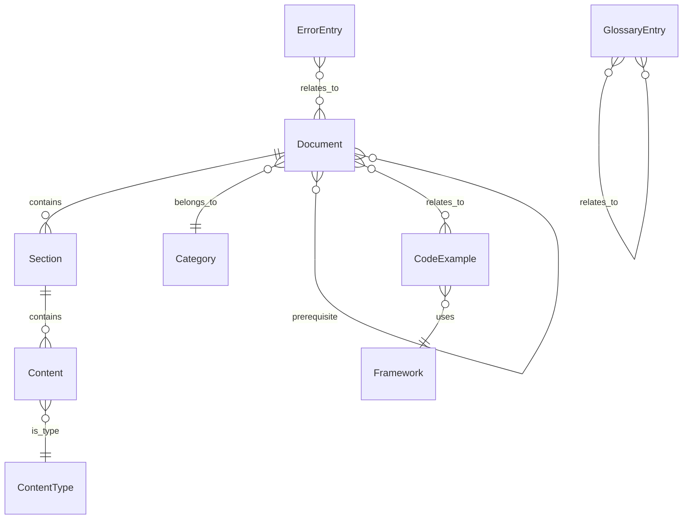

# Data Model: Cornerstone3D 影像浏览器开发指南

**Feature**: 001-image-viewer-guide
**Date**: 2025-01-18
**Status**: Phase 1 - Design Complete

## 数据模型概述

本数据模型定义了 Cornerstone3D 影像浏览器开发指南的文档结构。由于本功能是创建文档而非软件应用，这里的"数据模型"指的是文档的组织结构、内容类型和元数据定义。

---

## 核心实体

### 1. 文档 (Document)

文档是指南的基本单元，对应一个 Markdown 文件。

#### 属性

| 属性名 | 类型 | 必填 | 描述 | 示例 |
|--------|------|------|------|------|
| `id` | string | ✅ | 文档唯一标识符 | `project-setup` |
| `title` | string | ✅ | 文档标题（中文） | `项目初始化` |
| `filename` | string | ✅ | Markdown 文件名 | `project-setup.md` |
| `category` | Category | ✅ | 文档所属分类 | `getting-started` |
| `order` | number | ✅ | 同类文档中的顺序 | `1` |
| `description` | string | ✅ | 文档简短描述 | `如何创建和初始化一个新的 Cornerstone3D 项目` |
| `prerequisites` | string[] | ❌ | 前置文档 ID 列表 | `[]` |
| `estimatedTime` | string | ❌ | 预计阅读/完成时间 | `10 分钟` |
| `difficulty` | Difficulty | ❌ | 难度级别 | `beginner` |
| `tags` | string[] | ❌ | 标签列表 | `["项目", "初始化", "Vite"]` |

#### 类型定义

```typescript
type Category =
  | "architecture"        // 架构文档
  | "getting-started"     // 快速入门
  | "advanced"            // 高级指南
  | "examples"            // 示例代码
  | "troubleshooting";    // 故障排查

type Difficulty = "beginner" | "intermediate" | "advanced";

interface Document {
  id: string;
  title: string;
  filename: string;
  category: Category;
  order: number;
  description: string;
  prerequisites?: string[];
  estimatedTime?: string;
  difficulty?: Difficulty;
  tags?: string[];
}
```

---

### 2. 章节节 (Section)

章节是文档的子单元，使用 Markdown 标题定义。

#### 属性

| 属性名 | 类型 | 必填 | 描述 | 示例 |
|--------|------|------|------|------|
| `level` | number | ✅ | 标题层级（1-6） | `2` |
| `title` | string | ✅ | 章节标题（中文） | `安装依赖` |
| `anchor` | string | ✅ | 锚点 ID（用于链接） | `安装依赖` |
| `content` | Content[] | ✅ | 章节内容列表 | 见下文 |

#### 类型定义

```typescript
interface Section {
  level: number;
  title: string;
  anchor: string;
  content: Content[];
}
```

---

### 3. 内容块 (Content)

内容块是章节的基本组成部分，可以是段落、列表、代码块等。

#### 类型定义

```typescript
type Content =
  | ParagraphContent        // 段落
  | ListContent             // 列表（有序或无序）
  | CodeBlockContent        // 代码块
  | ImageContent            // 图片
  | TableContent            // 表格
  | NoteContent             // 注意、提示、警告
  | LinkContent             // 链接
  | DiagramContent;         // 图表（Mermaid）

// 段落内容
interface ParagraphContent {
  type: "paragraph";
  text: string;            // Markdown 格式的文本
  inlineCode?: string[];   // 行内代码片段
}

// 列表内容
interface ListContent {
  type: "list";
  ordered: boolean;        // true = 有序列表，false = 无序列表
  items: string[];         // 列表项
}

// 代码块内容
interface CodeBlockContent {
  type: "code-block";
  language: string;        // 代码语言（typescript、javascript 等）
  code: string;            // 代码内容
  caption?: string;        // 代码说明（中文）
  filename?: string;       // 文件名（如果代码来自特定文件）
  highlightedLines?: number[]; // 高亮行号
}

// 图片内容
interface ImageContent {
  type: "image";
  src: string;             // 图片路径
  alt: string;             // 替代文本（中文）
  caption?: string;        // 图片说明（中文）
  width?: string;          // 宽度（如 "600px"）
}

// 表格内容
interface TableContent {
  type: "table";
  headers: string[];       // 表头
  rows: string[][];        // 表格行
  caption?: string;        // 表格说明（中文）
}

// 注意、提示、警告
interface NoteContent {
  type: "note";
  level: "note" | "tip" | "warning" | "important";
  content: string;         // Markdown 格式的文本
}

// 链接内容
interface LinkContent {
  type: "link";
  text: string;            // 链接文本（中文）
  href: string;            // 链接 URL
  external?: boolean;      // 是否为外部链接
}

// 图表内容（Mermaid）
interface DiagramContent {
  type: "diagram";
  diagramType: "flowchart" | "sequence" | "class" | "state" | "er";
  code: string;            // Mermaid 代码
  caption?: string;        // 图表说明（中文）
}
```

---

### 4. 代码示例 (CodeExample)

代码示例是特殊的文档，包含完整的可运行代码。

#### 属性

| 属性名 | 类型 | 必填 | 描述 | 示例 |
|--------|------|------|------|------|
| `id` | string | ✅ | 示例唯一标识符 | `basic-viewer` |
| `title` | string | ✅ | 示例标题（中文） | `基础影像查看器` |
| `description` | string | ✅ | 示例描述 | `一个简单的 DICOM 影像查看器，支持基本的缩放和平移` |
| `framework` | Framework | ✅ | 使用的框架 | `react` |
| `language` | string | ✅ | 编程语言 | `typescript` |
| `path` | string | ✅ | 示例代码目录路径 | `guides/examples/basic-viewer/` |
| `relatedDocs` | string[] | ❌ | 相关文档 ID 列表 | `["first-viewer", "basic-interactions"]` |
| `features` | string[] | ✅ | 示例展示的功能列表 | `["StackViewport", "缩放", "平移", "窗宽窗位"]` |
| `difficulty` | Difficulty | ❌ | 难度级别 | `beginner` |
| `estimatedTime` | string | ❌ | 预计完成时间 | `15 分钟` |

#### 类型定义

```typescript
type Framework = "react" | "vue" | "angular" | "vanilla";

interface CodeExample {
  id: string;
  title: string;
  description: string;
  framework: Framework;
  language: string;
  path: string;
  relatedDocs?: string[];
  features: string[];
  difficulty?: Difficulty;
  estimatedTime?: string;
}
```

---

### 5. 术语表 (Glossary)

术语表定义了 Cornerstone3D 相关术语的中英文对照和解释。

#### 属性

| 属性名 | 类型 | 必填 | 描述 | 示例 |
|--------|------|------|------|------|
| `term` | string | ✅ | 英文术语 | `RenderingEngine` |
| `translation` | string | ✅ | 中文翻译 | `渲染引擎` |
| `definition` | string | ✅ | 定义（中文） | `管理 WebGL 上下文和视口生命周期的核心组件` |
| `category` | string | ❌ | 术语分类 | `core` |
| `relatedTerms` | string[] | ❌ | 相关术语 | `["Viewport", "StackViewport", "VolumeViewport"]` |
| `seeAlso` | string[] | ❌ | 参考链接 | `["/architecture/core-concepts"]` |

#### 类型定义

```typescript
interface GlossaryEntry {
  term: string;
  translation: string;
  definition: string;
  category?: string;
  relatedTerms?: string[];
  seeAlso?: string[];
}
```

---

### 6. 错误条目 (ErrorEntry)

错误条目定义了常见错误、原因和解决方案，用于故障排查文档。

#### 属性

| 属性名 | 类型 | 必填 | 描述 | 示例 |
|--------|------|------|------|------|
| `errorCode` | string | ✅ | 错误代码或错误消息 | `CORNERSTONE_NOT_INITIALIZED` |
| `title` | string | ✅ | 错误标题（中文） | `Cornerstone3D 未初始化` |
| `description` | string | ✅ | 错误描述（中文） | `在调用 Cornerstone3D API 之前，必须先调用 init() 函数进行初始化` |
| `cause` | string[] | ✅ | 可能的原因列表 | `["忘记调用 init()", "在 init() 完成前调用了其他 API"]` |
| `solution` | string | ✅ | 解决方案（中文） | `确保在应用启动时调用 await init()，并在初始化完成后再使用其他 API` |
| `codeExample` | CodeBlockContent | ❌ | 修复代码示例 | 见下文 |
| `relatedDocs` | string[] | ❌ | 相关文档 ID 列表 | `["initialization"]` |

#### 类型定义

```typescript
interface ErrorEntry {
  errorCode: string;
  title: string;
  description: string;
  cause: string[];
  solution: string;
  codeExample?: CodeBlockContent;
  relatedDocs?: string[];
}
```

---

## 关系模型

### 文档关系图



### 实体关系说明

1. **Document ↔ Section**: 一个文档包含多个章节，章节属于唯一文档
2. **Document ↔ Category**: 文档属于唯一分类
3. **Section ↔ Content**: 章节包含多个内容块
4. **Document ↔ Document**: 文档之间可以有前置关系（prerequisites）
5. **Document ↔ CodeExample**: 文档可以关联到多个代码示例
6. **GlossaryEntry ↔ GlossaryEntry**: 术语之间可以有相关关系
7. **ErrorEntry ↔ Document**: 错误条目可以关联到相关文档

---

## 验证规则

### 文档验证规则

1. **ID 唯一性**: 所有文档 ID 必须唯一
2. **标题非空**: 文档标题不能为空
3. **分类有效**: 文档分类必须是预定义的 Category 类型之一
4. **顺序正整数**: 文档顺序必须是正整数
5. **前置有效**: 前置文档 ID 必须存在
6. **文件名有效**: 文件名必须以 `.md` 结尾

### 代码示例验证规则

1. **路径存在**: 代码示例路径必须存在
2. **包含 package.json**: 目录必须包含 package.json 文件
3. **包含 README.md**: 目录必须包含 README.md 文件
4. **可运行**: 示例代码必须可以运行（通过 npm install && npm run dev 验证）
5. **类型检查通过**: TypeScript 示例必须通过 tsc --noEmit 检查

### 内容质量验证规则

1. **中文优先**: 所有文本内容（除代码外）必须使用中文
2. **术语规范**: 技术术语首次出现时必须提供中文解释
3. **代码注释**: 代码示例必须包含中文注释
4. **链接有效**: 内部链接必须指向存在的文档
5. **图片存在**: 引用的图片必须存在

---

## 元数据模式

本文档遵循以下元数据模式（在每个 Markdown 文件的 frontmatter 中）：

```yaml
---
id: project-setup
title: 项目初始化
category: getting-started
order: 1
description: 如何创建和初始化一个新的 Cornerstone3D 项目
prerequisites: []
estimatedTime: "10 分钟"
difficulty: beginner
tags: ["项目", "初始化", "Vite"]
---
```

---

## 数据持久化

由于本功能是文档项目，"数据持久化"指的是文档的存储方式：

1. **文件系统**: 所有文档存储为 Markdown 文件
2. **版本控制**: 使用 Git 进行版本控制
3. **备份**: GitHub 仓库作为主备份
4. **分发**: 通过 GitHub 和 npm 包分发

---

## 未来扩展

### 可能的扩展方向

1. **文档搜索**: 添加全文搜索功能，基于文档内容
2. **用户反馈**: 允许用户对文档进行评论和反馈
3. **自动生成**: 基于代码注释自动生成部分文档
4. **多语言**: 未来支持英文等其他语言
5. **交互式示例**: 使用 StackBlitz 或 CodeSandbox 提供在线交互式示例

---

## 总结

本数据模型定义了 Cornerstone3D 影像浏览器开发指南的文档结构和内容类型。所有文档都将遵循这个模型，确保一致性和可维护性。

关键实体包括：
- **Document**: 文档的基本单元
- **Section**: 文档的章节
- **Content**: 内容块（段落、代码、图片等）
- **CodeExample**: 完整的代码示例
- **GlossaryEntry**: 术语表条目
- **ErrorEntry**: 错误条目

所有文档都将使用 Markdown 格式编写，遵循项目宪章的"中文优先"原则，并提供完整的代码示例和中文注释。
